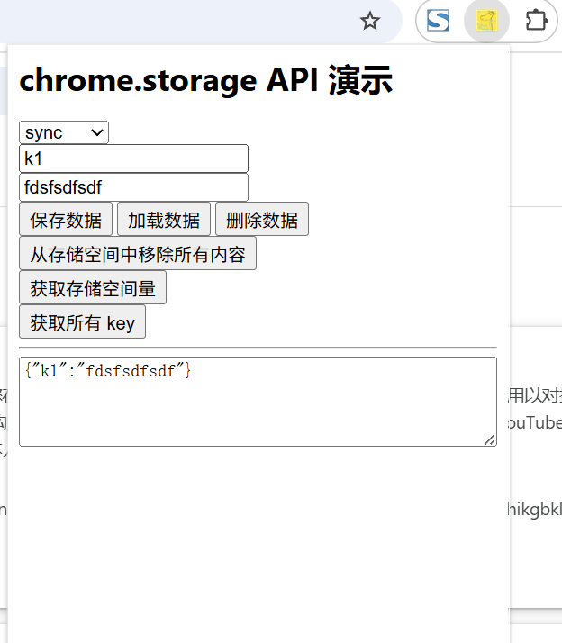
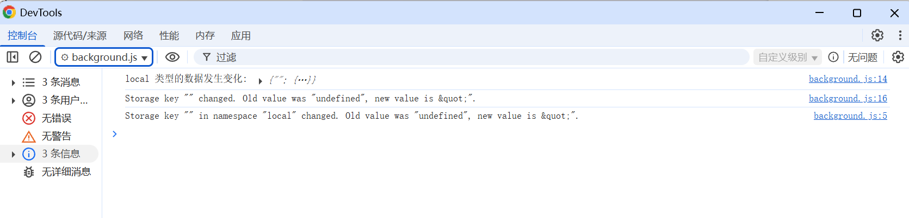

# 数据存储 展示 (chrome.storage)

## 存储区域
- storage.local
数据存储在本地，并在移除扩展程序时清除。
存储空间限制为 10 MB（在 Chrome 113 及更早版本中为 5 MB），但可以通过请求 "unlimitedStorage" 权限来增加此限制。我们建议使用 storage.local 存储更多数据。
默认情况下，它会向内容脚本公开，但可以通过调用 chrome.storage.local.setAccessLevel() 来更改此行为。

- storage.managed
受管理的存储空间是只读存储空间，用于存储已安装的扩展程序，由系统管理员使用开发者定义的架构和企业政策进行管理。
政策类似于选项，但由系统管理员而非用户配置，从而允许为组织的所有用户预配置扩展程序。默认情况下，storage.managed 会向内容脚本公开，但可以通过调用 chrome.storage.managed.setAccessLevel() 来更改此行为。
如需了解政策，请参阅管理员文档。如需详细了解 managed 存储区，请参阅存储区的清单。

- storage.session
在加载扩展程序时将数据保存在内存中。如果扩展程序被停用、重新加载或更新，并且浏览器重新启动，则存储空间会被清除。
默认情况下，它不会向内容脚本公开，但可以通过调用 chrome.storage.session.setAccessLevel() 来更改此行为。存储空间上限为 10 MB（在 Chrome 111 及更早版本中为 1 MB）。storage.session 接口是我们推荐用于 Service Worker 的多个接口之一。

- storage.sync
如果启用了同步，数据会同步到用户登录的任何 Chrome 浏览器。
如果停用，则行为与 storage.local 类似。Chrome 会在浏览器离线时将数据存储在本地，并在浏览器重新在线时恢复同步。
配额限制约为 100 KB，每个商品 8 KB。我们建议使用 storage.sync，以便在同步的浏览器之间保留用户设置。如果您要处理敏感用户数据，请改用 storage.session。
默认情况下，storage.sync 会向内容脚本公开，但可以通过调用 chrome.storage.sync.setAccessLevel() 来更改此行为。

## manifest.json 配置
```json
{
    "permissions": [
        "storage"
    ],
}
```

## action.html 配置
```html
<html lang="zh-cn">
  <head>
    <title>chrome.storage API 演示</title>
  </head>
  <body>
    <h1>chrome.storage API 演示</h1>
    <select id="data-type">
      <option value="local">local</option>
      <option value="sync">sync</option>
      <option value="session">session</option>
    </select>
    <br/>
    <label>
        <input type="text" id="data-input-key" placeholder="key" />
    </label>
    <br/>
    <label>
        <input type="text" id="data-input-value" placeholder="value" />
    </label>
    <br/>
    <button id="set-btn">保存数据</button>
    <button id="get-btn">加载数据</button>
    <button id="remove-btn">删除数据</button>
    <button id="clear-btn">从存储空间中移除所有内容</button><br/>
    <button id="get-space-btn">获取存储空间量</button><br/>
    <button id="get-all-keys-btn">获取所有 key</button><br/>
    <hr/>
    <label>
        <textarea id="data-result" rows="4" cols="50"></textarea>
    </label>
  </body>
  <script src="../js/action.js" type="module"></script>
</html>
```

## action.js 配置
```javascript
// 保存数据
document.getElementById('set-btn').addEventListener('click', () => {
    const key = document.getElementById('data-input-key').value;
    const value = document.getElementById('data-input-value').value;
    const type = document.getElementById('data-type').value;
    chrome.storage[type].set({[key]: value}, () => {
        console.log("数据保存成功");
    });
});

// 加载数据
document.getElementById('get-btn').addEventListener('click', () => {
    const key = document.getElementById('data-input-key').value;
    const type = document.getElementById('data-type').value;
    chrome.storage[type].get(key, (result) => {
        document.getElementById('data-result').value = JSON.stringify(result);
    });
});

// 删除数据
document.getElementById('remove-btn').addEventListener('click', () => {
    const key = document.getElementById('data-input-key').value;
    const type = document.getElementById('data-type').value;
    chrome.storage[type].remove(key, () => {
        console.log("数据删除成功");
    });
});

// 清空数据
document.getElementById('clear-btn').addEventListener('click', () => {
    const type = document.getElementById('data-type').value;
    chrome.storage[type].clear(() => {
        console.log("从存储空间中移除所有内容成功");
    });
});

// 获取所有 key
document.getElementById('get-all-keys-btn').addEventListener('click', () => {
    const type = document.getElementById('data-type').value;
    chrome.storage[type].get(null, (result) => {
        document.getElementById('data-result').value = JSON.stringify(Object.keys(result));
    });
});

// 获取存储空间量
document.getElementById('get-space-btn').addEventListener('click', () => {
    const type = document.getElementById('data-type').value;
    chrome.storage[type].getBytesInUse(null, (bytesInUse) => {
        document.getElementById('data-result').value = `当前占用空间: ${bytesInUse} 字节`;
    });
});
```

## 效果



## 资料
```markdown
https://developer.chrome.com/docs/extensions/reference/api/storage?hl=zh-cn
https://github.com/GoogleChrome/chrome-extensions-samples/tree/17956f44b6f04d28407a4b7eee428611affd4fab/api/contextMenus/global_context_search
https://github.com/GoogleChrome/chrome-extensions-samples/tree/17956f44b6f04d28407a4b7eee428611affd4fab/examples/water_alarm_notification
```
