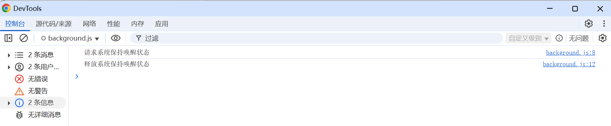

# 电源管理 展示 (chrome.power)

> 默认情况下，操作系统会在用户处于非活动状态时调暗屏幕，并最终暂停系统。借助电源 API，应用或扩展程序可以使系统保持唤醒状态

## manifest.json 配置
```json
{
    "permissions": [
        "power"
    ],
    "background": {
        "service_worker": "js/background.js"
    }
}
```

## background.js 代码
```javascript
// 请求暂时停用电源管理。level 描述了应停用电源管理的程度。如果同一应用之前发出的请求仍处于有效状态，则会被新请求替换。
// - system 
//     防止系统因用户不活动而进入休眠状态。

// - display
//     防止显示屏因用户不活动而关闭或变暗，或防止系统进入休眠状态。
chrome.power.requestKeepAwake('system');
console.log('请求系统保持唤醒状态');

// 释放之前通过 requestKeepAwake() 发出的请求
chrome.power.releaseKeepAwake();
console.log('释放系统保持唤醒状态');
```

## 调试


## 资料
```markdown
https://developer.chrome.com/docs/extensions/reference/api/power?hl=zh-cn
```