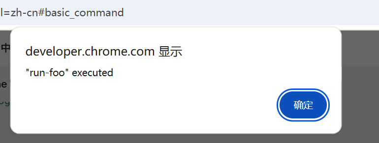
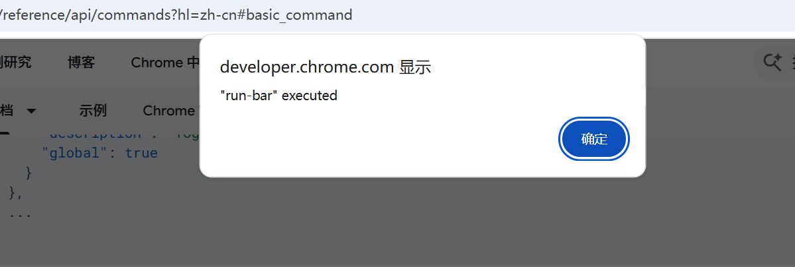
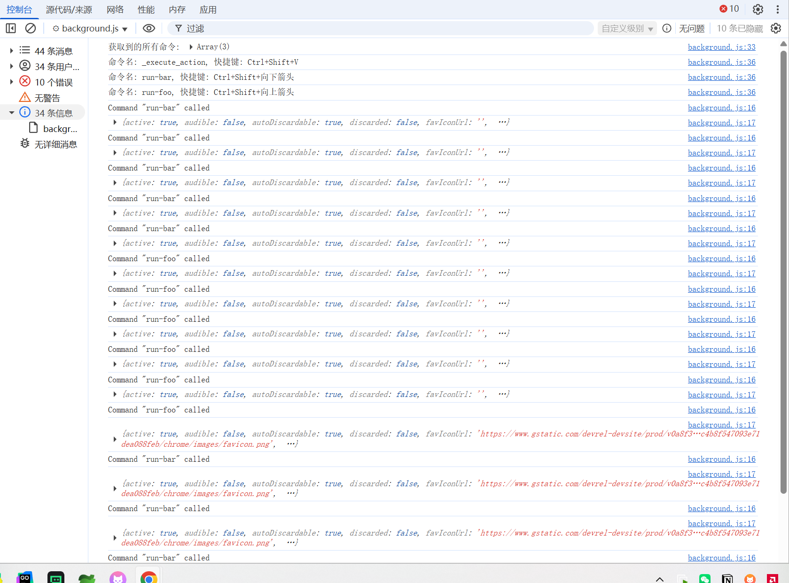

# 键盘快捷键 展示 (chrome.commands)

## 支持的键

> 以下键可用作命令快捷键。键定义区分大小写。尝试加载密钥大小写不正确的扩展程序会导致安装时出现清单解析错误。

- Alpha 版密钥
    A … Z

- 数字键
    0 … 9

- 标准密钥字符串
    Comma、Period、Home、End、PageUp、PageDown、Space、Insert、Delete

- 箭头键 

    Up、Down、Left、Right

- 媒体键

    MediaNextTrack、MediaPlayPause、MediaPrevTrack、MediaStop

- 辅助键字符串

    Ctrl、Alt、Shift、MacCtrl（仅限 macOS）、Command（仅限 macOS）、Search（仅限 ChromeOS）

## 组合键要求

- 扩展命令快捷方式必须包含 Ctrl 或 Alt。

    - 修饰键不能与媒体键结合使用。

    - 在许多 macOS 键盘上，Alt 指的是 Option 键。

    - 在 macOS 上，Command 或 MacCtrl 也可用于代替 Ctrl 或 Alt（请参阅下一个项目符号）。

- 在 macOS 上，Ctrl 会自动转换为 Command。

    - Command 还可用于 "mac" 快捷方式，以明确指代 Command 键。

    - 如需在 macOS 上使用 Control 键，请在定义 "mac" 快捷方式时将 Ctrl 替换为 MacCtrl。

    - 在其他平台的组合中使用 MacCtrl 会导致验证错误，并阻止安装扩展程序。

- Shift 是所有平台上的可选修饰符。

- Search 是 ChromeOS 独有的可选修饰符。

- 某些操作系统和 Chrome 快捷键（例如窗口管理）始终优先于扩展程序命令快捷键，并且无法被替换


## manifest.json 配置
```json
{
    "background": {
        "service_worker": "js/background.js"
    },
    "permissions": [
        "activeTab",
        "scripting"
    ],
    "commands": {
        "run-foo": {
            "suggested_key": {
                "default": "Ctrl+Shift+Up",
                "mac": "Command+Shift+Up"
            },
            "description": "Run \"foo\" on the current page."
        },
        "run-bar": {
            "suggested_key": "Ctrl+Shift+Down",
            "description": "Run \"bar\" on the current page."
        },
        "_execute_action": {
            "suggested_key": {
                "windows": "Ctrl+Shift+V",
                "mac": "Command+Shift+V",
                "chromeos": "Ctrl+Shift+V",
                "linux": "Ctrl+Shift+V"
            }
        }
    }
}
```

## js/background.js
```js
chrome.action.onClicked.addListener((tab) => {
    chrome.scripting.executeScript({
        target: {tabId: tab.id},
        func: contentScriptFunc,
        args: ['action'],
    });
});

function contentScriptFunc(name) {
    alert(`"${name}" executed`);
}

// 快捷键触发 This callback WILL NOT be called for "_execute_action"
chrome.commands.onCommand.addListener((command, tab) => {
    console.log(`Command "${command}" called`);
    console.log(tab);
    command === 'run-foo' && chrome.scripting.executeScript({
        target: {tabId: tab.id},
        func: contentScriptFunc,
        args: ['run-foo'],
    });
    command === 'run-bar' && chrome.scripting.executeScript({
        target: {tabId: tab.id},
        func: contentScriptFunc,
        args: ['run-bar'],
    });
});

// 返回相应扩展程序的所有已注册的扩展程序命令及其快捷方式（如果处于有效状态）。
// 在 Chrome 110 之前，此命令不会返回 _execute_action。
chrome.commands.getAll().then((commands) => {
    console.log('获取到的所有命令:', commands);
    // 循环输出 commands 中的每个元素的 name 和 shortcut
    commands.forEach((command) => {
        console.log(`命令名: ${command.name}, 快捷键: ${command.shortcut || '无'}`);
    });
});
```

## 效果





## 资料
```markdown
https://developer.chrome.com/docs/extensions/reference/api/commands?hl=zh-cn
```