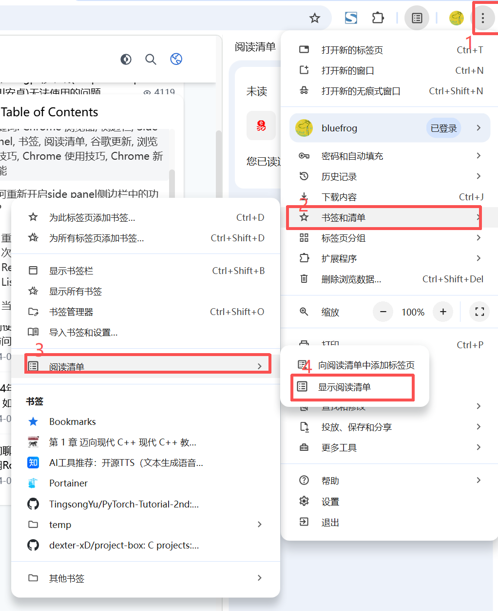
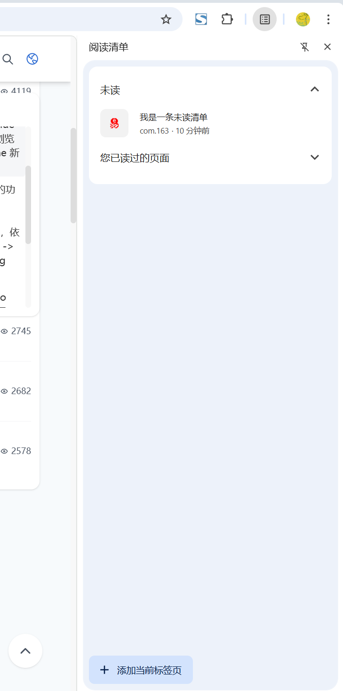
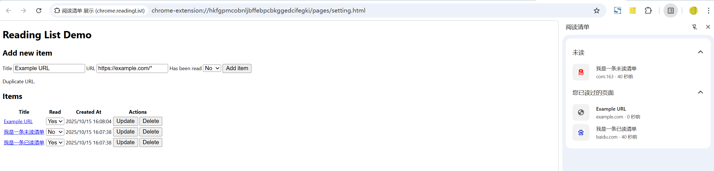

# 阅读清单 展示 (chrome.readingList)

## manifest.json 配置
```json
{
    "background": {
        "service_worker": "js/background.js"
    },
    "action": {
        "default_icon": "images/icon.png",
        "default_title": "展示 chrome.readingList API 阅读清单"
    },
    "permissions": [
        "readingList"
    ]
}
```

## pages/setting.html
```html
<!doctype html>
<html lang="zh-CN">
  <head>
    <meta charset="UTF-8" />
    <meta http-equiv="X-UA-Compatible" content="IE=edge" />
    <meta name="viewport" content="width=device-width, initial-scale=1.0" />
    <title>Reading List Demo</title>
    <link rel="stylesheet" href="../css/setting.css" />
    <script defer src="../js/setting.js"></script>
  </head>
  <body>
    <template id="table-item">
      <tr>
        <td><a>Title</a></td>
        <td>
          <select name="read" value="no">
            <option value="no">No</option>
            <option value="yes">Yes</option>
          </select>
        </td>
        <td>1/1/1970, 00:00:00</td>
        <td>
          <button class="update-button">Update</button>
          <button class="delete-button">Delete</button>
        </td>
      </tr>
    </template>
    <form>
      <h1>Reading List Demo</h1>
      <section>
        <h2>Add new item</h2>
        <label>
          <span>Title</span>
          <input type="text" name="title" value="Example URL" />
        </label>
        <label>
          <span>URL</span>
          <input type="text" name="url" value="https://example.com/*" />
        </label>
        <label>
          <span>Has been read</span>
          <select name="read" value="no">
            <option value="no">No</option>
            <option value="yes">Yes</option>
          </select>
        </label>
        <button type="button" id="add-item">Add item</button>
        <p id="error"></p>
      </section>
      <section>
        <h2>Items</h2>
        <table id="items">
          <tr>
            <th>Title</th>
            <th>Read</th>
            <th>Created At</th>
            <th>Actions</th>
          </tr>
        </table>
      </section>
    </form>
  </body>
</html>
```

## js/setting.js 配置
```javascript
console.log('进入 setting.js');

const ADD_ITEM_BUTTON_ID = 'add-item';
const ITEMS_TABLE_ID = 'items';
const TABLE_ITEM_TEMPLATE_ID = 'table-item';
const READ_SELECT_YES_VALUE = 'yes';
const READ_SELECT_NO_VALUE = 'no';

/**
 * Removes an entry from the reading list.
 *
 * @param url URL of entry to remove.
 */
async function removeEntry(url) {
  await chrome.readingList.removeEntry({ url });
}

/**
 * Adds an entry to the reading list.
 *
 * @param title Title of the entry
 * @param url URL of entry to add
 * @param hasBeenRead If the entry has been read
 */
async function addEntry(title, url, hasBeenRead) {
  await chrome.readingList.addEntry({ title, url, hasBeenRead });
}

/**
 * Updates an entry in the reading list.
 *
 * @param url URL of entry to update
 * @param hasBeenRead If the entry has been read
 */
async function updateEntry(url, hasBeenRead) {
  await chrome.readingList.updateEntry({ url, hasBeenRead });
}

/**
 * Updates the UI with the current reading list items.
 */
async function updateUI() {
  const items = await chrome.readingList.query({});

  const table = document.getElementById(ITEMS_TABLE_ID);

  for (const item of items) {
    // Use existing row if possible, otherwise create a new one.
    const row =
      document.querySelector(`[data-url="${item.url}"]`) ||
      document.getElementById(TABLE_ITEM_TEMPLATE_ID).content.cloneNode(true)
        .children[0];

    updateRow(row, item);

    table.appendChild(row);
  }

  // Remove any rows that no longer exist
  table.querySelectorAll('tr').forEach((row, i) => {
    // Ignore header row
    if (i === 0) return;
    if (!items.find((i) => i.url === row.getAttribute('data-url'))) {
      row.remove();
    }
  });
}

/**
 * Updates a row with the data from item.
 *
 * @param row Table row element to update.
 * @param item Data from reading list API.
 */
function updateRow(row, item) {
  row.setAttribute('data-url', item.url);

  const titleField = row.querySelector('td:nth-child(1) a');
  titleField.href = item.url;
  titleField.innerText = item.title;

  const readField = row.querySelector('td:nth-child(2) select');
  readField.value = item.hasBeenRead
    ? READ_SELECT_YES_VALUE
    : READ_SELECT_NO_VALUE;

  const createdAtField = row.querySelector('td:nth-child(3)');
  createdAtField.innerText = `${new Date(item.creationTime).toLocaleString()}`;

  const deleteButton = row.querySelector('.delete-button');
  deleteButton.addEventListener('click', async (event) => {
    event.preventDefault();
    await removeEntry(item.url);
    updateUI();
  });

  const updateButton = row.querySelector('.update-button');
  updateButton.addEventListener('click', async (event) => {
    event.preventDefault();
    await updateEntry(item.url, readField.value === READ_SELECT_YES_VALUE);
  });
}

const ERROR_ID = 'error';

const ITEM_TITLE_SELECTOR = '[name="title"]';
const ITEM_URL_SELECTOR = '[name="url"]';
const ITEM_READ_SELECTOR = '[name="read"]';

// Add item button click handler
document
  .getElementById(ADD_ITEM_BUTTON_ID)
  .addEventListener('click', async () => {
    try {
      // Get data from input fields
      const title = document.querySelector(ITEM_TITLE_SELECTOR).value;
      const url = document.querySelector(ITEM_URL_SELECTOR).value;
      const hasBeenRead =
        document.querySelector(ITEM_READ_SELECTOR).value ===
        READ_SELECT_YES_VALUE;

      // Attempt to add the entry
      await addEntry(title, url, hasBeenRead);
      document.getElementById(ERROR_ID).style.display = 'none';
    } catch (ex) {
      // Something went wrong, show an error
      document.getElementById(ERROR_ID).innerText = ex.message;
      document.getElementById(ERROR_ID).style.display = 'block';
    }

    updateUI();
  });

updateUI();

// Update the UI whenever data in the reading list changes
chrome.readingList.onEntryAdded.addListener(updateUI);
chrome.readingList.onEntryRemoved.addListener(updateUI);
chrome.readingList.onEntryUpdated.addListener(updateUI);
```

## js/background.js 配置
```javascript
// 点击 action 图标 打开配置页面
chrome.action.onClicked.addListener(openDemoTab);
function openDemoTab() {
  chrome.tabs.create({ url: 'pages/setting.html' });
}

// 扩展安装时 清除所有阅读清单
chrome.runtime.onInstalled.addListener(async function() {
    // 获取 所有阅读清单
    const items = await chrome.readingList.query({});
    console.log('所有阅读清单:', items);
    // 清除样条
    items.forEach((item) => {
        removeEntry(item.url);
    });

    // 添加一条未读的阅读清单
    chrome.readingList.addEntry({
        title: "我是一条未读清单", // 条目的标题。
        url: "https://www.163.com", // 相应条目的网址。
        hasBeenRead: false // 如果条目已被读取，则为 true。
    });

    // 添加一条已读的阅读清单
    chrome.readingList.addEntry({
        title: "我是一条已读清单", // 条目的标题。
        url: "https://www.baidu.com", // 相应条目的网址。
        hasBeenRead: true // 如果条目已被读取，则为 true。
    });
});

// 删除指定在阅读清单中的条目
async function removeEntry(url) {
    await chrome.readingList.removeEntry({
        url: url // 要移除的网址
    });
}

// 当新增阅读清单项时触发
chrome.readingList.onEntryAdded.addListener(function(entry) {
    console.log('新增阅读清单项:', entry);
    console.log('entry.creationTime:', entry.creationTime); // 条目的创建时间。以自 1970 年 1 月 1 日以来的毫秒数记录。
    console.log('entry.hasBeenRead:', entry.hasBeenRead); // 如果条目已被读取，则为 true。
    console.log('entry.lastUpdateTime:', entry.lastUpdateTime); // 相应条目的上次更新时间。此值以自 1970 年 1 月 1 日以来的毫秒数表示。
    console.log('entry.title:', entry.title); // 条目的标题。
    console.log('entry.url:', entry.url); // 相应条目的网址。
});

// 当从阅读清单中移除 ReadingListEntry 时触发
chrome.readingList.onEntryRemoved.addListener(function(entry) {
    console.log('移除阅读清单项:', entry);
});

// 当阅读清单中的 ReadingListEntry 更新时触发
chrome.readingList.onEntryUpdated.addListener(function(entry) {
    console.log('更新阅读清单项:', entry);
});
```

## 显示





## 资料
```markdown
https://developer.chrome.com/docs/extensions/reference/api/readingList?hl=zh-cn
https://github.com/GoogleChrome/chrome-extensions-samples/tree/main/api-samples/readingList
```