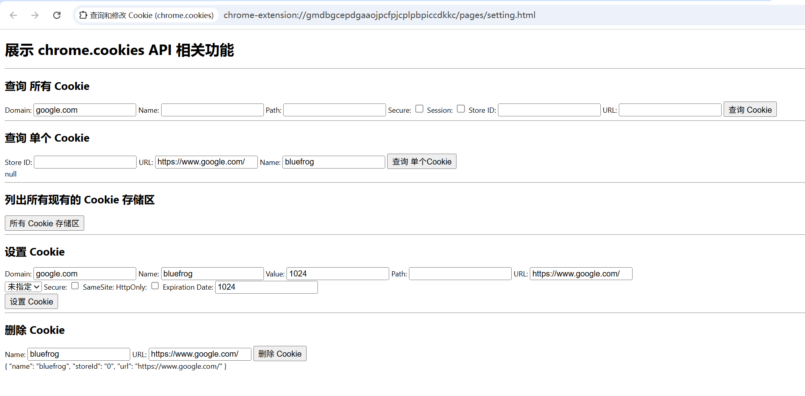
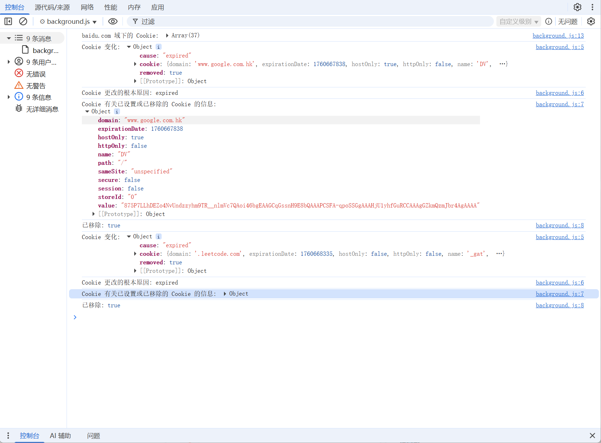

# 查询和修改 Cookie 展示 (chrome.cookies)

> 使用 chrome.cookies API 可查询和修改 Cookie，并在 Cookie 发生更改时收到通知
> 如需使用 Cookie API，请在清单中声明 "cookies" 权限，并为要访问其 Cookie 的任何主机声明主机权限

## manifest.json 配置

```json
{
    "background": {
        "service_worker": "js/background.js"
    },
    "action": {
        "default_icon": "images/icon.png",
        "default_title": "展示 chrome.cookies API 相关功能",
        "default_popup": "pages/action.html"
    },
    "permissions": [
        "cookies"
    ],
    "host_permissions": [
        "<all_urls>"
    ]
}
```

## pages/setting.html 代码
```html
<!doctype html>
<html lang="zh-CN">
    <body>
        <h1>展示 chrome.cookies API 相关功能</h1>
        <hr/>
        <h2>查询 所有 Cookie</h2>
        <label for="search-domain-input" title="将检索到的 Cookie 限制为网域与此网域匹配或为此网域的子网域的 Cookie。">Domain:</label>
        <input type="text" id="search-domain-input" value="google.com" />
        <label for="search-name-input" title="按名称过滤 Cookie。">Name:</label>
        <input type="text" id="search-name-input" />
        <!--
        <label for="search-partition-key-input" title="用于读取或修改具有 Partitioned 属性的 Cookie 的分区键。">Partition Key:</label>
        <input type="text" id="search-partition-key-input" />

            hasCrossSiteAncestor
            布尔值（可选）

            Chrome 130 及更高版本
            指示 Cookie 是否是在跨网站情境中设置的。这样可以防止在跨网站情境中嵌入的顶级网站访问在同网站情境中由该顶级网站设置的 Cookie。

            topLevelSite
            字符串（选填）

            分区 Cookie 可用的顶级网站。
        -->
        <label for="search-path-input" title="将检索到的 Cookie 限制为路径与此字符串完全匹配的 Cookie。">Path:</label>
        <input type="text" id="search-path-input" />
        <label for="search-secure-input" title="按 Secure 属性过滤 Cookie。">Secure:</label>
        <input type="checkbox" id="search-secure-input" />
        <label for="search-session-input" title="过滤掉会话 Cookie 与永久性 Cookie。">Session:</label>
        <input type="checkbox" id="search-session-input" />
        <label for="search-store-id-input" title="要从中检索 Cookie 的 Cookie 存储区。如果省略，则使用当前执行上下文的 Cookie 存储区。">Store ID:</label>
        <input type="text" id="search-store-id-input" />
        <label for="search-url-input" title="将检索到的 Cookie 限制为与指定网址匹配的 Cookie。">URL:</label>
        <input type="text" id="search-url-input" />
        <button id="search-btn">查询 Cookie</button>
        <div id="search-result-container"></div>

        <hr/>
        <h2>查询 单个 Cookie</h2>
        <label for="get-store-id-input" title="要从中检索 Cookie 的 Cookie 存储区。如果省略，则使用当前执行上下文的 Cookie 存储区。">Store ID:</label>
        <input type="text" id="get-store-id-input" />
        <label for="get-url-input" title="将检索到的 Cookie 限制为与指定网址匹配的 Cookie。">URL:</label>
        <input type="text" id="get-url-input" value="https://www.google.com/" />
        <label for="get-name-input" title="要获取的 Cookie 名称。">Name:</label>
        <input type="text" id="get-name-input" value="bluefrog" />
        <button id="get-btn">查询 单个Cookie</button>
        <div id="get-result-container"></div>

        <hr/>
        <h2>列出所有现有的 Cookie 存储区</h2>
        <button id="cookies-store-btn">所有 Cookie 存储区</button>
        <div id="cookies-store-container"></div> 

        <hr/>
        <h2>设置 Cookie</h2>
        <label for="set-domain-input" title="相应 Cookie 的网域。如果省略，相应 Cookie 将成为仅限主机使用的 Cookie。">Domain:</label>
        <input type="text" id="set-domain-input" value="google.com" />
        <label for="set-name-input" title="相应 Cookie 的名称。如果省略，则默认为空。">Name:</label>
        <input type="text" id="set-name-input" value="bluefrog" />
        <label for="set-value-input" title="相应 Cookie 的值。如果省略，则默认为空。">Value:</label>
        <input type="text" id="set-value-input" value="1024" />
        <label for="set-path-input" title="Cookie 的路径。默认为网址参数的路径部分。">Path:</label>
        <input type="text" id="set-path-input" value="" />
        <label for="set-url-input" title="要与 Cookie 设置相关联的 request-URI。此值可能会影响所创建 Cookie 的默认网域和路径值。如果未在清单文件中指定相应网址的主机权限，API 调用将会失败。">URL:</label>
        <input type="text" id="set-url-input" value="https://www.google.com/" /><br/>
        <select id="set-same-site-input">
            <option value="no_restriction">不限制</option>
            <option value="lax">宽松</option>
            <option value="strict">严格</option>
            <option value="unspecified" selected>未指定</option>
        </select>
        <label for="set-secure-input" title="是否应将 Cookie 标记为“Secure”。默认值为 false。">Secure:</label>
        <input type="checkbox" id="set-secure-input" />
        <label for="set-same-site-input" title="Cookie 的同网站状态。默认为“unspecified”，即如果省略，则设置 Cookie 时不指定 SameSite 属性。">SameSite:</label>
        <label for="set-http-only-input" title="是否应将 Cookie 标记为 HttpOnly。默认值为 false。">HttpOnly:</label>
        <input type="checkbox" id="set-http-only-input" />
        <label for="set-expirationDate-input" title="Cookie 的过期日期，以自 UNIX 纪元以来的秒数表示。如果省略，相应 Cookie 将成为会话 Cookie。">Expiration Date:</label>
        <input type="number" id="set-expirationDate-input" value="1024" /><br/>
        <button id="set-btn">设置 Cookie</button>
        <div id="set-result-container"></div>

        <hr/>
        <h2>删除 Cookie</h2>

        <label for="delete-name-input" title="要删除的 Cookie 的名称。">Name:</label>
        <input type="text" id="delete-name-input" value="bluefrog" />
        <label for="delete-url-input" title="将删除的 Cookie 限制为与指定网址匹配的 Cookie。">URL:</label>
        <input type="text" id="delete-url-input" value="https://www.google.com/" />
        <button id="delete-btn">删除 Cookie</button>
        <div id="delete-result-container"></div>

    </body>
    <script src="../js/setting.js" type="module"></script>
</html>
```

## js/setting.js 代码
```javascript
// 点击 查询 Cookie 按钮
document.getElementById('search-btn').addEventListener('click', function() {
    let params = {};
    // 获取 查询 Cookie 表单 所有输入框的值
    const searchDomain = document.getElementById('search-domain-input').value;
    if (searchDomain) {
        params.domain = searchDomain;
    }
    const searchName = document.getElementById('search-name-input').value;
    if (searchName) {
        params.name = searchName;
    }
    // const searchPartitionKey = document.getElementById('search-partition-key-input').value;
    //const searchTopLevelSite = document.getElementById('search-top-level-site-input').value;
    const searchUrl = document.getElementById('search-url-input').value;
    if (searchUrl) {
        params.url = searchUrl;
    }
    const searchSecure = document.getElementById('search-secure-input').checked;
    if (searchSecure) {
        params.secure = true;
    }
    const searchSession = document.getElementById('search-session-input').checked;
    if (searchSession) {
        params.session = true;
    }
    const storeId = document.getElementById('search-store-id-input').value;
    if (storeId) {
        params.storeId = storeId;
    }
    const path = document.getElementById('search-path-input').value;
    if (path) {
        params.path = path;
    }
    // 从单个 Cookie 存储区检索与给定信息匹配的所有 Cookie。返回的 Cookie 将按路径长度进行排序，路径最长的 Cookie 排在最前面。
    // 如果多个 Cookie 的路径长度相同，则创建时间最早的 Cookie 会排在前面。此方法仅检索扩展程序具有主机权限的网域的 Cookie。
    chrome.cookies.getAll(params, function(cookies) {
        // 处理查询到的 Cookie
        console.log('查询到的 Cookie:', cookies);
        // 渲染 Cookie 到页面
        document.getElementById('search-result-container').innerHTML = JSON.stringify(cookies, null, 2);
    });
});

// 点击 查询 单个Cookie 按钮
document.getElementById('get-btn').addEventListener('click', function() {
    let params = {};
    // 获取 查询 单个Cookie 表单 所有输入框的值
    const storeId = document.getElementById('get-store-id-input').value;
    if (storeId) {
        params.storeId = storeId;
    }
    const url = document.getElementById('get-url-input').value;
    if (url) {
        params.url = url;
    }
    const name = document.getElementById('get-name-input').value;
    if (name) {
        params.name = name;
    }
    // 从单个 Cookie 存储区检索与给定信息匹配的 Cookie。
    chrome.cookies.get(params, function(cookie) {
        // 处理查询到的 Cookie
        console.log('查询到的 Cookie:', cookie);
        // 渲染 Cookie 到页面
        document.getElementById('get-result-container').innerHTML = JSON.stringify(cookie, null, 2);
    });
});

// 点击 列出所有现有的 Cookie 存储区 按钮
document.getElementById('cookies-store-btn').addEventListener('click', function() {
    // 列出所有现有的 Cookie 存储区
    chrome.cookies.getAllCookieStores(function(cookieStores) {
        // 处理查询到的 Cookie 存储区
        console.log('查询到的 Cookie 存储区:', cookieStores);
        for (const store of cookieStores) {
            console.log('id:', store.id); // Cookie 存储区的唯一标识符
            console.log('tabIds:', store.tabIds); // 共享此 Cookie 存储区的所有浏览器标签页的标识符
        }
        // 渲染 Cookie 存储区到页面
        document.getElementById('cookies-store-container').innerHTML = JSON.stringify(cookieStores, null, 2);
    });
});

// 点击 设置 Cookie 按钮
document.getElementById('set-btn').addEventListener('click', async function() {
    let params = {};
    // 获取 设置 Cookie 表单 所有输入框的值
    const name = document.getElementById('set-name-input').value;
    if (name) {
        params.name = name;
    }
    const value = document.getElementById('set-value-input').value;
    if (value) {
        params.value = value;
    }
    const domain = document.getElementById('set-domain-input').value;
    if (domain) {
        params.domain = domain;
    }
    const path = document.getElementById('set-path-input').value;
    if (path) {
        params.path = path;
    }
    const url = document.getElementById('set-url-input').value;
    if (url) {
        params.url = url;
    }
    const expirationDate = document.getElementById('set-expirationDate-input').value;
    if (expirationDate > 0) {
        params.expirationDate = Date.now() / 1000 + Number(expirationDate);
    }
    const secure = document.getElementById('set-secure-input').checked;
    if (secure) {
        params.secure = true;
    }
    const httpOnly = document.getElementById('set-http-only-input').checked;
    if (httpOnly) {
        params.httpOnly = true; 
    }
    const sameSite = document.getElementById('set-same-site-input').value;
    if (sameSite) {
        params.sameSite = sameSite;
    }
    // 使用给定的 Cookie 数据设置 Cookie；如果存在等效的 Cookie，可能会覆盖这些 Cookie
    let res = await chrome.cookies.set(params, function(cookie) {
        // 处理设置的 Cookie
        console.log('设置的 Cookie:', cookie);
    });
    console.log("设置 Cookie 结果:", res);
});

// 点击 删除 Cookie 按钮
document.getElementById('delete-btn').addEventListener('click', async function() {
    let params = {};
    // 获取 删除 Cookie 表单 所有输入框的值
    const name = document.getElementById('delete-name-input').value;
    if (name) {
        params.name = name;
    }
    const url = document.getElementById('delete-url-input').value;
    if (url) {
        params.url = url;
    }
    // 使用给定的 Cookie 数据删除 Cookie
    let res = await chrome.cookies.remove(params, function(cookie) {
        // 处理删除的 Cookie
        console.log('删除的 Cookie:', cookie);
        // 渲染 删除 Cookie 结果 到页面
        document.getElementById('delete-result-container').innerHTML = JSON.stringify(cookie, null, 2);
    });
    console.log("删除 Cookie 结果:", res);
});
``` 

## js/background.js 代码
```javascript
// 设置或移除 Cookie 时触发
// 作为一种特殊情况，请注意，更新 Cookie 的属性是通过两步流程实现的：首先完全移除要更新的 Cookie，生成“原因”为“覆盖”的通知。之后，
// 系统会写入包含更新值的新 Cookie，并生成第二个通知，其中“原因”为“显式”。
chrome.cookies.onChanged.addListener((changeInfo) => {
    console.log('Cookie 变化:', changeInfo);
    console.log('Cookie 更改的根本原因:', changeInfo.cause); // evicted / expired / explicit / expired_overwrite / overwrite
    console.log('Cookie 有关已设置或已移除的 Cookie 的信息:', changeInfo.cookie); // 有关已设置或已移除的 Cookie 的信息。
    console.log('已移除:', changeInfo.removed); // 如果已移除 Cookie，则为 True。
});

// 用于过滤要检索的 Cookie 的信息
chrome.cookies.getAll({ domain: 'baidu.com' }, (cookies) => {
    console.log('baidu.com 域下的 Cookie:', cookies);
});

// 点击 action 图标 打开配置页面
chrome.action.onClicked.addListener(openDemoTab);
function openDemoTab() {
    chrome.tabs.create({ url: 'pages/setting.html' });
}
```

## 效果



## 资料
```markdown
https://developer.chrome.com/docs/extensions/reference/api/cookies?hl=zh-cn
https://github.com/GoogleChrome/chrome-extensions-samples/tree/main/api-samples/cookies/cookie-clearer
```