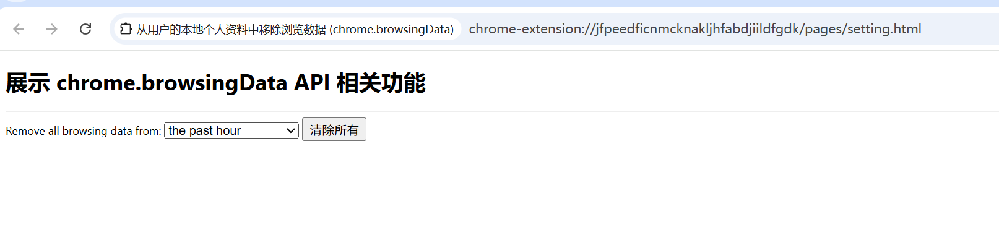
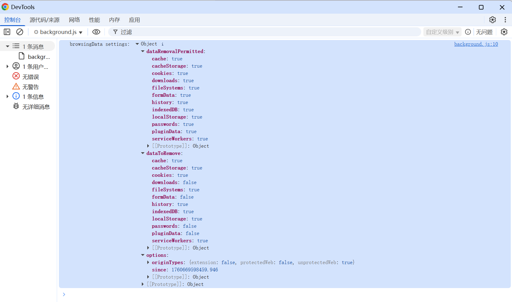

# 从用户的本地个人资料中移除浏览数据 展示 (chrome.browsingData)

> 使用 chrome.browsingData API 从用户的本地个人资料中移除浏览数据

## 数据类型
```
- appcache                  网站的应用缓存。
- cache                     浏览器的缓存。
- cacheStorage              stroge 缓存
- Cookie                    浏览器的 Cookie。
- downloads                 浏览器的下载列表。
- fileSystems               网站的文件系统。
- formData                  浏览器存储的表单数据。
- history                   浏览器的历史记录。
- indexedDB                 网站的 IndexedDB 数据。
- localStorage              网站的本地存储数据。
- passwords                 储的密码。
- pluginData                插件的数据 已移除对 Flash 的支持。系统将忽略此数据类型。
- serverBoundCertificates   与服务器绑定的证书。 已移除对服务器绑定证书的支持。系统将忽略此数据类型。
- serviceWorkers            Service Worker。
- webSQL                    网站的 WebSQL 数据。
```

## manifest.json
```json
{
    "permissions": [
        "browsingData"
    ]
}
```

## pages/setting.html
```html
<!doctype html>
<html lang="zh-CN">
    <body>
        <h1>展示 chrome.browsingData API 相关功能</h1>
        <hr/>
        <label for="timeframe">Remove all browsing data from:</label>
        <select id="timeframe">
            <option value="hour">the past hour</option>
            <option value="day">the past day</option>
            <option value="week">the past week</option>
            <option value="4weeks">the past four weeks</option>
            <option value="forever">the beginning of time</option>
        </select>
        <button id="clear-all-btn">清除所有</button>
    </body>
    <script src="../js/setting.js" type="module"></script>
</html>
```

## js/setting.js
```javascript

function parseMilliseconds(timeframe) {
    let now = new Date().getTime();
    let milliseconds = {
        hour: 60 * 60 * 1000,
        day: 24 * 60 * 60 * 1000,
        week: 7 * 24 * 60 * 60 * 1000,
        '4weeks': 4 * 7 * 24 * 60 * 60 * 1000
    };
    if (milliseconds[timeframe]) return now - milliseconds[timeframe];
    if (timeframe === 'forever') return 0;
    return null;
}

function buttonClicked(event) {
    event.preventDefault();
    const option = document.getElementById('timeframe');
    let selectedTimeframe = option.value;
    let removal_start = parseMilliseconds(selectedTimeframe);
    if (removal_start == undefined) {
        return null;
    }
    chrome.browsingData.remove(
        { since: removal_start },
        {
            appcache: true,
            cache: true,
            cacheStorage: true,
            cookies: true,
            downloads: true,
            fileSystems: true,
            formData: true,
            history: true,
            indexedDB: true,
            localStorage: true,
            serverBoundCertificates: true,
            serviceWorkers: true,
            pluginData: true,
            passwords: true,
            webSQL: true
        }
    );
    const success = document.createElement('div');
    success.classList.add('overlay');
    success.setAttribute('role', 'alert');
    success.textContent = 'Data has been cleared.';
    document.body.appendChild(success);

    setTimeout(function () {
        success.classList.add('visible');
    }, 10);
    setTimeout(function () {
        if (close === false) success.classList.remove('visible');
        else window.close();
    }, 4000);
}

window.addEventListener('DOMContentLoaded', function () {
    document.getElementById('clear-all-btn').addEventListener('click', buttonClicked);
});
```

## js/background.js
```javascript
// 点击 action 图标 打开配置页面
chrome.action.onClicked.addListener(openDemoTab);
function openDemoTab() {
    chrome.tabs.create({ url: 'pages/setting.html' });
}

// 报告“清除浏览数据”设置界面中当前选择了哪些类型的数据。
// 注意：此 API 中包含的某些数据类型在设置界面中不可用，并且某些界面设置可控制此处列出的多种数据类型。
chrome.browsingData.settings().then((settings) => {
    console.log('browsingData settings:', settings);
}).catch((error) => {
    console.error('Error fetching browsingData settings:', error);
});
```

## 效果



## 资料
```markdown
https://developer.chrome.com/docs/extensions/reference/api/browsingData?hl=zh-cn
https://github.com/GoogleChrome/chrome-extensions-samples/tree/main/api-samples/browsingData
```