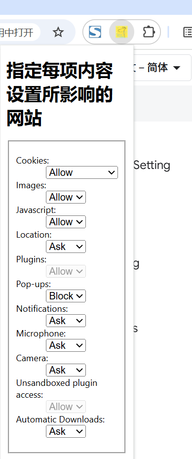

# 指定每项内容设置所影响的网站 展示 (chrome.contentSettings)

> 使用 chrome.contentSettings API 更改用于控制网站是否可以使用 Cookie、JavaScript 和插件等功能的设置
> 更一般地说，内容设置允许您按网站自定义 Chrome 的行为，而不是全局自定义

## 概念和用法
### 内容设置模式
您可以使用模式来指定每项内容设置所影响的网站。例如，https://*.youtube.com/* 指定了 youtube.com 及其所有子网域。
内容设置模式的语法与匹配模式的语法相同，但存在以下几点差异：

- 对于 http、https 和 ftp 网址，路径必须是通配符 (/*)。对于 file 网址，路径必须完全指定，并且不得包含通配符。
- 与匹配模式不同，内容设置模式可以指定端口号。如果指定了端口号，则该模式仅匹配具有该端口的网站。如果未指定端口号，则该模式会匹配所有端口。

### 模式优先级
如果有多条内容设置规则适用于特定网站，则具有更具体模式的规则优先适用。

例如，以下模式按优先级排序:

- https://www.example.com/*
- https://*.example.com/*（匹配 example.com 和所有子网域）
- <all_urls>（匹配所有网址）

有三种通配符会影响模式的具体程度:

- 端口中的通配符（例如 https://www.example.com:*/*）
- 方案中的通配符（例如 *://www.example.com:123/*）
- 主机名中的通配符（例如 https://*.example.com:123/*）

如果一个模式在某个部分比另一个模式更具体，但在另一部分则不太具体，系统会按以下顺序检查不同的部分：主机名、方案、端口。例如，以下格式按优先级排序:

- https://www.example.com:*/* 指定主机名和方案。
- *:/www.example.com:123/* 不如 高，因为虽然它指定了主机名，但未指定方案。
- https://*.example.com:123/* 较低，因为虽然它指定了端口和 scheme，但主机名中包含通配符。   

## 属性
```markdown
- automaticDownloads 是否允许网站自动下载多个文件 默认值为 ask 主网址是顶级框架的网址 不使用辅助网址 
    allow 允许网站自动下载多个文件
    block不允许网站自动下载多个文件；
    ask 在网站想要自动下载第一个文件之后的其他文件时，询问用户。 

- autoVerify 是否允许网站使用 Private State Tokens API默认值为 allow。 调用 set() 时，主要网址格式必须为 <all_urls>。不使用辅助网址。
    allow 允许网站使用 Private State Tokens API
    block 阻止网站使用 Private State Tokens API。 

- camera 是否允许网站访问摄像头  默认值为 ask。 主网址是请求相机访问权限的文档的网址。不使用辅助网址。 注意：如果两个模式均为“<all_urls>”，则“allow”设置无效
    allow：允许网站访问摄像头
    block：不允许网站访问摄像头
    ask 当网站想要访问摄像头时进行询问。

- clipboard 是否允许网站通过 Async Clipboard API 的高级功能访问剪贴板。“高级”功能包括在用户手势之后写入内置格式以外的任何内容，即读取能力、写入自定义格式的能力以及在没有用户手势的情况下写入的能力。默认值为 ask。 主网址是指请求剪贴板访问权限的文档的网址。不使用辅助网址。
    allow：允许网站使用高级剪贴板功能 
    block：不允许网站使用高级剪贴板功能
    ask：当网站想要使用高级剪贴板功能时进行询问。 

- cookies 是否允许网站设置 Cookie 和其他本地数据。 默认值为 allow。 主网址是指表示 Cookie 源站的网址。辅助网址是顶级框架的网址。
    allow：接受 Cookie；
    block：阻止 Cookie；
    session_only：仅接受当前会话的 Cookie。 

- images 是否显示图片。  默认值为 allow。 主网址是顶级框架的网址。辅助网址是图片的网址。
    allow：显示图片；
    block：不显示图片。

- javascript 是否运行 JavaScript。默认值为 allow。 主网址是顶级框架的网址。不使用辅助网址。
    allow：运行 JavaScript；
    block：不运行 JavaScript。

- location 是否允许地理定位。默认值为 ask。 主网址是请求位置数据的文档的网址。辅助网址是顶级框架的网址（可能与请求网址相同，也可能不同）。
    allow：允许网站跟踪您的实际位置。 
    block：不允许网站跟踪您的实际位置。 
    ask：在允许网站跟踪您的实际位置之前先询问。 

- microphone 是否允许网站使用麦克风。  默认值为 ask。 主网址是指请求麦克风访问权限的文档的网址。不使用辅助网址。 注意：如果两个模式均为“<all_urls>”，则“allow”设置无效。
    allow：允许网站访问麦克风；
    block：不允许网站访问麦克风；
    ask：在网站想要访问麦克风时进行询问。

- notifications 是否允许网站显示桌面通知。 默认值为 ask。 主网址是指想要显示通知的文档的网址。不使用辅助网址。
    allow：允许网站显示桌面通知；
    block：不允许网站显示桌面通知；
    ask：当网站想要显示桌面通知时进行询问。 

- popups 是否允许网站显示弹出式窗口。默认值为 block。 主网址是顶级框架的网址。不使用辅助网址。
    allow：允许网站显示弹出式窗口；
    block：不允许网站显示弹出式窗口。 

- fullscreen 已弃用。不再有任何效果。系统现在会自动为所有网站授予全屏权限。值始终为 allow。
- mouselock 已弃用。不再有任何效果。现在，系统会自动为所有网站授予鼠标锁定权限。值始终为 allow。
- plugins 已弃用。由于 Chrome 88 中移除了 Flash 支持，此权限不再有任何作用。值始终为 block。对 set() 和 clear() 的调用将被忽略。
- unsandboxedPlugins 已弃用。之前，此权限用于控制是否允许网站在沙盒外运行插件，不过，随着 Chrome 88 中移除了 Flash 代理进程，此权限不再有任何作用。值始终为 block。对 set() 和 clear() 的调用将被忽略。
```

## manifest.json 配置
```json
{
    "action": {
        "default_icon": "images/icon.png",
        "default_title": "展示 chrome.contentSettings API 相关功能",
        "default_popup": "pages/action.html"
    },
    "permissions": [
        "contentSettings",
        "tabs"
    ]
}
```

## pages/action.html 配置
```html
<!doctype html>
<html lang="zh-CN">
  <body>
    <h1>指定每项内容设置所影响的网站</h1>
    <fieldset>
      <dl>
        <dt><label for="cookies">Cookies: </label></dt>
        <dd>
          <select id="cookies" disabled>
            <option value="allow">Allow</option>
            <option value="session_only">Session only</option>
            <option value="block">Block</option>
          </select>
        </dd>
        <dt><label for="images">Images: </label></dt>
        <dd>
          <select id="images" disabled>
            <option value="allow">Allow</option>
            <option value="block">Block</option>
          </select>
        </dd>

        <dt><label for="javascript">Javascript: </label></dt>
        <dd>
          <select id="javascript" disabled>
            <option value="allow">Allow</option>
            <option value="block">Block</option>
          </select>
        </dd>
        <dt><label for="location">Location: </label></dt>
        <dd>
          <select id="location" disabled>
            <option value="allow">Allow</option>
            <option value="ask">Ask</option>
            <option value="block">Block</option>
          </select>
        </dd>
        <dt><label for="plugins">Plugins: </label></dt>
        <dd>
          <select id="plugins" disabled>
            <option value="allow">Allow</option>
            <option value="block">Block</option>
          </select>
        </dd>
        <dt><label for="popups">Pop-ups: </label></dt>
        <dd>
          <select id="popups" disabled>
            <option value="allow">Allow</option>
            <option value="block">Block</option>
          </select>
        </dd>
        <dt><label for="notifications">Notifications: </label></dt>
        <dd>
          <select id="notifications" disabled>
            <option value="allow">Allow</option>
            <option value="ask">Ask</option>
            <option value="block">Block</option>
          </select>
        </dd>
        <dt><label for="microphone">Microphone: </label></dt>
        <dd>
          <select id="microphone" disabled>
            <option value="allow">Allow</option>
            <option value="ask">Ask</option>
            <option value="block">Block</option>
          </select>
        </dd>
        <dt><label for="camera">Camera: </label></dt>
        <dd>
          <select id="camera" disabled>
            <option value="allow">Allow</option>
            <option value="ask">Ask</option>
            <option value="block">Block</option>
          </select>
        </dd>
        <dt>
          <label for="unsandboxedPlugins">Unsandboxed plugin access: </label>
        </dt>
        <dd>
          <select id="unsandboxedPlugins" disabled>
            <option value="allow">Allow</option>
            <option value="ask">Ask</option>
            <option value="block">Block</option>
          </select>
        </dd>
        <dt><label for="automaticDownloads">Automatic Downloads: </label></dt>
        <dd>
          <select id="automaticDownloads" disabled>
            <option value="allow">Allow</option>
            <option value="ask">Ask</option>
            <option value="block">Block</option>
          </select>
        </dd>
      </dl>
    </fieldset>
  </body>
  <script src="../js/action.js" type="module"></script>
</html>
```

## js/action.js 配置
```javascript
// 处理选择框变化事件
let incognito;
let url;

function settingChanged() {
    let type = this.id;
    let setting = this.value;
    let pattern = /^file:/.test(url) ? url : url.replace(/\/[^/]*?$/, '/*');
    console.log(type + ' setting for ' + pattern + ': ' + setting);
    // HACK: [type] is not recognised by the docserver's sample crawler, so
    // mention an explicit
    // type: chrome.contentSettings.cookies.set - See http://crbug.com/299634
    chrome.contentSettings[type].set({
        primaryPattern: pattern,
        setting: setting,
        // regular: 常规个人资料的设置（如果未在其他位置被覆盖，则无痕式个人资料会继承此设置 
        // incognito_session_only: 无痕式个人资料的设置，只能在无痕式会话期间设置，并在无痕式会话结束时删除（会覆盖常规设置）。
        scope: incognito ? 'incognito_session_only' : 'regular'
    });
}

document.addEventListener('DOMContentLoaded', function () {
    chrome.tabs.query({ active: true, currentWindow: true }, function (tabs) {
        let current = tabs[0];
        incognito = current.incognito;
        url = current.url;
        let types = [
            'cookies',
            'images',
            'javascript',
            'location',
            'popups',
            'notifications',
            'microphone',
            'camera',
            'automaticDownloads'
        ];
        types.forEach(function (type) {
            // HACK: [type] is not recognised by the docserver's sample crawler, so
            // mention an explicit
            // type: chrome.contentSettings.cookies.get - See http://crbug.com/299634
            chrome.contentSettings[type] &&
            chrome.contentSettings[type].get(
                {
                primaryUrl: url,
                incognito: incognito
                },
                function (details) {
                document.getElementById(type).disabled = false;
                document.getElementById(type).value = details.setting;
                }
            );
        });
    });

    let selects = document.querySelectorAll('select');
    for (let i = 0; i < selects.length; i++) {
        selects[i].addEventListener('change', settingChanged);
    }
});
```

## 效果


## 资料
```markdown
https://developer.chrome.com/docs/extensions/reference/api/contentSettings?hl=zh-cn
https://github.com/GoogleChrome/chrome-extensions-samples/tree/main/api-samples/contentSettings
```