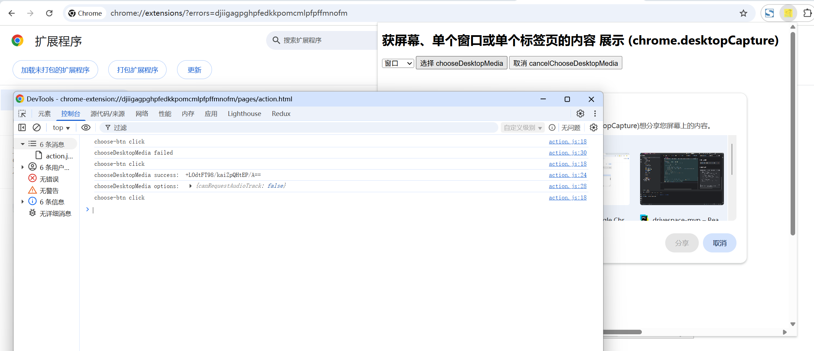

# 获屏幕、单个窗口或单个标签页的内容 展示 (chrome.desktopCapture)

> Desktop Capture API 可捕获屏幕、单个窗口或单个标签页的内容


## manifest.json 配置
```json
{
    "action": {
        "default_icon": "images/icon.png",
        "default_title": "展示 chrome.desktopCapture API 相关功能",
        "default_popup": "pages/action.html"
    },
    "permissions": [
        "desktopCapture"
    ]
}
```

## pages/action.html 配置
```html
<!doctype html>
<html lang="zh-CN">
    <head>
        <meta charset="utf-8">
        <title>展示 chrome.desktopCapture API 相关功能</title>
        <style>
            body {
                width: 1200px;
                height: 800px;
            }
        </style>
    </head>
    <body>
        <h1>获屏幕、单个窗口或单个标签页的内容 展示 (chrome.desktopCapture)</h1>
        <select id="type">
            <option value="screen">屏幕</option>
            <option value="window">窗口</option>
            <option value="tab">标签页</option>
            <option value="audio">音频</option>
        </select>
        <button id="choose-btn">选择 chooseDesktopMedia</button>
        <button id="cancel-btn">取消 cancelChooseDesktopMedia</button>
    </body>
    <script src="../js/action.js" type="module"></script>
</html>
```

## js/action.js 配置
```javascript
let id = null;

// 取消选择
document.getElementById('cancel-btn').addEventListener('click', () => {
    console.log('cancel-btn click');
    if (id) {
        chrome.desktopCapture.cancelChooseDesktopMedia(id).then(() => {
            console.log('cancelChooseDesktopMedia success');
        }).catch((error) => {
            console.log('cancelChooseDesktopMedia error: ', error);
        });
        id = null;
    }
});

// 选择
document.getElementById('choose-btn').addEventListener('click', () => {
    console.log('choose-btn click');
    let type = document.getElementById('type').value;
    chrome.desktopCapture.chooseDesktopMedia([type], (streamId,options) => {
        if (streamId) {
            // 一个不透明的字符串，可传递给 getUserMedia() API 以生成与用户选择的来源对应的媒体流。
            // 如果用户未选择任何来源（即取消了提示），则系统会使用空的 streamId 调用回调。创建的 streamId 只能使用一次，如果未使用，会在几秒后过期
            console.log('chooseDesktopMedia success: ', streamId);  // 
            id = streamId;

            // options.canRequestAudioTrack 如果“audio”包含在参数来源中，并且最终用户未取消选中“分享音频”复选框，则为 true。否则为 false，在这种情况下，不应通过 getUserMedia 调用请求音频流
            console.log('chooseDesktopMedia options: ', options);
        } else {
            console.log('chooseDesktopMedia failed');
        }
    });
});
```

## 效果


## 资料
```markdown
https://developer.chrome.com/docs/extensions/reference/api/desktopCapture?hl=zh-cn
```
