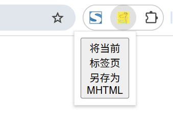
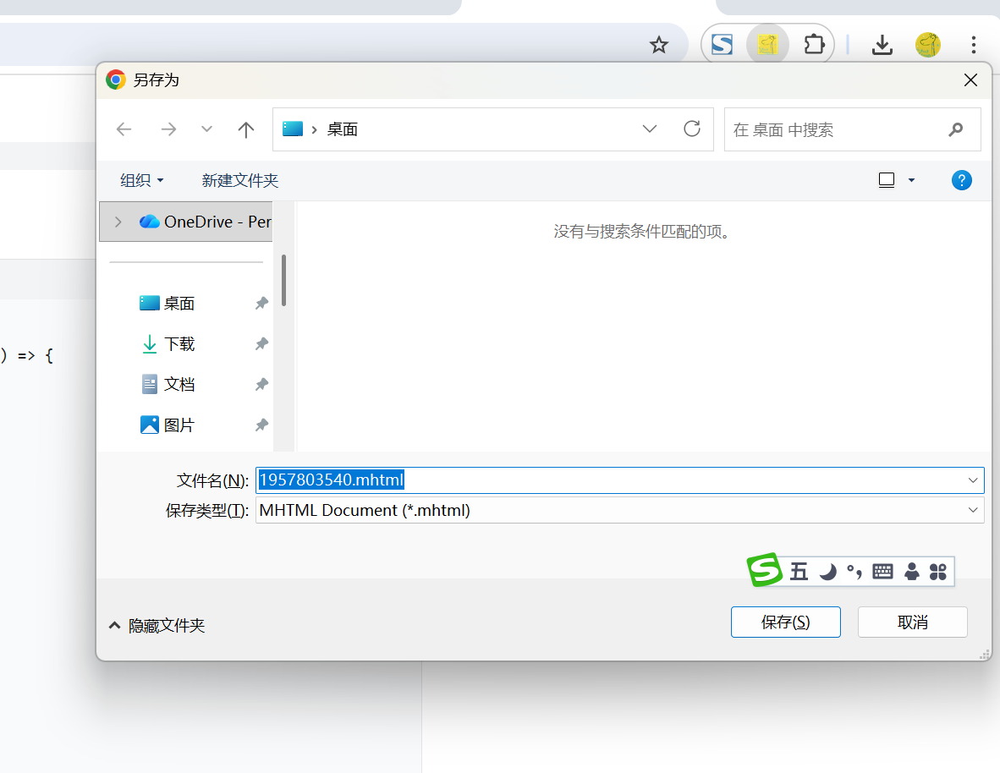

# 将标签页另存为 MHTML 展示 (chrome.pageCapture)

> 使用 chrome.pageCapture API 将标签页另存为 MHTML
> MHTML 是一种标准格式，大多数浏览器都支持这种格式。它将网页及其所有资源（CSS 文件、图片等）封装在一个文件中。
> 请注意，出于安全考虑，MHTML 文件只能从文件系统加载，并且只能在主框架中加载。

## manifest.json 配置
```json
{
    "action": {
        "default_icon": "images/icon.png",
        "default_title": "展示 chrome.pageCapture API 相关功能",
        "default_popup": "pages/action.html"
    },
    "permissions": [
        "pageCapture",
        "tabs"
    ]
}
```

## pages/action.html 代码
```html
<!doctype html>
<html lang="zh-CN">
    <head>
        <meta charset="utf-8">
        <title>展示 chrome.pageCapture API 相关功能</title>
    </head>
    <body>
        <button id="save-btn">将当前标签页另存为 MHTML</button>
    </body>
    <script src="../js/action.js" type="module"></script>
</html>
```

## js/action.js 代码
```javascript
// 点击按钮将当前标签页另存为 MHTML
document.getElementById('save-btn').addEventListener('click', () => {
    console.log('点击了将当前标签页另存为 MHTML 按钮');
    chrome.tabs.query({ active: true, currentWindow: true }, (tabs) => {
        let tabId = tabs[0].id;
        chrome.pageCapture.saveAsMHTML(
        { 
            tabId: tabId  // 要另存为 MHTML 的标签页的 ID
        }, 
        (mhtmlBlob) => {
            console.log(mhtmlBlob);
            if (chrome.runtime.lastError) {
                console.error(chrome.runtime.lastError.message);
                return;
            }
            // 将 Blob 转换为下载链接
            const url = URL.createObjectURL(mhtmlBlob);
            const a = document.createElement("a");
            a.href = url;
            a.download = tabId + ".mhtml"; // 文件名
            a.click();
            URL.revokeObjectURL(url); // 释放资源
        });
    });
});
```

## 运行效果



## 资料
```markdown
https://developer.chrome.com/docs/extensions/reference/api/pageCapture?hl=zh-cn
```