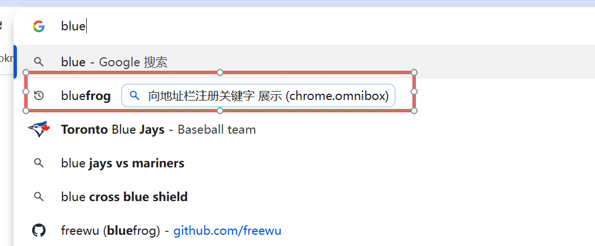
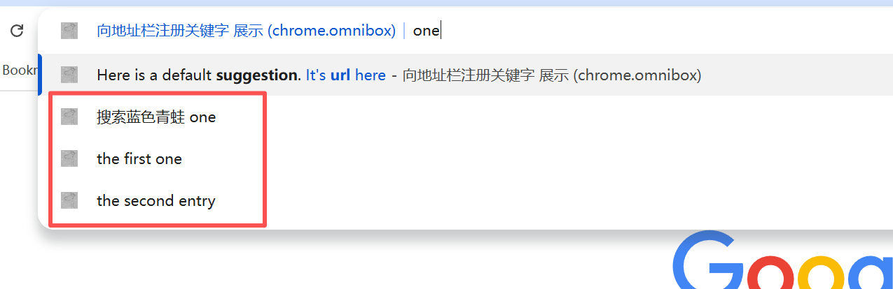
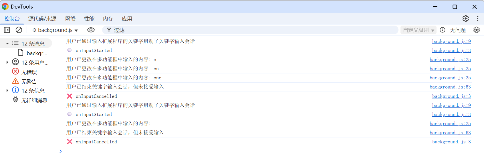

# 向地址栏注册关键字 展示 (chrome.omnibox)

> 当用户输入扩展程序的关键字后，便开始仅与您的扩展程序互动。每次按键操作都会发送到您的扩展程序，您可以提供建议作为响应
> 必须在清单中包含 "omnibox.keyword" 字段，才能使用多功能框 API。
> 还应指定一个 16x16 像素的图标，该图标会在建议用户进入关键字模式时显示在地址栏中

## manifest.json 配置
```json
{
    "icons":
    {
        "16": "images/icon.png",
        "48": "images/icon.png",
        "128": "images/icon.png"
    },
    "omnibox": { "keyword" : "bluefrog" },
    "background": {
        "service_worker": "js/background.js"
    },
    "permissions": [
        "omnibox",
        "tabs"
    ]
}
```

## js/background.js 代码
```javascript
const appendLog = (text) => {
    console.log(text);
    //chrome.runtime.sendMessage({ type: 'append-log', text });
};

// 用户已通过输入扩展程序的关键字启动了关键字输入会话。保证在每个输入会话中发送一次，并且在任何 onInputChanged 事件之前发送
chrome.omnibox.onInputStarted.addListener(function () {
    console.log("用户已通过输入扩展程序的关键字启动了关键字输入会话");
    appendLog('💬 onInputStarted');

    // 为默认建议设置说明和样式。默认建议是指显示在网址栏下方的第一个建议行中的文字
    // 网址下拉菜单中显示的文字。可以包含用于设置样式的 XML 样式标记。
    //      url   用于表示字面网址 <url></url
    //      match 用于突出显示与用户查询匹配的文本 <match></match>
    //      dim   用于表示暗淡的辅助文本样式可以嵌套，例如 <dim>dimmed text</dim>
    chrome.omnibox.setDefaultSuggestion({
        description:
        "Here is a default <match>suggestion</match>. <url>It's <match>url</match> here</url>"
    });
});

// 用户已更改在多功能框中输入的内容
chrome.omnibox.onInputChanged.addListener(function (text, suggest) {
    console.log(`用户已更改在多功能框中输入的内容: ${text}`);
    // 建议结果数组
    const suggestions = [
        {
            content: `bluefrog ${text}`,
            description: `搜索蓝色青蛙 ${text}`
        },
        { 
            content: text + ' one', 
            description: 'the first one', 
            deletable: true 
        },
        {
            content: text + ' number two',
            description: 'the second entry',
            deletable: true
        }
    ];
    suggest(suggestions);
});

// 用户已接受在多功能框中输入的内容
chrome.omnibox.onInputEntered.addListener(function (text, disposition) {
    appendLog( `✔️ onInputEntered: text -> ${text} | disposition -> ${disposition}`);
    console.log(`用户已接受在多功能框中输入的内容: ${text}`);
    // 多功能框查询的窗口处置。这是显示结果的推荐上下文。
    // 例如，如果多功能框命令是导航到某个网址，则“newForegroundTab”处置方式表示导航应在新选中的标签页中进行。
    // currentTab
    // newForegroundTab
    // newBackgroundTab
    console.log(`用户选择的操作: ${disposition}`);
    // todo 可以根据不同胡 disposition 做不同的操作
    const newURL = 'https://www.google.com/search?q=' + encodeURIComponent(text);
    chrome.tabs.create({ url: newURL });
});

// 用户已结束关键字输入会话，但未接受输入
chrome.omnibox.onInputCancelled.addListener(function () {
    console.log("用户已结束关键字输入会话，但未接受输入");
    appendLog('❌ onInputCancelled');
});

// 用户已删除建议的结果。
chrome.omnibox.onDeleteSuggestion.addListener(function (text) {
    console.log(`用户已删除建议的结果: ${text}`);
    appendLog('⛔ onDeleteSuggestion: ' + text);
});
```

## 效果





## 资料
```markdown
https://developer.chrome.com/docs/extensions/reference/api/omnibox?hl=zh-cn
https://github.com/GoogleChrome/chrome-extensions-samples/tree/main/api-samples/omnibox
```