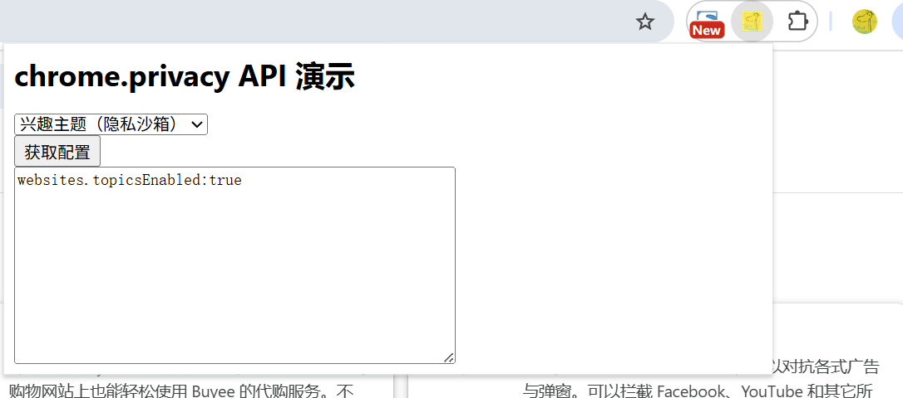

# 用户隐私管理 展示 (chrome.privacy)

> 使用 chrome.privacy API 来控制 Chrome 中可能会影响用户隐私的功能的使用情况。
> 此 API 依赖于 ChromeSetting 类型的 API 原型来获取和设置 Chrome 的配置项。

## manifest.json 配置
```json
{
    "action": {
        "default_icon": "images/icon.png",
        "default_title": "展示 chrome.privacy API",
        "default_popup": "pages/action.html"
    },
    "background": {
        "service_worker": "js/background.js"
    },
    "permissions": [
        "privacy"
    ]
}
```

## pages/action.html 代码
```html
<html lang="zh-cn">
  <head>
    <title>chrome.privacy API 演示</title>
    <style>
        body {
            width: 600px;
        }
    </style>
  </head>
  <body>
    <h1>chrome.privacy API 演示</h1>
    <label>
        <select id="config">
            <optgroup label="network">
                <option value="network.networkPredictionEnabled">网络预测功能</option>
                <option value="network.webRTCIPHandlingPolicy">WebRTC IP处理策略</option>
            </optgroup>
            <optgroup label="services">    
                <option value="services.alternateErrorPagesEnabled">替代错误页面</option>
                <option value="services.autofillAddressEnabled">地址自动填充</option>
                <option value="services.autofillCreditCardEnabled">信用卡自动填充</option>
                <option value="services.passwordSavingEnabled">密码保存</option>
                <option value="services.safeBrowsingExtendedReportingEnabled">安全浏览扩展报告</option>
                <option value="services.spellingServiceEnabled">拼写服务</option>
                <option value="services.searchSuggestEnabled">搜索建议</option>
                <option value="services.translationServiceEnabled">翻译服务</option>
            </optgroup>
            <optgroup label="websites">
                <option value="websites.adMeasurementEnabled">广告测量</option>
                <option value="websites.doNotTrackEnabled">不跟踪功能</option>
                <option value="websites.fledgeEnabled">FLEDGE（隐私沙箱）</option>
                <option value="websites.protectedContentEnabled">受保护内容</option>
                <option value="websites.referrersEnabled">引用来源发送</option>
                <option value="websites.relatedWebsiteSetsEnabled">相关网站集</option>
                <option value="websites.thirdPartyCookiesAllowed">第三方Cookie</option>
                <option value="websites.topicsEnabled">兴趣主题（隐私沙箱）</option>
            </optgroup>
        </select>
    </label>
    <br/>
    <button id="get-config-btn">获取配置</button>
    <br/>
    <textarea id="config-result" rows="10" cols="50"></textarea>
  </body>
  <script src="../js/action.js" type="module"></script>
</html>
```

## js/action.js 代码
```javascript
// 点击获取配置按钮
document.getElementById('get-config-btn').addEventListener('click', async () => {
    const config = document.getElementById('config').value;
    // 用.分隔配置项，获取配置项的最后一个部分作为显示的配置项名称
    const arr = config.split('.')

    // 自行使用 set 去做设置处理
    chrome.privacy[arr[0]][arr[1]].get({}, function(details) {
        // {levelOfControl: 'controllable_by_this_extension', value: true}
        console.log(details);
        document.getElementById('config-result').value = config + ":"  + details.value;
    });
});
```

## 效果



## 资料
```markdown
https://developer.chrome.com/docs/extensions/reference/api/privacy?hl=zh-cn
https://github.com/GoogleChrome/chrome-extensions-samples/tree/main/api-samples/privacy
```