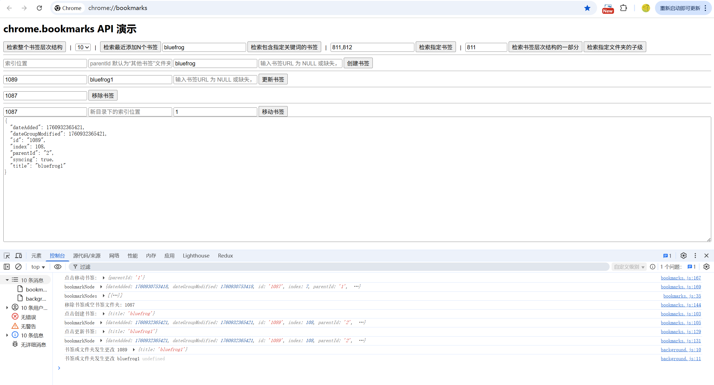

# 书签管理 展示 (chrome.bookmarks)

> 使用 chrome.bookmarks API 可创建、整理和以其他方式操作书签。
> 配合替换网页 chrome_url_overrides 设置，使用 chrome.bookmarks API 创建自定义胡书签管理器页面。

## manifest.json 配置
```json
{
    "action": {
        "default_icon": "images/icon.png",
        "default_title": "展示 chrome.bookmarks API"
    },
    "background": {
        "service_worker": "js/background.js"
    },
    "permissions": [
        "bookmarks"
    ],
    "chrome_url_overrides": {
        "bookmarks": "pages/bookmarks.html"
    }
}
```

## 效果



## 资料
```markdown
https://developer.chrome.com/docs/extensions/reference/api/bookmarks?hl=zh-cn
https://github.com/GoogleChrome/chrome-extensions-samples/tree/main/api-samples/bookmarks
```