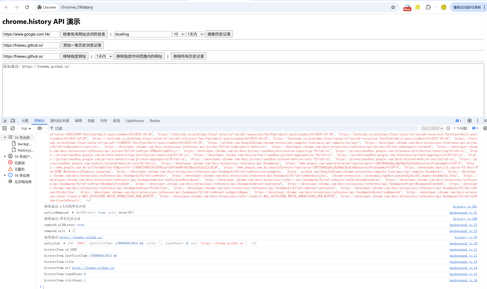

# 浏览器历史记录管理 展示 (chrome.history)

> 使用 chrome.history API 与浏览器记录的已访问页面进行互动。您可以在浏览器的历史记录中添加、移除和查询网址。
> 如需自定义历史记录页面，配合替换网页 chrome_url_overrides 设置。

## manifest.json 配置
```json
{
    "action": {
        "default_icon": "images/icon.png",
        "default_title": "展示 chrome.history API"
    },
    "background": {
        "service_worker": "js/background.js"
    },
    "permissions": [
        "history"
    ],
    "chrome_url_overrides": {
        "history": "pages/history.html"
    }
}
```

## 效果


## 资料
```markdown
https://developer.chrome.com/docs/extensions/reference/api/history?hl=zh-cn
https://github.com/GoogleChrome/chrome-extensions-samples/tree/main/api-samples/history
```