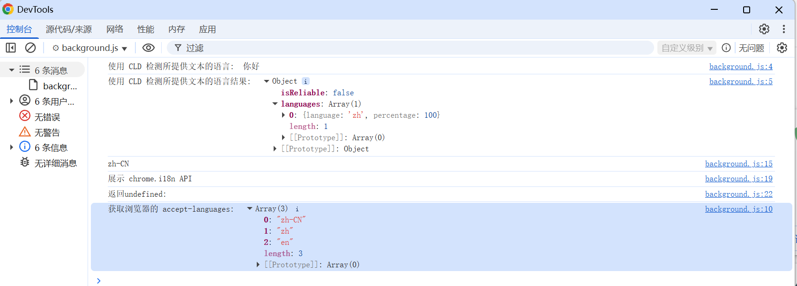

# 国际化 展示 (chrome.i18n)

> 使用 chrome.i18n 基础架构在整个应用或扩展程序中实现国际化


## 概念和用法
需要将其所有面向用户的字符串都放入名为 messages.json 的文件中。
每次添加新的语言区域时，都会在名为 /_locales/_{localeCode}_ 的目录下添加一个消息文件，其中 {localeCode} 是一个代码，例如 en 表示英语

> 如果扩展程序具有 /_locales 目录，则清单必须定义 "default_locale"

## 国际化的一些说明
- 您可以使用任何受支持的语言区域。如果您使用的语言区域不受支持，Google Chrome 会忽略该语言区域。

- 在 manifest.json 和 CSS 文件中，按如下方式引用名为 messagename 的字符串：
    ```json
        __MSG_messagename__
    ```

- 在扩展程序或应用的 JavaScript 代码中，按如下方式引用名为 messagename 的字符串：
    ```javascript
        chrome.i18n.getMessage("messagename")
    ```
- 在每次对 getMessage() 的调用中，您最多可以提供 9 个要包含在消息中的字符串

- 某些消息（例如 @@bidi_dir 和 @@ui_locale）由国际化系统提供。如需查看预定义消息名称的完整列表，请参阅预定义消息部分。

- 在 messages.json 中，每个面向用户的字符串都有一个名称、一个“message”项和一个可选的“description”项。该名称是一个键，例如“extName”或“search_string”，用于标识字符串。“message”指定相应语言区域中字符串的值。可选的“说明”可为翻译人员提供帮助，因为他们可能无法了解字符串在扩展程序中的使用方式。例如：
    ```json
    {
        "search_string": {
            "message": "hello%20world",
            "description": "The string we search for. Put %20 between words that go together."
        },
        ...
    }
    ```

## 目录格式
```
_locales/
    ├── en/
    │   └── messages.json
    ├── zh_CN/
    │   └── messages.json
```

## 消息文件格式
```json
{
    "message_name": {
        "message": "The string value in the current language.",
        "description": "An optional description of the message."
    },
    ...
}
```

## 预定义的消息
```
@@extension_id	扩展程序或应用 ID；您可以使用此字符串来构建扩展程序内资源的网址。即使是未本地化的扩展程序也可以使用此消息。
注意：您无法在清单文件中使用此消息。
@@ui_locale	当前语言区域；您可以使用此字符串来构建特定于语言区域的网址。
@@bidi_dir	当前语言区域的文字方向，对于从左到右书写的语言（例如英语），为“ltr”；对于从右到左书写的语言（例如阿拉伯语），为“rtl”。
@@bidi_reversed_dir	如果 @@bidi_dir 为“ltr”，则此值为“rtl”；否则为“ltr”。
@@bidi_start_edge	如果 @@bidi_dir 为“ltr”，则此值为“left”；否则为“right”。
@@bidi_end_edge	如果 @@bidi_dir 为“ltr”，则此值为“right”；否则为“left”。
```
以下示例展示了如何在 CSS 文件中使用 @@extension_id 构建网址：
```css
body {
  background-image:url('chrome-extension://__MSG_@@extension_id__/background.png');
}
```
如果扩展程序 ID 为 abcdefghijklmnopqrstuvwxyzabcdef，则上一个代码段中的粗体行将变为：
```css
  background-image:url('chrome-extension://abcdefghijklmnopqrstuvwxyzabcdef/background.png');
```
以下示例展示了如何在 CSS 文件中使用 @@bidi_* 消息：
```css
body {
  direction: __MSG_@@bidi_dir__;
}

div#header {
  margin-bottom: 1.05em;
  overflow: hidden;
  padding-bottom: 1.5em;
  padding-__MSG_@@bidi_start_edge__: 0;
  padding-__MSG_@@bidi_end_edge__: 1.5em;
  position: relative;
}
```
对于从左到右书写的语言（例如英语），粗体行变为：
```css
  dir: ltr;
  padding-left: 0;
  padding-right: 1.5em;
```

## 语言区域
| 语言区域代码 | 语言（地区） |
|------------|------------|
| ar         | 阿拉伯语    |
| am         | 阿姆哈拉语  |
| bg         | 保加利亚语  |
| bn         | 孟加拉语    |
| ca         | 加泰罗尼亚语|
| cs         | 捷克语      |
| da         | 丹麦语      |
| de         | 德语        |
| el         | 希腊语      |
| en         | 英语        |
| en_AU      | 英语（澳大利亚）|
| en_GB      | 英语（英国）|
| en_US      | 英语（美国）|
| es         | 西班牙语    |
| es_419     | 西班牙语（拉丁美洲和加勒比地区）|
| et         | 爱沙尼亚语  |
| fa         | 波斯语      |
| fi         | 芬兰语      |
| fil        | 菲律宾语    |
| fr         | 法语        |
| gu         | 古吉拉特语  |
| he         | 希伯来语    |
| hi         | 印地语      |
| hr         | 克罗地亚语  |
| hu         | 匈牙利语    |
| id         | 印度尼西亚语|
| it         | 意大利语    |
| ja         | 日语        |
| kn         | 卡纳达语    |
| ko         | 韩语        |
| lt         | 立陶宛语    |
| lv         | 拉脱维亚语  |
| ml         | 马拉雅拉姆语|
| mr         | 马拉地语    |
| ms         | 马来语      |
| nl         | 荷兰语      |
| no         | 挪威语      |
| pl         | 波兰语      |
| pt_BR      | 葡萄牙语（巴西）|
| pt_PT      | 葡萄牙语（葡萄牙）|
| ro         | 罗马尼亚语  |
| ru         | 俄语        |
| sk         | 斯洛伐克语  |
| sl         | 斯洛文尼亚语|
| sr         | 塞尔维亚语  |
| sv         | 瑞典语      |
| sw         | 斯瓦希里语  |
| ta         | 泰米尔语    |
| te         | 泰卢固语    |
| th         | 泰语        |
| tr         | 土耳其语    |
| uk         | 乌克兰语    |
| vi         | 越南语      |
| zh_CN      | 中文（中国）|
| zh_TW      | 中文（台湾）|

## 测试多语言
```
据需要创建任意数量的快捷方式，以便轻松进行多语言测试。例如：

path_to_chrome.exe --lang=en --user-data-dir=c:\chrome-profile-en
path_to_chrome.exe --lang=en_GB --user-data-dir=c:\chrome-profile-en_GB
path_to_chrome.exe --lang=ko --user-data-dir=c:\chrome-profile-ko
```

## mainfest.json 配置
```json
{
    "manifest_version": 3,
    "name": "__MSG_extension_name__",
    "version": "1.0",
    "description": "__MSG_extension_description__",
    "icons":
    {
        "16": "images/icon.png",
        "48": "images/icon.png",
        "128": "images/icon.png"
    },
    "default_locale": "en",
    "action": {
        "default_icon": "images/icon.png",
        "default_title": "__MSG_extension_title_"
    },
    "background": {
        "service_worker": "js/background.js"
    }
}
```

## js/background.js 代码
```javascript
// 使用 CLD 检测所提供文本的语言
let text = '你好'; // 要翻译的用户输入字符串
chrome.i18n.detectLanguage( text, function (result) {
    console.log("使用 CLD 检测所提供文本的语言: ", text);
    console.log("使用 CLD 检测所提供文本的语言结果: ", result);
});

// 获取浏览器的 accept-languages 这与浏览器使用的语言区域不同；如需获取语言区域，请使用 i18n.getUILanguage。
chrome.i18n.getAcceptLanguages(function (languages) {
    console.log("获取浏览器的 accept-languages: ",languages);
});

// 获取浏览器的浏览器界面语言
let lang = chrome.i18n.getUILanguage();
console.log(lang); // 浏览器界面语言代码，例如 en-US 或 fr-FR。

// 获取指定消息的本地化字符串。如果缺少消息，此方法会返回空字符串 ('')。如果 getMessage() 调用的格式有误（例如，messageName 不是字符串，或者 substitutions 数组的元素超过 9 个），此方法会返回 undefined。
let msg = chrome.i18n.getMessage('extension_title');
console.log(msg); // 扩展标题的本地化字符串

let msg1 = chrome.i18n.getMessage('extension_title1');
console.log("返回undefined:", msg1); // 扩展标题的本地化字符串 undefined
```

## 效果


## 资料
```markdown
https://developer.chrome.com/docs/extensions/reference/api/i18n?hl=zh-cn
https://github.com/GoogleChrome/chrome-extensions-samples/tree/main/_archive/mv2/extensions/news/
```