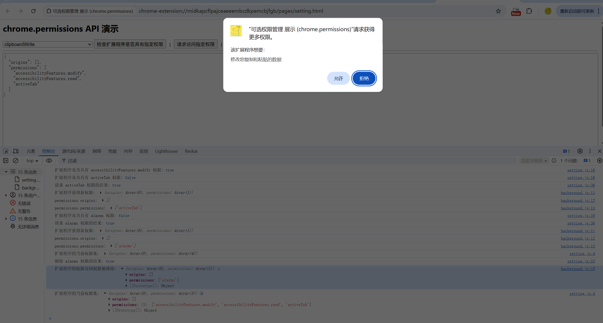
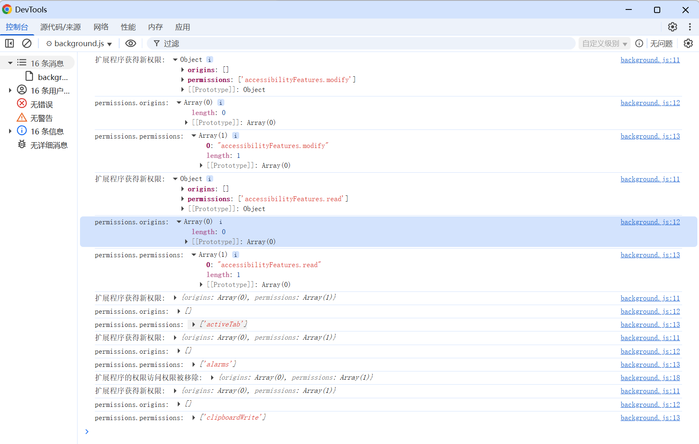

# 可选的权限 展示 (chrome.permissions)

> 使用 chrome.permissions API 在运行时（而非安装时）请求已声明为可选的权限，以便用户了解需要这些权限的原因，并仅授予必要的权限

## 不能指定为可选的权限
| 权限                   | 说明                                                             |
|-----------------------|------------------------------------------------------------------|
| debugger              | chrome.debugger API 可作为 Chrome 远程调试协议的替代传输方式。         |
| declarativeNetRequest | 授予扩展程序对 chrome.declarativeNetRequest API 的访问权限。          |
| devtools              | 允许扩展程序扩展 Chrome 开发者工具的功能。                             |
| geolocation           | 允许扩展程序使用 HTML5 地理定位 API。                                 |
| mdns                  | 授予扩展程序对 chrome.mdns API 的访问权限。                           |
| proxy                 | 授予扩展程序对 chrome.proxy API 的访问权限，以管理 Chrome 的代理设置。   |
| tts                   | chrome.tts API 用于播放合成的文字转语音 (TTS)。                       |
| ttsEngine             | chrome.ttsEngine API 使用扩展程序实现文字转语音 (TTS) 引擎。           |
| wallpaper             | 仅限 ChromeOS。使用 chrome.wallpaper API 更改 ChromeOS 壁纸。        |


## 可选的权限
| 权限                                 | 说明                                                                | 告警信息                                                 |
|-------------------------------------|---------------------------------------------------------------------|--------------------------------------------------------|
| accessibilityFeatures.modify        | 允许扩展程序在使用 chrome.accessibilityFeatures API 时修改无障碍功能状态。 | 更改无障碍设置。 |
| accessibilityFeatures.read          | 允许扩展程序在使用 chrome.accessibilityFeatures API 时读取无障碍功能状态。 | 查看您的无障碍设置。 |
| activeTab                           | 通过用户手势授予对当前标签页的临时访问权限。如需了解详情，请参阅 activeTab。    |  |
| alarms                              | 授予对 chrome.alarms API 的访问权限。                                   |  |
| audio                               | 授予对 chrome.audio API 的访问权限。                                    |  |
| background                          | 使 Chrome 提前启动（用户登录计算机后立即启动，在用户启动 Chrome 之前），并延迟关闭（即使在其最后一个窗口关闭后，也要等到用户明确退出 Chrome）。 |  |
| bookmarks                           | 授予对 chrome.bookmarks API 的访问权限。                                | 读取和更改您的书签。 |
| browsingData                        | 授予对 chrome.browsingData API 的访问权限。                             |  |
| certificateProvider                 | 授予对 chrome.certificateProvider API 的访问权限。                      |  |
| clipboardRead                       | 允许扩展程序使用 Web 平台 Clipboard API 粘贴剪贴板中的内容。               | 读取您复制和粘贴的数据。 |
| clipboardWrite                      | 允许扩展程序使用 Web 平台 Clipboard API 剪切和复制内容到剪贴板。            | 修改您复制和粘贴的数据。 |
| contentSettings                     | 授予对 chrome.contentSettings API 的访问权限。 | 网站对 Cookie、JavaScript、插件、地理位置信息、麦克风、摄像头等功能的使用权限。 |
| contextMenus                        | 授予对 chrome.contextMenus API 的访问权限。 |  |
| cookies                             | 授予对 chrome.cookies API 的访问权限。 |  |
| debugger                            | 授予对 chrome.debugger API 的访问权限。 | 访问页面调试程序后端。读取和更改您在所有网站上的所有数据。 |
| declarativeContent                  | 授予对 chrome.declarativeContent API 的访问权限。 |  |
| declarativeNetRequest               | 授予对 chrome.declarativeNetRequest API 的访问权限。 | 屏蔽所有页面上的内容。 |
| declarativeNetRequestWithHostAccess | 可访问 chrome.declarativeNetRequest API，但需要主机权限才能执行所有操作。 |  |
| declarativeNetRequestFeedback       | 授予使用 chrome.declarativeNetRequest API 时将错误和警告写入开发者工具控制台的权限。此权限适用于未封装的扩展程序， | 读取您的浏览记录。 |
| dns                                 | 授予对 chrome.dns API 的访问权限。                                                                       |  |
| desktopCapture                      | 授予对 chrome.desktopCapture API 的访问权限。 | 截取屏幕内容。 |
| documentScan                        | 授予对 chrome.documentScan API 的访问权限。 |  |
| downloads                           | 授予对 chrome.downloads API 的访问权限。 | 管理您的下载内容。 |
| downloads.open                      | 允许使用 chrome.downloads.open() | 管理您的下载内容。 |
| downloads.ui                        | 允许使用 chrome.downloads.setUiOptions() | 管理您的下载内容。 |
| enterprise.deviceAttributes         | 授予对 chrome.enterprise.deviceAttributes API 的访问权限。 |  |
| enterprise.hardwarePlatform         | 授予对 chrome.enterprise.hardwarePlatform API 的访问权限。 |  |
| enterprise.networkingAttributes     | 授予对 chrome.enterprise.networkingAttributes API 的访问权限。 |  |
| enterprise.platformKeys             | 授予对 chrome.enterprise.platformKeys API 的访问权限。 |  |
| favicon                             | 授予对 Favicon API 的访问权限。 | 查看您访问的网站的图标。 |
| fileBrowserHandler                  | 授予对 chrome.fileBrowserHandler API 的访问权限。 |  |
| fileSystemProvider                  | 授予对 chrome.fileSystemProvider API 的访问权限。 |  |
| fontSettings                        | 授予对 chrome.fontSettings API 的访问权限。 |  |
| gcm                                 | 授予对 chrome.gcm 和 chrome.instanceID API 的访问权限。 |  |
| geolocation                         | 允许扩展程序在不提示用户授予权限的情况下使用地理定位 API。 | 检测您所在的地理位置。 |
| history                             | 授予对 chrome.history API 的访问权限。 | 读取和更改您在所有已登录的设备上的浏览记录。 |
| identity                            | 授予对 chrome.identity API 的访问权限。 |  |
| identity.email                      | 通过 chrome.identity API 授予对用户电子邮件地址的访问权限。 | 请注意您的电子邮件地址。 |
| idle                                | 授予对 chrome.idle API 的访问权限。 |  |
| loginState                          | 授予对 chrome.loginState API 的访问权限。 |  |
| management                          | 授予对 chrome.management API 的访问权限。 | 管理您的应用、扩展程序和主题背景。 |
| nativeMessaging                     | 授予对原生消息传递 API 的访问权限。 | 与协作的原生应用进行通信。 |
| notifications                       | 授予对 chrome.notifications API 的访问权限。 | 显示通知 |
| offscreen                           | 授予对 chrome.offscreen API 的访问权限。 |  |
| pageCapture                         | 授予对 chrome.pageCapture API 的访问权限。 | 读取和更改您在所有网站上的所有数据。 |
| platformKeys                        | 授予对 chrome.platformKeys API 的访问权限。 |  |
| power                               | 授予对 chrome.power API 的访问权限。 |  |
| printerProvider                     | 授予对 chrome.printerProvider API 的访问权限。 |  |
| printing                            | 授予对 chrome.printing API 的访问权限。 |  |
| printingMetrics                     | 授予对 chrome.printingMetrics API 的访问权限。 |  |
| privacy                             | 授予对 chrome.privacy API 的访问权限。 | 更改与隐私权相关的设置。 | 
| processes                           | 授予对 chrome.processes API 的访问权限。 |  |
| proxy                               | 授予对 chrome.proxy API 的访问权限。 | 读取和更改您在所有网站上的所有数据。 |
| readingList                         | 授予对 chrome.readingList API 的访问权限。 | 读取和更改阅读清单中的条目。 |
| runtime                             | 可访问 runtime.connectNative() 和 runtime.sendNativeMessage()。对于 runtime 命名空间的所有其他功能，无需任何权限。 |  |
| scripting                           | 授予对 chrome.scripting API 的访问权限。 |  |
| search                              | 授予对 chrome.search API 的访问权限。 |  |
| sessions                            | 授予对 chrome.sessions API 的访问权限。 | 与 "history" 权限搭配使用时：读取和更改您在所有已登录的设备上的浏览记录。|
|                                     |                                      | 与 "tabs" 权限搭配使用时：读取您在所有已登录的设备上的浏览记录。 |
| sidePanel                           | 授予对 chrome.sidePanel API 的访问权限。 |  |
| storage                             | 授予对 chrome.storage API 的访问权限。 |  |
| system.cpu                          | 授予对 chrome.system.cpu API 的访问权限。 |  |
| system.display                      | 授予对 chrome.system.display API 的访问权限。 |  |
| system.memory                       | 授予对 chrome.system.memory API 的访问权限。 |  |
| system.storage                      | 授予对 chrome.system.storage API 的访问权限。 | 识别并弹出存储设备。 |
| tabCapture                          | 授予对 chrome.tabCapture API 的访问权限。 | 读取和更改您在所有网站上的所有数据。 |
| tabGroups                           | 授予对 chrome.tabGroups API 的访问权限。 | 查看和管理您的标签页组。 |
| tabs                                | 授予对多个 API（包括 chrome.tabs 和 chrome.windows）使用的标签页对象的特许字段的访问权限。通常不需要声明此权限即可使用这些 API。 | 读取您的浏览记录。 |
| topSites                            | 授予对 chrome.topSites API 的访问权限。 | 查看您最常访问的网站列表。 |      
| tts                                 | 授予对 chrome.tts API 的访问权限。 |  |
| ttsEngine                           | 授予对 chrome.ttsEngine API 的访问权限。 | 使用合成语音朗读所说出的所有文字。 |
| unlimitedStorage                    | 为 chrome.storage.local、IndexedDB、Cache Storage 和 Origin Private File System 提供不限配额。如需了解详情，请参阅存储空间和 Cookie。 |  |
| userScripts                         | 授予对 chrome.userScripts API 的访问权限。注意：用户还必须明确启用用户脚本的使用。 |  |
| vpnProvider                         | 授予对 chrome.vpnProvider API 的访问权限。 |  |
| wallpaper                           | 授予对 chrome.wallpaper API 的访问权限。 |  |
| webAuthenticationProxy              | 授予对 chrome.webAuthenticationProxy API 的访问权限。 | 读取和更改您在所有网站上的所有数据。 |
| webNavigation                       | 授予对 chrome.webNavigation API 的访问权限。 | 读取您的浏览记录。 |
| webRequest                          | 授予对 chrome.webRequest API 的访问权限。 |  |
| webRequestBlocking                  | 允许使用 chrome.webRequest API 进行屏蔽。 |  |


## manifest.json 配置
```json
{
    "background": {
        "service_worker": "js/background.js"
    },
    "action": {
        "default_icon": "images/icon.png",
        "default_title": "展示 chrome.permissions API"
    },
    "optional_permissions": [
        "accessibilityFeatures.modify",
        "accessibilityFeatures.read",
        "activeTab",
        "alarms",
        "background",
        "bookmarks",
        "browsingData",
        "clipboardRead",
        "clipboardWrite",
        "contentSettings",
        "contextMenus",
        "cookies",
        "declarativeContent",
        "declarativeNetRequestWithHostAccess",
        "declarativeNetRequestFeedback",
        "desktopCapture",
        "downloads",
        "downloads.open",
        "downloads.ui",
        "favicon",
        "gcm",
        "history",
        "identity",
        "identity.email",
        "idle",
        "management",
        "nativeMessaging",
        "notifications",
        "offscreen",
        "pageCapture",
        "power",
        "privacy",
        "readingList",
        "scripting",
        "search",
        "sessions",
        "sidePanel",
        "storage",
        "system.cpu",
        "system.display",
        "system.memory",
        "system.storage",
        "tabCapture",
        "tabGroups",
        "tabs",
        "topSites",
        "userScripts",
        "webNavigation",
        "webRequest"
    ],
    "optional_host_permissions": [
        "*://*/*"
    ]
}
```

## 效果



## 资料
```markdown
https://developer.chrome.com/docs/extensions/reference/api/permissions?hl=zh-cn
```