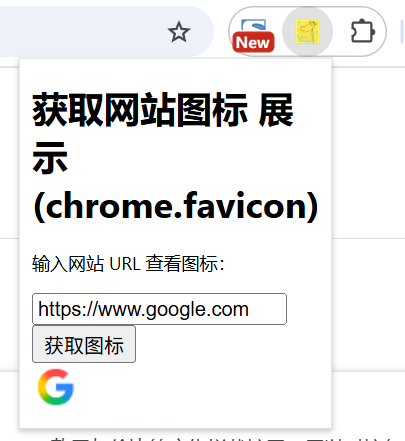

# 获取网站图标 展示 (chrome.favicon)

## 访问网站的图标
```markdown
如需检索网站的 Favicon，您需要构建以下网址

    chrome-extension://EXTENSION_ID/_favicon/?pageUrl=EXAMPLE_URL&size=FAV_SIZE

- EXTENSION_ID  扩展程序的 ID。
- EXAMPLE_URL   网站图标所属网站的网址。
- FAV_SIZE      favicon 的大小。最常见的尺寸为 16 x 16 像素。
```

## manifest.json 配置
```json
{
    "permissions": [
        "favicon"
    ]
}
```

## 效果



## 资料
```markdown
https://developer.chrome.com/docs/extensions/how-to/ui/favicons?hl=zh-cn
https://github.com/GoogleChrome/chrome-extensions-samples/
```