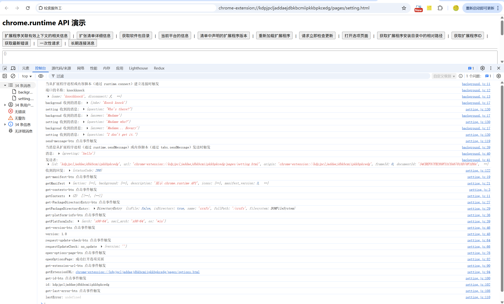

# 检索服务工作线程、返回清单的相关详细信息，以及监听和响应扩展程序生命周期中的事件 展示 (chrome.runtime)

> 此 API 的大多数成员都不需要任何权限。connectNative()、sendNativeMessage() 和 onNativeConnect 需要此权限

## 使用领域
- 消息传递

    您的扩展程序可以使用以下方法和事件与扩展程序内的不同上下文以及其他扩展程序进行通信：connect()、onConnect、onConnectExternal、sendMessage()、onMessage 和 onMessageExternal。
    此外，您的扩展程序可以使用 connectNative() 和 sendNativeMessage() 将消息传递给用户设备上的原生应用。

- 访问扩展程序和平台元数据
    
    检索有关扩展程序和平台的几项特定元数据。此类别中的方法包括 getManifest() 和 getPlatformInfo()。

- 管理扩展程序生命周期和选项

    这些属性可让您对扩展程序执行一些元操作，并显示选项页面。 
    此类别中的方法和事件包括 onInstalled、onStartup、openOptionsPage()、reload()、requestUpdateCheck() 和 setUninstallURL()。

- 辅助实用程序
    
    提供实用程序，例如将内部资源表示形式转换为外部格式。此类别中的方法包括 getURL()。

- 自助服务终端模式实用程序
    
    这些方法仅在 ChromeOS 上可用，主要用于支持自助服务终端实现。 此类别中的方法包括 restart() 和 restartAfterDelay()。


## 声明选项页面行为

> 附加信息选项网页分为两类：完整网页和嵌入式。类型 取决于其在清单中的声明方式。

- 完整网页选项页面
    
    系统会在新标签页中显示整页选项页面。在清单中的 "options_page" 字段中注册选项 HTML 文件
    ```json
    {
        "options_page": "pages/options.html",
    }
    {
        "options_ui": {
            "page": "pages/options.html",
            "open_in_tab": true,
        }
    }
    ``` 


- 嵌入式选项

    通过嵌入式选项页，用户无需离开 嵌入框中的扩展程序管理页面。要声明嵌入选项，
    请注册 HTML 文件（位于扩展程序清单中的 "options_ui" 字段下），并将 "open_in_tab" 键设为 false
    ```json
    {
        "options_ui": {
            "page": "pages/options.html",
            "open_in_tab": false,
        }
    }
    ```

## manifest.json 配置
```json
{
    "action": {
        "default_icon": "images/icon.png",
        "default_title": "展示 chrome.permissions API"
    },
    "background": {
        "service_worker": "js/background.js"
    },
    "permissions": [
        "nativeMessaging"
    ],
    "options_ui": {
        "page": "pages/options.html",
        "open_in_tab": false
    }
}
```

## 展示效果


## 资料
```markdown
https://developer.chrome.com/docs/extensions/reference/api/runtime?hl=zh-cn
https://github.com/GoogleChrome/chrome-extensions-samples/tree/main/api-samples/web-accessible-resources
https://developer.chrome.com/docs/extensions/develop/concepts/messaging?hl=zh-cn
https://developer.chrome.com/docs/extensions/develop/ui/options-page?hl=zh-cn#full_page
https://developer.chrome.com/docs/extensions/reference/manifest/web-accessible-resources?hl=zh-cn
```