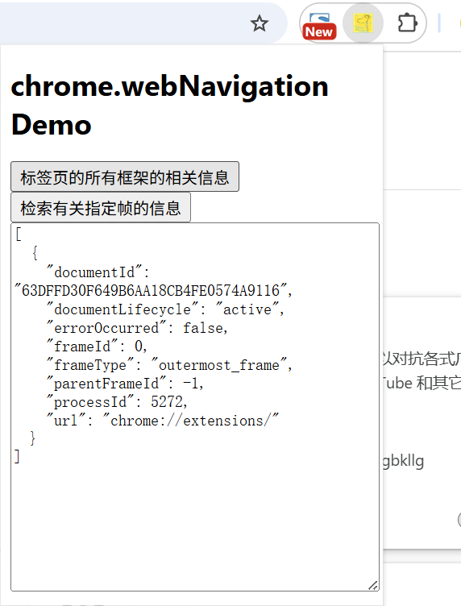
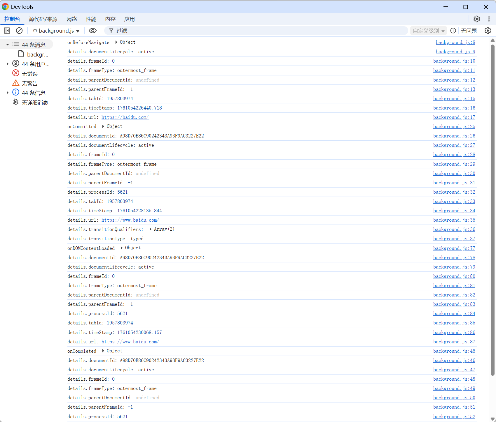

# 接收有关正在处理的导航请求的状态的通知 展示 (chrome.webNavigation)

> 使用 chrome.webNavigation API 接收有关正在处理的导航请求的状态的通知

## 活动顺序
对于成功完成的导航，系统会按以下顺序触发事件：

    onBeforeNavigate -> onCommitted -> [onDOMContentLoaded] -> onCompleted

如果在此过程中发生任何错误，系统会生成 onErrorOccurred 事件。对于特定导航，在 onErrorOccurred 之后不会再触发其他事件。

如果导航框架包含子框架，则其 onCommitted 会在任何子框架的 onBeforeNavigate 之前触发；而 onCompleted 会在所有子框架的 onCompleted 之后触发。

如果帧的参考 fragment 发生更改，则会触发 onReferenceFragmentUpdated 事件。此事件可以在 onDOMContentLoaded 之后的任何时间触发，甚至在 onCompleted 之后触发。

如果使用 History API 修改帧的状态（例如，使用 history.pushState()），系统会触发 onHistoryStateUpdated 事件。此事件可在 onDOMContentLoaded 之后的任何时间触发。

如果导航从往返缓存中恢复了网页，则不会触发 onDOMContentLoaded 事件。由于内容在首次访问网页时已完成加载，因此不会触发该事件。

如果导航是使用 Chrome Instant 或 Instant Pages 触发的，则会将完全加载的网页替换到当前标签页中。在这种情况下，系统会触发 onTabReplaced 事件。

## 过渡限定符
| 过渡限定符         | 说明                                                       |
| ---------------- | ---------------------------------------------------------- |
| client_redirect  | 在导航期间，网页上由 JavaScript 或元刷新标记导致了一个或多个重定向。 |
| server_redirect  | 在导航期间，由于服务器发送的 HTTP 标头而发生了一次或多次重定向。     |
| forward_back     | 用户使用"前进"或"后退"按钮发起导航。                             |
| from_address_bar | 用户从地址栏（也称为多功能框）发起导航。                          |

## UrlFilter 根据各种条件过滤网址 (所有条件均区分大小写)
```markdown 
- cidrBlocks

    string[] 
    如果网址的主机部分是 IP 地址，并且包含在数组中指定的任何 CIDR 地址块中，则匹配。

- hostContains

    string 
    如果网址的主机名包含指定字符串，则匹配。
    如需测试主机名组件是否具有前缀“foo”，请使用 hostcontains: “.foo”。这与“www.foobar.com”一致和“foo.com”，因为在主机名的开头添加了隐式点。同样，hostcontains 可用于匹配组件后缀（“foo.”）及与组件（“.foo.”）完全匹配。
    由于在主机名末尾未添加隐式点，因此最后组件的后缀和完全匹配需要使用 host 最终到达网址后缀 单独执行。

- hostEquals

    string 
    如果网址的主机名等于指定字符串，则匹配。

- hostPrefix

    string 
    如果网址的主机名以指定字符串开头，则匹配。

- hostSuffix

    string 
    如果网址的主机名以指定字符串结尾，则匹配。

- originAndPathMatches

    string 
    如果不带查询片段和片段标识符的网址与指定的正则表达式匹配，则匹配。如果端口号与默认端口号匹配，则会从网址中删除。正则表达式使用 RE2 语法。

- pathContains

    如果网址的路径段包含指定字符串，则匹配。

- pathEquals

    如果网址的路径段等于指定字符串，则匹配。

- pathPrefix

    如果网址的路径段以指定字符串开头，则匹配。

- pathSuffix

    如果网址的路径段以指定字符串结尾，则匹配。

- ports

    如果网址的端口包含在任何指定端口列表中，则匹配。例如，[80, 443, [1000, 1200]] 会匹配端口 80、443 上以及 1000-1200 范围内的所有请求。

- queryContains

    如果网址的查询段包含指定字符串，则匹配。

- queryEquals

    如果网址的查询段等于指定字符串，则匹配。

- queryPrefix

    如果网址的查询片段以指定字符串开头，则匹配。

- querySuffix

    如果网址的查询片段以指定字符串结尾，则匹配。

- schemes

    如果网址的架构等于数组中指定的任何架构，则匹配。

- urlContains

    如果网址（不含片段标识符）包含指定字符串，则匹配。如果端口号与默认端口号匹配，则会从网址中删除。

- urlEquals

    在网址（不含片段标识符）等于指定字符串时匹配。如果端口号与默认端口号匹配，则会从网址中删除。

- urlMatches

    如果网址（不带片段标识符）与指定的正则表达式匹配，则匹配。如果端口号与默认端口号匹配，则会从网址中删除。正则表达式使用 RE2 语法。

- urlPrefix

    如果网址（不带片段标识符）以指定字符串开头，则匹配。如果端口号与默认端口号匹配，则会从网址中删除。

- urlSuffix

    如果网址（无片段标识符）以指定字符串结尾，则匹配。如果端口号与默认端口号匹配，则会从网址中删除
```

## manifest.json

```json
{
    "background": {
        "service_worker": "js/background.js"
    },
    "action": {
        "default_icon": "images/icon.png",
        "default_title": "展示 chrome.webNavigation API",
        "default_popup": "pages/action.html"
    },
    "permissions": [
        "webNavigation",
        "tabs"
    ]
}
```

## 效果展示



## 资料
```markdown
https://developer.chrome.com/docs/extensions/reference/api/webNavigation?hl=zh-cn
https://github.com/GoogleChrome/chrome-extensions-samples/tree/main/api-samples/webNavigation
https://developer.chrome.com/docs/extensions/reference/api/events?hl=zh-cn#type-UrlFilter
https://developer.chrome.com/docs/extensions/reference/api/extensionTypes?hl=zh-cn
```