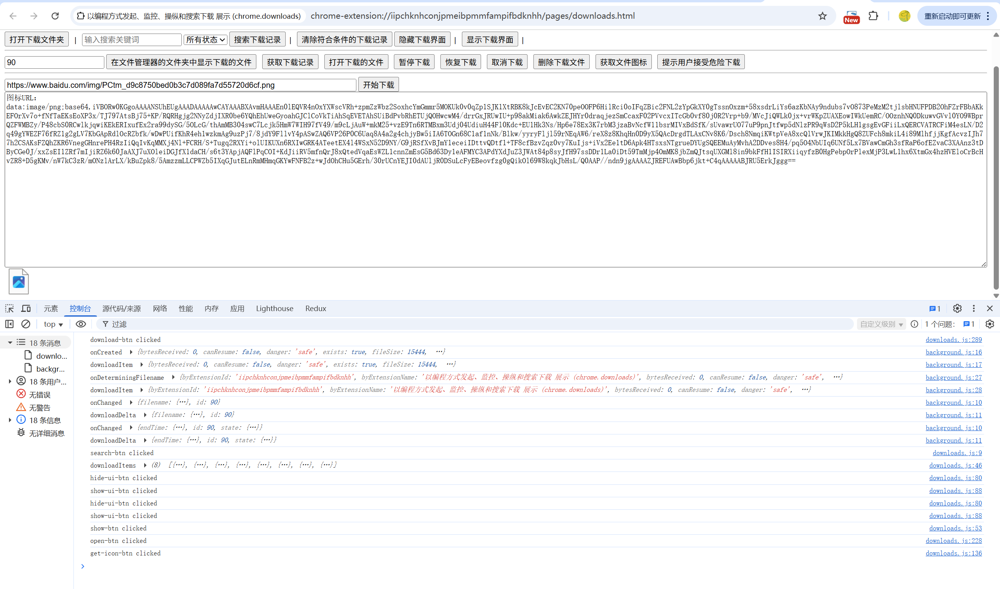

# 以编程方式发起、监控、操纵和搜索下载 展示 (chrome.downloads)

> 使用 chrome.downloads API 以编程方式发起、监控、操纵和搜索下载


## manifest.json 配置
```json
{
    "action": {
        "default_icon": "images/icon.png",
        "default_title": "展示 chrome.downloads API"
    },
    "background": {
        "service_worker": "js/background.js"
    },
    "permissions": [
        "downloads",
        "downloads.ui",
        "downloads.open"
    ]
}
```

## 效果


## 资料
```markdown
https://developer.chrome.com/docs/extensions/reference/api/downloads?hl=zh-cn
https://github.com/GoogleChrome/chrome-extensions-samples/tree/main/_archive/mv2/api/downloads
```