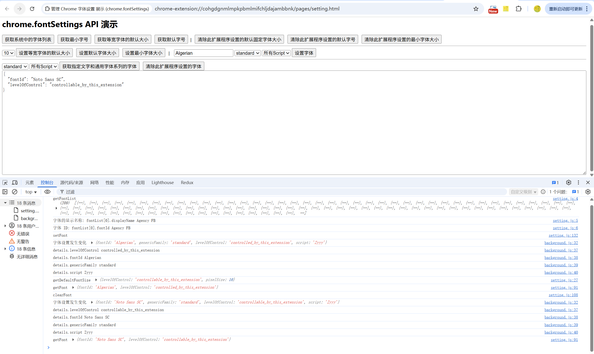

# 管理 Chrome 字体设置 展示 (chrome.fontSettings)

> 使用 chrome.fontSettings API 管理 Chrome 的字体设置

## 概念和用法

Chrome 允许某些字体设置取决于某些通用字体系列和语言文字。例如，用于无衬线简体中文字体的字体可能与用于衬线日文字体的字体不同。

Chrome 支持的通用字体系列基于 CSS 通用字体系列，并列在 GenericReference 下。当网页指定了通用字体系列时，Chrome 会根据相应设置选择字体。如果未指定任何通用字体系列，Chrome 会使用“标准”通用字体系列的设置。

当网页指定语言时，Chrome 会根据相应语言文字的设置选择字体。如果未指定语言，Chrome 会使用默认脚本或全局脚本的设置。

受支持的语言文字由 ISO 15924 文字代码指定，并列在 ScriptCode 下。从技术上讲，Chrome 设置并非严格按脚本进行，还取决于语言。例如，当网页指定俄语时，Chrome 会选择西里尔文字体（ISO 15924 文字代码“Cyrl”），并且不仅将此字体用于西里尔文字，还会用于该字体涵盖的所有内容，例如拉丁文字

## 示例
### 获取阿拉伯语的标准字体。
```javascript
chrome.fontSettings.getFont(
    { 
        genericFamily: 'standard', script: 'Arab' 
    },
    function(details) { 
        console.log(details.fontId); 
    }
);
```
### 为日语设置了无衬线字体。
```javascript
chrome.fontSettings.setFont(
    { 
        genericFamily: 'sansserif', 
        script: 'Jpan', 
        fontId: 'MS PGothic' 
    }
);
```

## manifest.json 配置
```json
{
    "permissions": [
        "fontSettings"
    ]
}
```

## 效果展示


## 资料
```markdown
https://developer.chrome.com/docs/extensions/reference/api/fontSettings?hl=zh-cn
https://github.com/GoogleChrome/chrome-extensions-samples/tree/main/api-samples/fontSettings
```