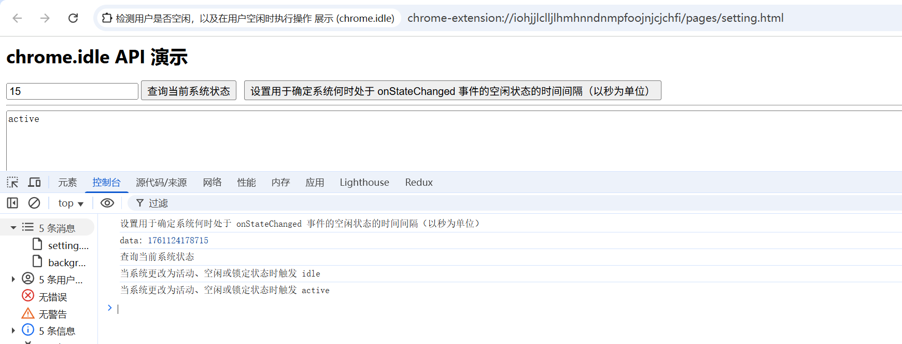

# 检测用户是否空闲，以及在用户空闲时执行操作 展示 (chrome.idle)

> 使用 chrome.idle API 检测机器的空闲状态何时发生变化


## manifest.json 配置
```json
{
    "permissions": [
        "idle"
    ]
}
```

## 效果展示



## 资料
```markdown
https://developer.chrome.com/docs/extensions/reference/api/idle?hl=zh-cn
```