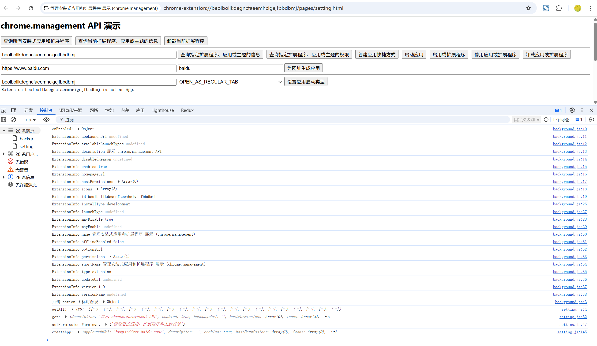

# 管理安装式应用和扩展程序 展示 (chrome.management)

> chrome.management API 提供了管理安装式应用和扩展程序的方式
> management.getPermissionWarningsByManifest()、management.uninstallSelf() 和 management.getSelf() 不需要管理权限

## manifest.json 配置
```json
{
    "permissions": [
        "management"
    ]
}
```

## 效果展示


## 资料
```markdown
https://developer.chrome.com/docs/extensions/reference/api/management?hl=zh-cn
```