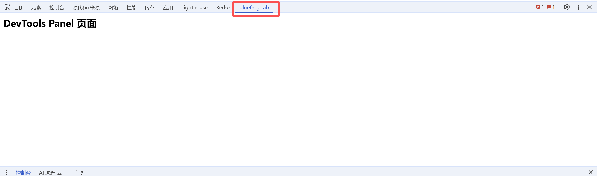
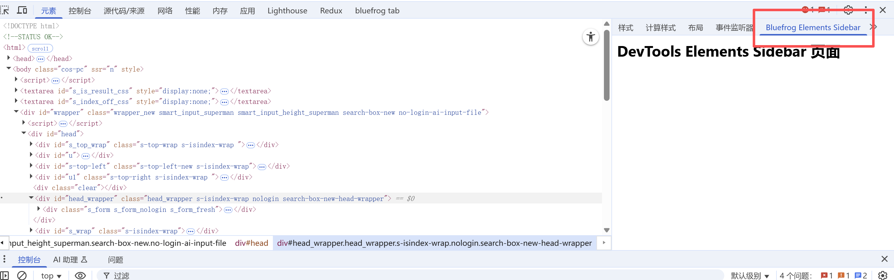
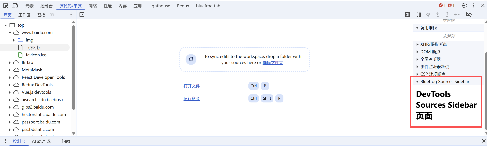
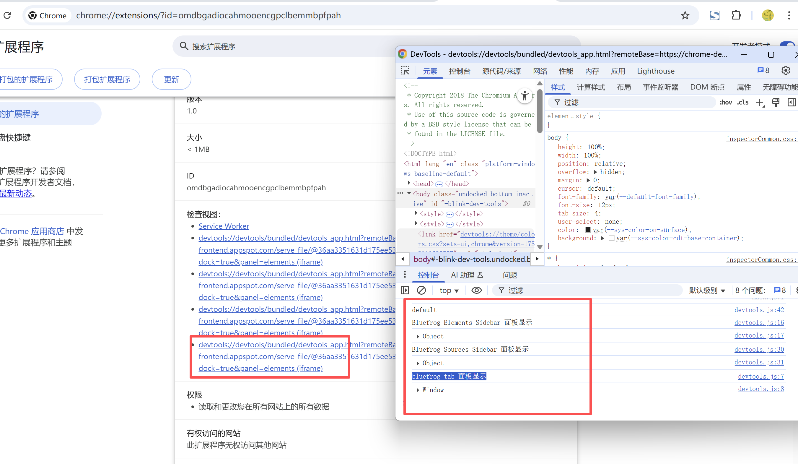

# 开发者工具 展示 (chrome.devtools.*)

> 每打开一个开发者工具窗口，都会创建devtools页面的实例，F12窗口关闭，页面也随着关闭，所以devtools页面的生命周期和devtools窗口是一致的。
> devtools页面可以访问一组特有的`DevTools API`以及有限的扩展API，这组特有的`DevTools API`只有devtools页面才可以访问，background都无权访问，
> 这些API包括：
- `chrome.devtools.panels` 创建自己的面板、访问现有面板和添加边栏
    使用 chrome.devtools.panels API 将扩展程序集成到开发者工具窗口界面中：创建自己的面板、访问现有面板和添加边栏
- `chrome.devtools.inspectedWindow` 获取被审查窗口的有关信息
    使用 chrome.devtools.inspectedWindow API 与检查的窗口进行交互：获取被检查页面的标签页 ID、在被检查的窗口中评估代码、重新加载页面或者获取页面中的资源列表
- `chrome.devtools.network` 获取有关网络请求的信息
    使用 chrome.devtools.network API 检索由开发者工具在“Network”面板中显示的网络请求的相关信息
- `chrome.devtools.performance` 监听网络请求
    使用 chrome.devtools.performance API 监听开发者工具“性能”面板中的录制状态更新
- `chrome.devtools.recorder` 监听录制状态更新
    使用 chrome.devtools.recorder API 自定义开发者工具中的“Recorder”面板

大部分扩展API都无法直接被 `DevTools` 页面调用，但它可以像`content-script` 一样直接调用 `chrome.extension` 和 `chrome.runtime` API，同时它也可以像 `content-script`一样使用Message交互的方式与background页面进行通信。


## manifest.json 配置
```json
{
    "devtools_page": "pages/devtools.html",
    "background": {
        "service_worker": "js/background.js"
    }
}
```

## pages/devtools.html 页面 (主要为了引入 js/devtools.js)
```html
<html lang="zh-cn">
  <style>
  </style>
  <body>
    <h1>Dev Tools 页面</h1>
  </body>
  <script src="../js/devtools.js"></script>
</html>
```

## js/devtools.js 脚本
```js
// Devtools 主面板
chrome.devtools.panels.create(
    "bluefrog tab",  "images/icon.png", "pages/devtools-panel.html",
    function(panel) { 
        panel.onShown.addListener(function(window) {
            // 当面板显示时执行的代码
            console.log("bluefrog tab 面板显示");
            console.log(window);
        });
    }
);

// Devtools 元素 侧边面板
chrome.devtools.panels.elements.createSidebarPane("Bluefrog Elements Sidebar",
    function(sidebar) {
        console.log("Bluefrog Elements Sidebar 面板显示");
        console.log(sidebar);
        // 在边栏窗格中显示内容：
        //     HTML 内容：调用 setPage() 可指定要在窗格中显示的 HTML 页面。
        //     JSON 数据：将 JSON 对象传递给 setObject()。
        //     JavaScript 表达式：将表达式传递给 setExpression()。开发者工具会在被检查网页的上下文中评估表达式，然后显示返回值。
        //sidebar.setObject({ some_data: "Some data to show", "author": "bluefrog" }); // JSON 数据
        //sidebar.setExpression("document.title"); // JavaScript 表达式
        sidebar.setPage("pages/devtools-elements-sidebar.html"); // HTML 内容
});

// Devtools 源码 侧边面板
chrome.devtools.panels.sources.createSidebarPane("Bluefrog Sources Sidebar",
    function(sidebar) {
        console.log("Bluefrog Sources Sidebar 面板显示");
        console.log(sidebar);
        // 在边栏窗格中显示内容：
        //     HTML 内容：调用 setPage() 可指定要在窗格中显示的 HTML 页面。
        //     JSON 数据：将 JSON 对象传递给 setObject()。
        //     JavaScript 表达式：将表达式传递给 setExpression()。开发者工具会在被检查网页的上下文中评估表达式，然后显示返回值。
        //sidebar.setObject({ some_data: "Some data to show", "author": "bluefrog" }); // JSON 数据
        //sidebar.setExpression("document.title"); // JavaScript 表达式
        sidebar.setPage("pages/devtools-sources-sidebar.html"); // HTML 内容
});

console.log(chrome.devtools.panels.themeName);
```

## 显示效果
### 主面板

### 元素 侧边面板

### 源码 侧边面板


## 调试



## 资料
```
https://developer.chrome.com/docs/extensions/how-to/devtools/extend-devtools?hl=zh-cn
https://developer.chrome.com/docs/extensions/reference/api/devtools/panels
https://developer.chrome.com/docs/extensions/reference/api/devtools/inspectedWindow?hl=zh-cn
https://developer.chrome.com/docs/extensions/reference/api/devtools/network?hl=zh-cn
https://developer.chrome.com/docs/extensions/reference/api/devtools/performance?hl=zh-cn
https://developer.chrome.com/docs/extensions/reference/api/devtools/recorder?hl=zh-cn
https://github.com/GoogleChrome/chrome-extensions-samples/tree/main/api-samples/devtools/panels
```