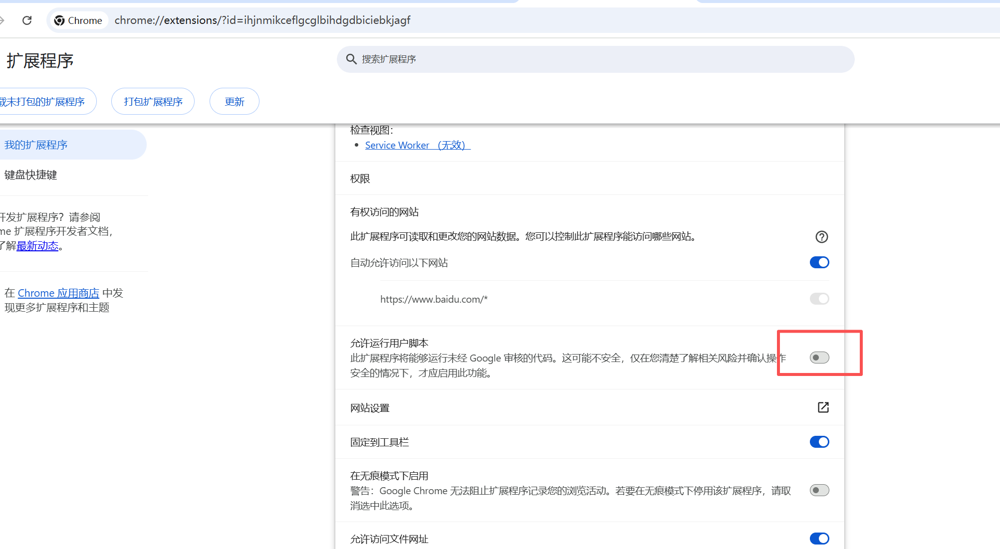
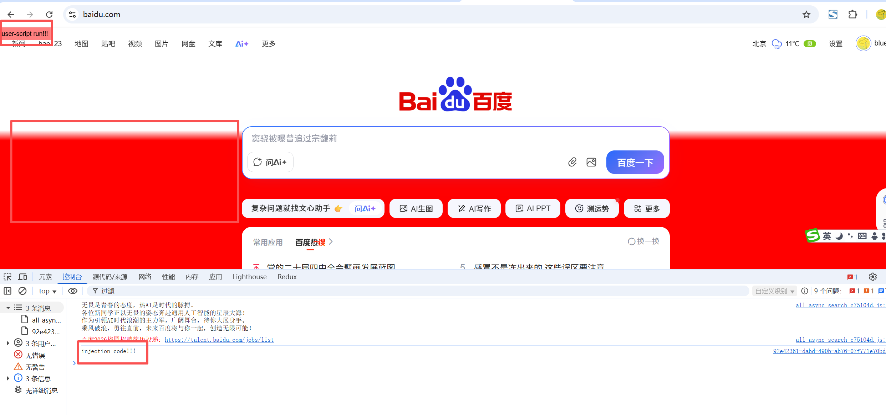
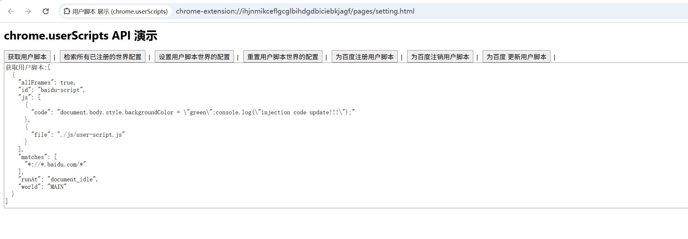

# 用户脚本 展示 (chrome.userScripts)


> 用户脚本是指注入到网页中的一小段代码，用于修改网页的外观或行为。与其他扩展功能（例如内容脚本和 chrome.scripting API）不同，用户脚本 API 可让您运行任意代码。
> 如果扩展程序运行由用户提供的脚本，而这些脚本无法作为扩展程序软件包的一部分提供，则必须使用此 API

## 启用 userScripts API 的使用

> 在扩展程序获得使用 userScripts API 的权限后，用户必须启用特定切换开关，才能允许扩展程序使用该 API。所需的具体开关以及停用时的 API 行为因 Chrome 版本而异



## manifest.json 配置

> 如需使用用户脚本 API chrome.userScripts，请向 manifest.json 添加 "userScripts" 权限，并为要运行脚本的网站添加 "host_permissions"

```json
{
    "host_permissions": [ // 并为要运行脚本的网站添加  和 matches 一致即可 
        "https://www.baidu.com/*"
    ],
    "permissions": [
        "userScripts"
    ]
}
```

## 效果展示




## 资料
```markdown
https://developer.chrome.com/docs/extensions/reference/api/userScripts?hl=zh-cn
https://github.com/GoogleChrome/chrome-extensions-samples/tree/main/api-samples/userScripts
```