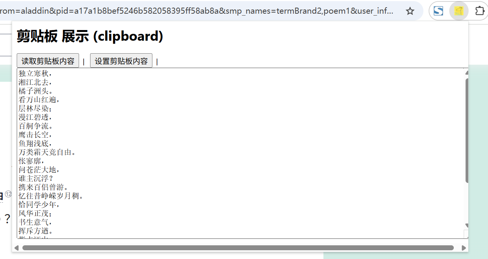

# 剪贴板 展示 (clipboard)

## manifest.json 权限
```json
{
    "permissions": [
        "clipboardRead",
        "clipboardWrite"
    ]
}
```

## 效果展示


## 资料
```markdown
https://developer.mozilla.org/zh-CN/docs/Web/API/Clipboard_API
https://github.com/GoogleChrome/chrome-extensions-samples/tree/main/functional-samples/cookbook.offscreen-clipboard-write
https://github.com/GoogleChrome/chrome-extensions-samples/tree/main/functional-samples/ai.gemini-on-device-alt-texter
```