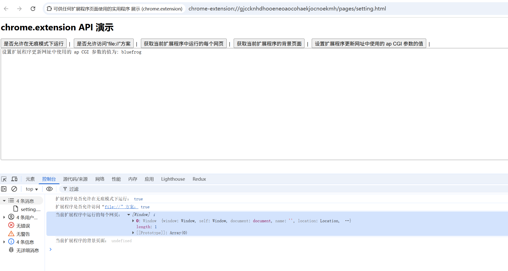

# 可供任何扩展程序页面使用的实用程序 展示 (chrome.extension)

## manifest.json 权限
```json
{
    "action": {
        "default_icon": "images/icon.png",
        "default_title": "展示 chrome.extension API"
    },
    "background": {
        "service_worker": "js/background.js"
    }
}
```

## 展示



## 资料
```markdown
https://developer.chrome.com/docs/extensions/reference/api/extension?hl=zh-cn
```
