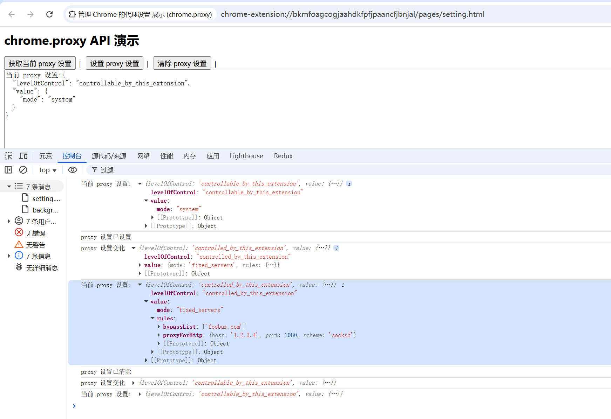

# 管理 Chrome 的代理设置 展示 (chrome.proxy)

> 使用 chrome.proxy API 管理 Chrome 的代理设置。此 API 依赖 ChromeSetting 类型 API 原型来获取和设置代理配置

## 代理模式
ProxyConfig 对象的 mode 属性决定了 Chrome 的整体行为 代理用量。它可以采用以下值：

- direct
    
    在 direct 模式下，所有连接都是直接创建，不涉及任何代理。此模式允许 ProxyConfig 对象中没有其他参数。

- auto_detect

    在auto_detect模式下，代理配置由可下载的 PAC 脚本决定。 位于http://wpad/wpad.dat此模式不允许在 ProxyConfig 对象中包含其他参数。
    
- pac_script

    在 pac_script 模式下，代理配置由从系统检索到的 PAC 脚本决定 取自 proxy.PacScript 对象中指定的网址，或直接从 data 元素中获取 proxy.PacScript 对象中指定的任何 ID。
    除此之外，此模式不允许使用任何其他参数， 在 ProxyConfig 对象中。
    
- fixed_servers

    在 fixed_servers 模式下，代理配置编码在 proxy.ProxyRules 对象中。其 代理规则中介绍了具体结构。除此之外，fixed_servers 模式 ProxyConfig 对象中的参数。
    
- system
    
    在 system 模式下，代理配置从操作系统中获取。
    此模式不允许 在 ProxyConfig 对象中包含更多参数。
    请注意，system 模式不同于 设置无代理配置。对于后一种情况，只有在以下情况下，Chrome 才会回退到系统设置： 任何命令行选项都不会影响代理配置。

## 示例
> 以下代码设置了 SOCKS 5 代理，用于与 foobar.com 以外的所有服务器的 HTTP 连接，并使用 直接连接（适用于所有其他协议）。这些设置会应用于常规窗口和无痕式窗口， 无痕式窗口会沿用常规窗口的设置。
### 固定服务器代理
```javascript
const config = {
    mode: "fixed_servers",
    rules: {
        proxyForHttp: {
            scheme: "socks5",
            host: "1.2.3.4"
        },
        bypassList: ["foobar.com"]
    }
};
chrome.proxy.settings.set({value: config, scope: 'regular'},function() {
    console.log("proxy 设置已更新");
});
```

### 自定义 PAC 脚本(上方设置改为 pac_script 模式)
```javascript
let config = {
    mode: "pac_script",
    pacScript: {
        data: "function FindProxyForURL(url, host) {\n" +
                "  if (host == 'foobar.com')\n" +
                "    return 'PROXY blackhole:80';\n" +
                "  return 'DIRECT';\n" +
                "}"
    }
};
chrome.proxy.settings.set({value: config, scope: 'regular'},function() {
    console.log("proxy 设置已更新");
});
```

## ProxyConfig 封装了完整代理配置的对象
```json
{
    "mode": "fixed_servers", // 模式  direct 从不使用代理 | auto_detect 动检测代理设置 | pac_script 使用指定的 PAC 脚本 | fixed_servers 手动指定代理服务器 | system 使用系统代理设置
    "pacScript": { // 此配置的代理自动配置 (PAC) 脚本。将此用于“pac_script”模式
        "data": "", // PAC script.
        "mandatory": false, // 如果为 true，无效的 PAC 脚本将阻止网络堆栈回退到直接连接。默认值为 false
        "url": "" // 要使用的 PAC 文件的网址
    },
    "rules": { // 用于封装所有协议的一组代理规则的对象。使用 singleProxy | proxyForHttp | proxyForHttps | proxyForFtp | fallbackProxy
        "proxyForHttp": {
            "scheme": "socks5", // 代理服务器本身的架构（协议）。默认值为 http   http | https | quic | socks4 | socks5
            "host": "1.2.3.4", // 代理服务器的主机名或 IP 地址。主机名必须采用 ASCII（Punycode 格式）。目前尚不支持 IDNA
            //"port": 1080 // 代理服务器的端口。默认为取决于 scheme 的端口。例如，对于 SOCKS5，默认端口为 1080。 http	80 | https 443 | socks4 1080 | socks5 1080
        },
        // fallbackProxy: {}, // ProxyServer 用于其他任何用途或未指定任何特定 agentFor... 的代理服务器。
        // proxyForFtp: {}, // ProxyServer 用于 FTP 请求的代理服务器
        // proxyForHttp: {}, // ProxyServer 用于 HTTP 请求的代理服务器
        // proxyForHttps: {}, // ProxyServer 用于 HTTPS 请求的代理服务器
        // singleProxy: {} // ProxyServer 要用于所有 Per-网址 请求（即 http、https 和 ftp）的代理服务器。
        "bypassList": ["foobar.com"] // 要在没有代理服务器的情况下连接的服务器列表
    }
}
```

## manifest.json 权限
```json
{
    "permissions": [
        "proxy"
    ]
}
```

## 展示


## 资料
```markdown
https://developer.chrome.com/docs/extensions/reference/api/proxy?hl=zh-cn
https://developer.chrome.com/docs/extensions/reference/api/types?hl=zh-cn#type-ChromeSetting
```