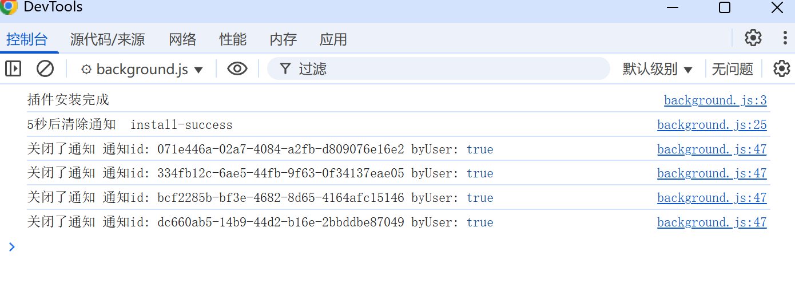
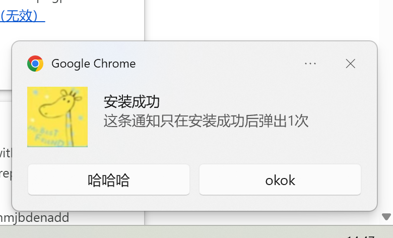
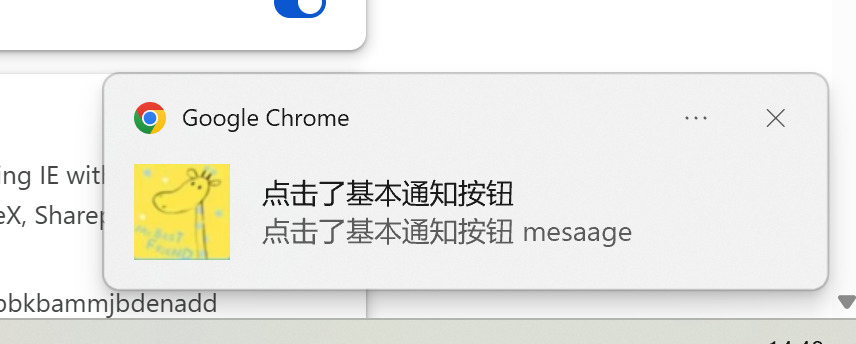
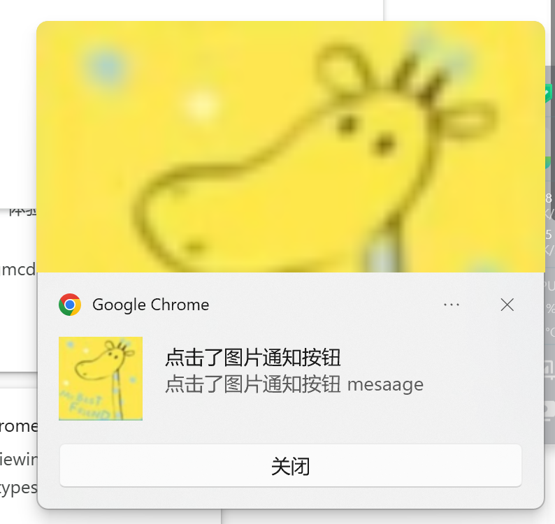
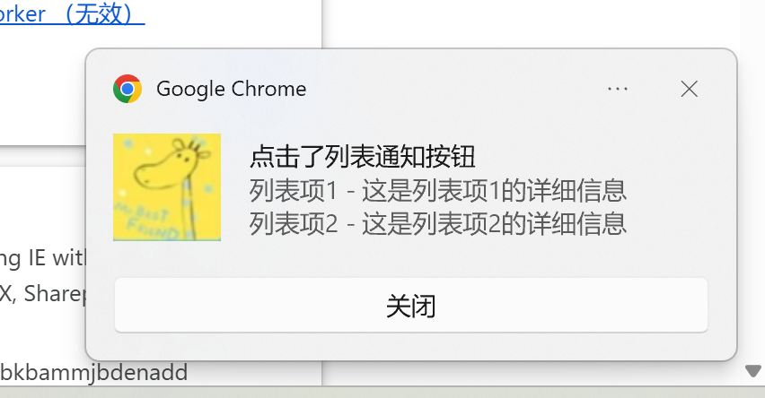

# 通知 展示 (chrome.notifications)

> 使用 chrome.notifications API 通过模板创建丰富通知，并在系统托盘中向用户显示这些通知

## manifest.json 配置
```json
{
    "permissions": [
        "notifications"
    ]
}
```

## js/background.js 代码
```js
// 插件安装完成后，显示安装成功通知
chrome.runtime.onInstalled.addListener(() => {
    console.log("插件安装完成");
    
    // 设置一个消息通知Id
    let notificationId = 'install-success';
    
    chrome.notifications.create(notificationId, {
        type: 'basic',
        iconUrl: '../images/icon.png', // 
        eventTime: Date.now(), // 通知创建时间 
        title: '安装成功',
        message: "这条通知只在安装成功后弹出1次",
        expandedMessage: "这是一条扩展消息，显示在通知详情中",
        priority: 0, // 通知优先级 -2 到 2，0 为默认优先级
        requireInteraction: true, // 是否需要用户交互后才清除通知,
        silent: true, // 是否静音播放通知声音
        buttons: [{ title: '哈哈哈' },{ title: 'okok' }],
    }).catch((error) => {
        console.error('创建通知失败:', error);
    });

    // 5秒后清除通知
    setTimeout(() => {
        console.log("5秒后清除通知 ", notificationId);
        chrome.notifications.clear(notificationId);
    }, 5000);
});

// 点击通知按钮触发事件
chrome.notifications.onButtonClicked.addListener(
    function(notificationId, buttonIndex) {
        console.log("点击了通知按钮 通知id:", notificationId, "按钮索引:", buttonIndex);
    }
);

// 点击通知窗体触发事件
chrome.notifications.onClicked.addListener(
    function(notificationId) {
        console.log("点击了通知窗体 通知id:", notificationId);
    },
);

// 关闭通知触发事件
chrome.notifications.onClosed.addListener(
    function(notificationId, byUser) {
        console.log("关闭了通知 通知id:", notificationId, "byUser:", byUser);
    }
);

// 通知权限级别改变触发事件 
// only ChromeOS has UI that dispatches this event. 
chrome.notifications.onPermissionLevelChanged.addListener(
    function(permissionLevel) {
        // granted / denied
        console.log("通知权限级别改变 权限级别:", permissionLevel);
    }
);
```

## pages/setting.html 代码
```html
<html lang="zh-cn">
  <body>
    <h1>chrome.notifications API 演示</h1>
    <button id="notify-basic-btn">基本通知</button>
    <button id="notify-progress-btn">进度通知</button>
    <button id="notify-image-btn">图片通知</button>
    <button id="notify-list-btn">列表通知</button>
    <hr/>
    <button id="check-permission-btn">检查通知权限</button>
    <button id="get-all-btn">获取所有通知</button>
    <hr/>
    <input id="notification-id-input" type="text" placeholder="输入通知ID" style="width: 400px;"/>
    <button id="clear-btn">清除指定通知</button>
    <textarea id="result-container" style="width: 100%; height: 300px;"></textarea>
  </body>
  <script src="../js/setting.js" type="module"></script>
</html>
```

## js/action.js 代码
```js
// "basic"
//     Contains an icon, title, message, expandedMessage, and up to two buttons.
// "image"
//     Contains an icon, title, message, expandedMessage, image, and up to two buttons.
// "list"
//     Contains an icon, title, message, items, and up to two buttons. Users on Mac OS X only see the first item.
// "progress"
//     Contains an icon, title, message, progress, and up to two buttons.

// 绑定 基本通知按钮
document.getElementById('notify-basic-btn').addEventListener('click', () => {
    console.log("点击基本通知按钮");
    // 发送通知 type = basic   icon, title, message, expandedMessage
    chrome.notifications.create({
        type: 'basic',
        iconUrl: '../images/icon.png', // 
        //eventTime: Date.now() + 1000, // 通知创建时间 
        title: '点击了基本通知按钮',
        message: "点击了基本通知按钮 mesaage",
        expandedMessage: "点击了基本通知按钮 expandedMessage",
        // priority: 1, // 通知优先级 -2 到 2，0 为默认优先级
        // requireInteraction: true, // 是否需要用户交互后才清除通知,
        // silent: true, // 是否静音播放通知声音
    });
});

// 绑定 进度通知按钮
document.getElementById('notify-progress-btn').addEventListener('click', () => {
    console.log("点击进度通知按钮");
    // 发送通知 type = progress   icon, title, message, progress, and up to two buttons.
    chrome.notifications.create({
        type: 'progress',
        iconUrl: '../images/icon.png', // 
        eventTime: Date.now() + 1000, // 通知创建时间 1秒后显示
        title: '安装成功',
        message: "这条通知只在安装成功后弹出1次",
        progress: 80, // 进度条进度，0 到 100
        priority: 1, // 通知优先级 -2 到 2，0 为默认优先级
        requireInteraction: true, // 是否需要用户交互后才清除通知,
        silent: true, // 是否静音播放通知声音
        buttons: [{ title: '哈哈哈' }],
    }).catch((error) => {
        console.error('创建通知失败:', error);
    });
});

// 绑定 图片通知按钮
document.getElementById('notify-image-btn').addEventListener('click', () => {
    console.log("点击图片通知按钮");
    // 发送通知 type = image   icon, title, message, expandedMessage, image, and up to two buttons.
    chrome.notifications.create({
        type: 'image',
        iconUrl: '../images/icon.png', // 
        eventTime: Date.now() + 1000, // 通知创建时间 1秒后显示
        title: '点击了图片通知按钮',
        message: "点击了图片通知按钮 mesaage",
        expandedMessage: "点击了图片通知按钮 expandedMessage",
        imageUrl: '../images/icon.png', // 图片 URL
        priority: 1, // 通知优先级 -2 到 2，0 为默认优先级
        requireInteraction: true, // 是否需要用户交互后才清除通知,
        silent: true, // 是否静音播放通知声音
    });
});

// 绑定 列表通知按钮
document.getElementById('notify-list-btn').addEventListener('click', () => {
    console.log("点击列表通知按钮");
    // 发送通知 type = list   icon, title, message, items, and up to two buttons.
    chrome.notifications.create({
        type: 'list',
        iconUrl: '../images/icon.png', // 
        eventTime: Date.now() + 1000, // 通知创建时间 1秒后显示
        title: '点击了列表通知按钮',
        message: "点击了列表通知按钮 mesaage",
        items: [{
            title: '列表项1',
            message: '这是列表项1的详细信息'
        }, {
            title: '列表项2',
            message: '这是列表项2的详细信息'
        }],
        priority: 1, // 通知优先级 -2 到 2，0 为默认优先级
        requireInteraction: true, // 是否需要用户交互后才清除通知,
        silent: true, // 是否静音播放通知声音
    });
});
```

## 调试


## 效果







## 资料
```
https://developer.chrome.google.cn/docs/extensions/develop/ui/notify-users?hl=zh-cn
https://developer.chrome.google.cn/docs/extensions/reference/api/notifications?hl=zh-cn#method-create
```