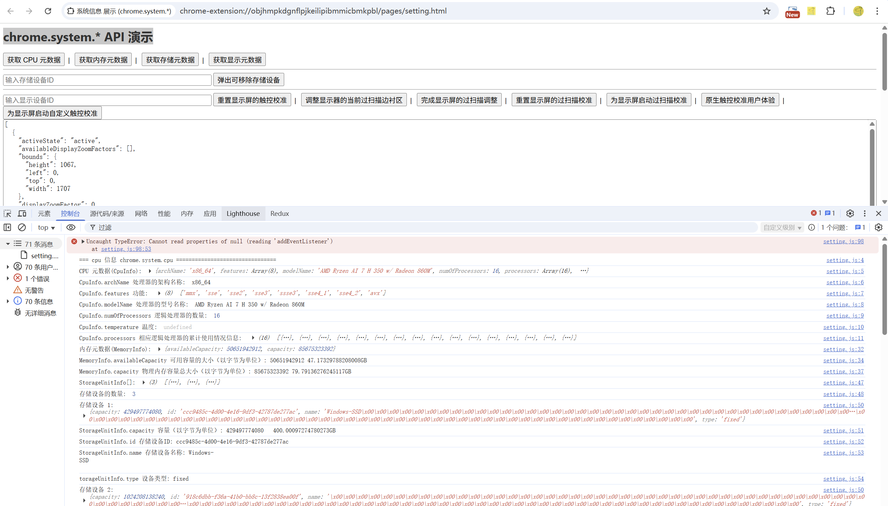
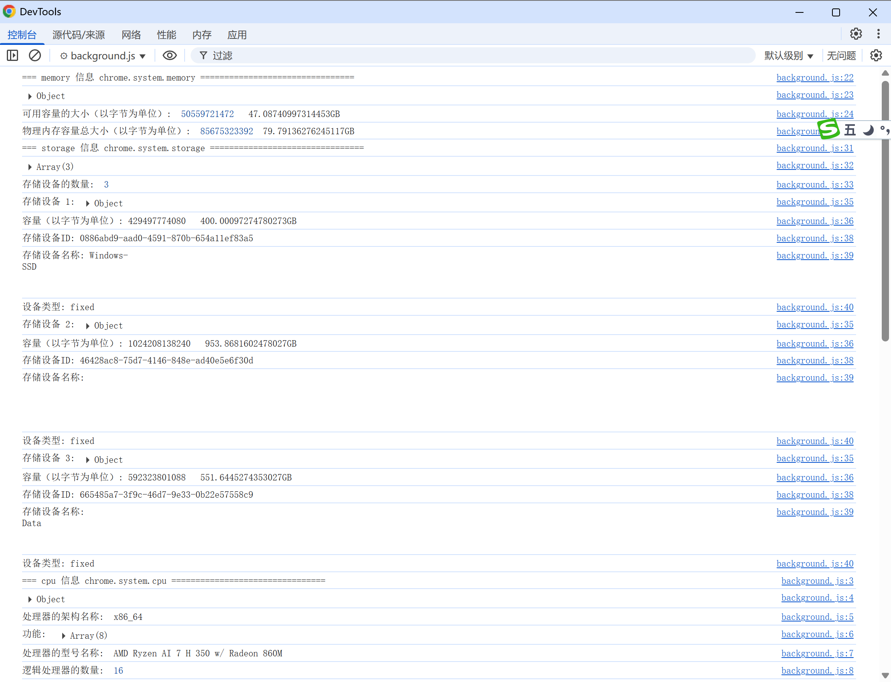

# 系统信息 展示 (chrome.system.*)

- chrome.system.cpu     查询 CPU 元数据
- chrome.system.memory  查询内存元数据
- chrome.system.storage 查询存储元数据
- chrome.system.display 查询显示元数据

## manifest.json 配置
```json
{
    "name": "系统信息 展示",
    "version": "1.0",
    "manifest_version": 3,
    "permissions": [
        "system.cpu",
        "system.memory",
        "system.storage",
        "system.display"
    ],
    "background": {
        "service_worker": "background.js"
    }
}
```

## js/background.js 代码
```javascript
// 查询 CPU 元数据 chrome.system.cpu
chrome.system.cpu.getInfo((info) => {
    console.log("=== cpu 信息 chrome.system.cpu ================================");
    console.log(info);
    console.log("处理器的架构名称: ", info.archName);
    console.log("功能: ", info.features); // 一组表示处理器部分功能的特征码。目前支持的代码包括“mmx”“sse”“sse2”“sse3”“ssse3”“sse4_1”“sse4_2”和“avx”
    console.log("处理器的型号名称: ", info.modelName);
    console.log("逻辑处理器的数量: ", info.numOfProcessors);
    console.log("温度: ", info.temperature); // 来自 CPU 各个散热区的 CPU 温度读数列表。温度以摄氏度为单位。前仅在 ChromeOS 上受支持
    // info.processors.forEach((processor, index) => {
    //     // idle / kernel / total / user
    //     console.log(`处理器 ${index + 1}:`, processor);
    //     console.log(`idle: ${processor.usage.idle}`); // 相应处理器处于空闲状态的累计时间。
    //     console.log(`kernel: ${processor.usage.kernel}`); // 相应处理器上内核程序使用的累计时间
    //     console.log(`total: ${processor.usage.total}`); // 相应处理器的总累计时间。此值等于用户 + 内核 + 空闲
    //     console.log(`user: ${processor.usage.user}`); // 用户空间程序在此处理器上使用的累计时间
    // });
});

// 查询内存元数据 chrome.system.memory
chrome.system.memory.getInfo((info) => {
    console.log("=== memory 信息 chrome.system.memory ================================");
    console.log(info);
    console.log("可用容量的大小（以字节为单位）: ", info.availableCapacity, " ",info.availableCapacity / 1024 / 1024 / 1024 + "GB");
    console.log("物理内存容量总大小（以字节为单位）: ", info.capacity, " " + info.capacity / 1024 / 1024 / 1024 + "GB");
});


// 查询存储元数据 chrome.system.storage
chrome.system.storage.getInfo((info) => {
    console.log("=== storage 信息 chrome.system.storage ================================");
    console.log(info);
    console.log("存储设备的数量: ", info.length);
    info.forEach((storage, index) => {
        console.log(`存储设备 ${index + 1}:`, storage);
        console.log(`容量（以字节为单位）: ${storage.capacity}`, " ", storage.capacity / 1024 / 1024 / 1024 + "GB");
        //console.log(`可用容量（以字节为单位）: ${storage.availableCapacity}`);
        console.log(`存储设备ID: ${storage.id}`);
        console.log(`存储设备名称: ${storage.name.trim()}`);
        console.log(`设备类型: ${storage.type}`); 
        // "fixed" The storage has fixed media, e.g. hard disk or SSD.
        // "removable" The storage is removable, e.g. USB flash drive.
        // "unknown"  The storage type is unknown.
    });
});

// 查询显示元数据 chrome.system.display
chrome.system.display.getInfo((info) => {
    console.log("=== display 信息 chrome.system.display ================================");
    console.log("显示设备的数量: ", info.length);
    info.forEach((display, index) => {
        console.log(`显示设备 ${index + 1}:`, display);
        console.log(`活动状态: ${display.activeState}`); // 显示设备的活动状态。
        console.log(`availableDisplayZoomFactors: ${display.availableDisplayZoomFactors}`); // 显示设备支持的缩放因子列表。
        console.log(`bounds: ${display.bounds}`); 
        console.log(`displayZoomFactor: ${display.displayZoomFactor}`); 
        console.log(`dpiX: ${display.dpiX}`);
        console.log(`dpiY: ${display.dpiY}`);
        console.log(`edid: ${display.edid}`); // This is only available to ChromeOS Kiosk apps and Web UI.
        console.log(`hasTouchSupport: ${display.hasTouchSupport}`); 
        console.log(`id: ${display.id}`); // The unique identifier of the display.
        console.log(`isEnabled: ${display.isEnabled}`);  // True if this display is enabled.
        console.log(`isPrimary: ${display.isPrimary}`);  // True if this is the primary display.
        console.log(`isUnified: ${display.isUnified}`);  // True for all displays when in unified desktop mode. See documentation for enableUnifiedDesktop.
        console.log(`mirroringDestinationIds: ${display.mirroringDestinationIds}`); 
        console.log(`mirroringSourceId: ${display.mirroringSourceId}`); 
        console.log(`modes: ${display.modes}`); 
        console.log(`name: ${display.name}`); 
        console.log(`overscan: ${display.overscan}`); 
        console.log(`rotation: ${display.rotation}`); 
        console.log(`workArea: ${display.workArea}`); 
        console.log();

    });
});
```

## 效果



## 资料
```
https://developer.chrome.google.cn/docs/extensions/reference/api/system/cpu
https://developer.chrome.google.cn/docs/extensions/reference/api/system/memory
https://developer.chrome.google.cn/docs/extensions/reference/api/system/storage
https://developer.chrome.google.cn/docs/extensions/reference/api/system/display
```