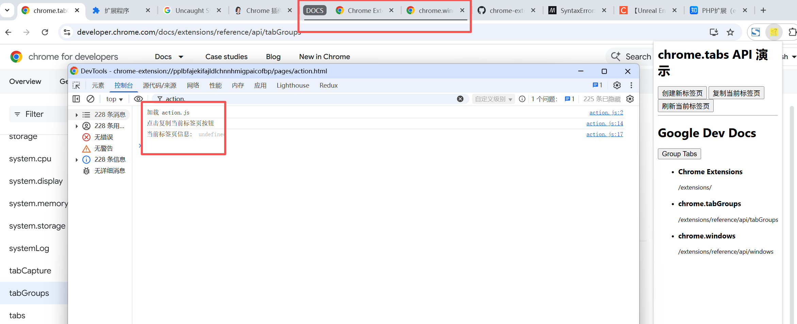

# 标签页 展示 (chrome.tabs)

## 权限

> 大多数功能无需任何权限即可使用。例如：创建新标签页、重新加载标签页、前往其他网址等

- "标签页"权限 tabs
    此权限不授予对 chrome.tabs 命名空间的访问权限。相反，它会授予扩展程序针对 tabs.Tab 实例上的四个敏感属性（url、pendingUrl、title 和 favIconUrl）调用 tabs.query() 的能力
    ```json
    "permissions": [
        "tabs"
    ],
    ```

- 主机权限
    主机权限允许扩展程序读取和查询匹配标签页的四项敏感 tabs.Tab 属性。它们还可以使用 tabs.captureVisibleTab()、scripting.executeScript()、scripting.insertCSS() 和 scripting.removeCSS() 等方法直接与匹配的标签页互动

    ```json
    "host_permissions": [
        "http://*/*",
        "https://*/*"
    ],
    ```

- "activeTab"权限 activeTab
    activeTab 会在用户调用时授予扩展程序当前标签页的临时主机权限。
    与主机权限不同，activeTab 不会触发任何警告。
    ```json
    "permissions": [
        "activeTab"
    ],
    ```

## manifest.json 配置
```json
{
    "permissions": [
        "tabs",
        "activeTab",
        "tabGroups"
    ],
    "host_permissions": [
        "http://*/*",
        "https://*/*"
    ]
}
```

## 效果


## 资料
```
https://developer.chrome.com/docs/extensions/reference/api/tabs?hl=zh-cn
https://developer.chrome.com/docs/extensions/reference/api/tabGroups?hl=zh-cn
https://github.com/GoogleChrome/chrome-extensions-samples/tree/main/functional-samples/tutorial.tabs-manager
```