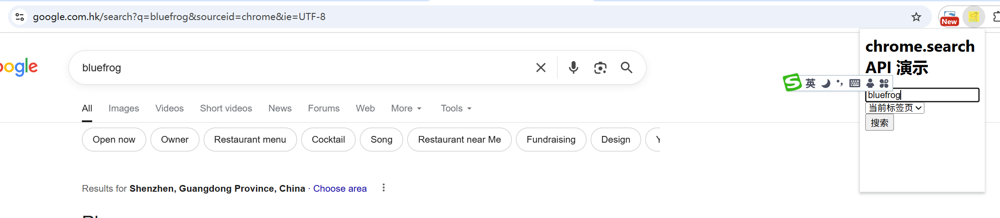

# 搜索 展示 (chrome.search)

> 使用 chrome.search API 通过默认提供程序进行搜索

## manifest.json 配置
```json
{
    "action": {
        "default_popup": "pages/action.html",
        "default_title": "搜索 展示 (chrome.search)",   
        "default_icon": "images/icon.png"
    },
    "permissions": [
        "search"
    ]
}
```

## pages/action.html
```html
<html lang="zh-cn">
    <head>
        <title>chrome.search API 演示</title>
    </head>
    <body>
        <h1>chrome.search API 演示</h1>
        <label>
            <input type="text" id="search-keyword" placeholder="搜索内容" />
        </label>
        <br/>
        <label>
            <select id="disposition">
                <option value="CURRENT_TAB">当前标签页</option>
                <option value="NEW_TAB">新标签页</option>
                <option value="NEW_WINDOW">新窗口</option>
            </select>
        </label>
        <br/>
        <button id="search-btn">搜索</button>
        <br/>
    </body>
    <script src="../js/action.js" type="module"></script>
</html>
```

## js/action.js
```js
// 点击搜索按钮
document.getElementById('search-btn').addEventListener('click', () => {
    const keyword = document.getElementById('search-keyword').value;
    const disposition = document.getElementById('disposition').value;
    chrome.search.query({
        text: keyword,
        disposition: disposition,
        // tabId: chrome.tabs.TAB_ID_NONE,可以指定 tabId 打开搜索结果， 与 disposition 互斥
    });
});
```

## 效果


## 资料
```markdown
https://developer.chrome.com/docs/extensions/reference/api/search?hl=zh-cn#type-QueryInfo
```