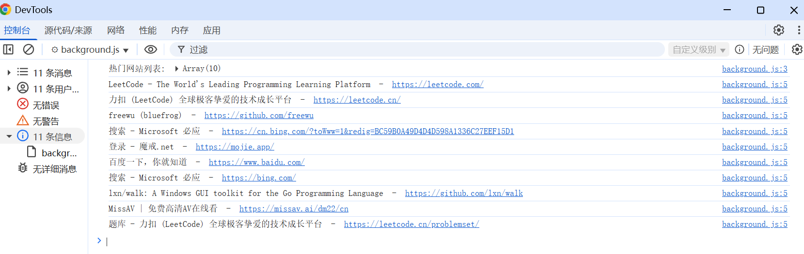

# 获取访问次数最多的网站 展示 (chrome.topSites)

> 使用 chrome.topSites API 访问新标签页上显示的顶级网站（即访问次数最多的网站）

## manifest.json 配置

```json
{
    "background": {
        "service_worker": "js/background.js"
    },
    "permissions": [
        "topSites"
    ]
}
```

## js/background.js
```js
// 获取热门网站列表
chrome.topSites.get((sites) => {
    console.log('热门网站列表:', sites);
    sites.forEach((site) => {
        console.log(site.title, " - ", site.url);
    });
});
```

## 效果


## 资料
````markdown
https://developer.chrome.com/docs/extensions/reference/api/topSites?hl=zh-cn
https://github.com/GoogleChrome/chrome-extensions-samples/tree/main/api-samples/topSites
````