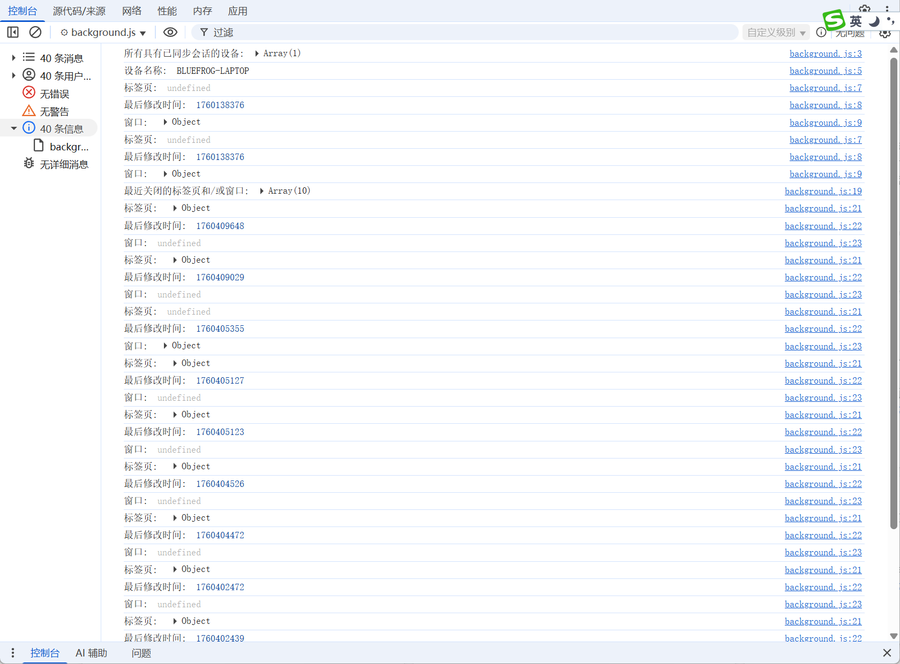

# 查询和恢复浏览会话中的标签页和窗口 展示 (chrome.sessions)

## manifest.json 配置
```json
{
    "background": {
        "service_worker": "js/background.js"
    },
    "permissions": [
        "sessions"
    ]
}
```

## js/background.js 代码
```js
// 获取最近关闭的标签页和/或窗口的列表
const filter = {
    maxResults: 10, // 相应列表中要提取的条目数上限。省略此参数可提取最大条目数 (sessions.MAX_SESSION_RESULTS)  默认 25
};
chrome.sessions.getRecentlyClosed(filter).then((sessions) => {
    console.log('最近关闭的标签页和/或窗口:', sessions);
    sessions.forEach((session) => {
        console.log("标签页: ", session.tab); // 如果相应条目描述的是，则为 tabs.Tab。系统会设置此值或 sessions.Session.window。
        console.log("最后修改时间: ", session.lastModified); // 窗口或标签页关闭或修改的时间，以自纪元开始算起的秒数表示。
        console.log("窗口: ", session.window); // 如果相应条目描述的是窗口，则为 windows.Window。系统会设置此值或 sessions.Session.tab
    });
});

// 重新打开 windows.Window 或 tabs.Tab，并提供一个可选的回调函数，用于在条目恢复后运行
chrome.sessions.restore(
    // sessionId 要恢复的 windows.Window.sessionId 或 tabs.Tab.sessionId。如果未指定此参数，系统会恢复最近关闭的会话
    sessionId,
).then((session) => {
    console.log('会话已恢复', session);
}); 

// 当最近关闭的标签页和/或窗口发生更改时触发。此事件不会监控同步会话更改。
chrome.sessions.onChanged.addListener(() => {
    console.log('最近关闭的标签页和/或窗口发生更改:');
});
```

## 运行效果


## 资料
```markdown
https://developer.chrome.com/docs/extensions/reference/api/sessions?hl=zh-cn#method-restore

```