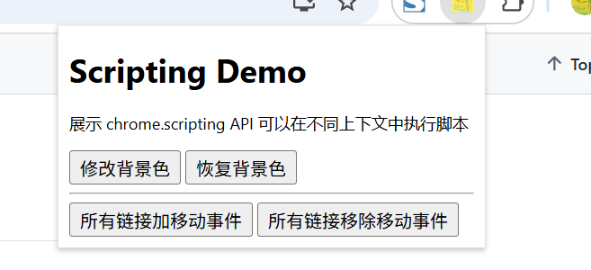
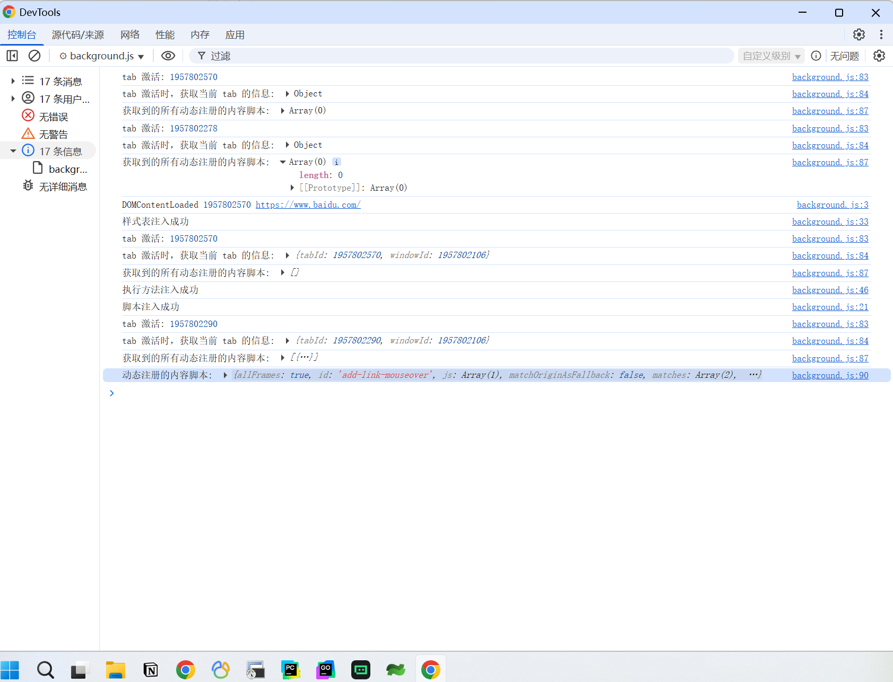

# 在不同上下文中执行脚本 展示 (chrome.scripting)

> 可以使用 chrome.scripting API 将 JavaScript 和 CSS 注入网站。这与您可以使用内容脚本执行的操作类似。
> 但通过使用 chrome.scripting 命名空间，扩展程序可以在运行时做出决策，而不是在安装时做出决策。

## manifest.json 配置
```json
{
    "background": {
        "service_worker": "js/background.js"
    },
    "permissions": [
        "scripting", 
        "webNavigation"
    ],
    "host_permissions": [
        "https://*/*",
        "http://*/*"
    ],
    "action": {
        "default_icon": "images/icon.png",
        "default_title": "展示 chrome.scripting API 可以在不同上下文中执行脚本",
        "default_popup": "pages/action.html"
    }
}
```

## 效果



## 资料
```markdown
https://developer.chrome.com/docs/extensions/reference/api/scripting?hl=zh-cn
https://github.com/GoogleChrome/chrome-extensions-samples/tree/main/api-samples/scripting
```