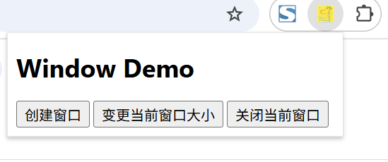
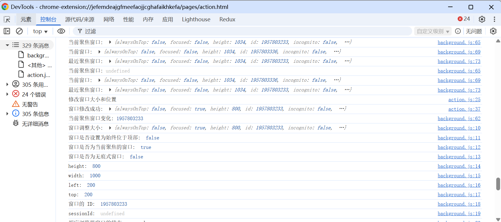

# 窗口 展示 (chrome.windows)

> 使用 chrome.windows API 与浏览器窗口互动。您可以使用此 API 在浏览器中创建、修改和重新排列窗口

## manifest.json 配置
```json
{
    "background": {
        "service_worker": "js/background.js"
    },
    "action": {
        "default_icon": "images/icon.png",
        "default_title": "展示 chrome.windows API",
        "default_popup": "pages/action.html"
    },
    "permissions": [
        "windows",
        "tabs"
    ]
}
```

## pages/action.html 配置
```html
<!DOCTYPE html>
<html lang="en">
<head>
    <meta charset="UTF-8">
    <meta name="viewport" content="width=device-width, initial-scale=1.0">
    <title>Window Demo</title>
    <style>
        body {
            width: 300px;
        }
    </style>
</head>
<body>
    <h1>Window Demo</h1>
    <button id="create-window-btn">创建窗口</button>
    <button id="update-window-btn">变更当前窗口大小</button>
    <button id="close-window-btn">关闭当前窗口</button>
    <script src="../js/action.js" type="module"></script>
</body>
</html>
```

## js/action.js 配置
```javascript
// 创建窗口
document.getElementById('create-window-btn').addEventListener('click', async () => {
    console.log('创建窗口');
    win = chrome.windows.create({
        focused: false, // 如果值为 true，则打开一个活动窗口。如果值为 false，则打开一个闲置窗口
        incognito: true, // 新窗口是否应为无痕式窗口。
        url: 'https://www.baidu.com', // 要在窗口中作为标签页打开的网址或网址数组。完全限定网址必须包含架构，例如 “http://www.google.com”，而不是“www.google.com”。非完全限定网址会被视为扩展程序中的相对网址。默认为“新标签页”。
        setSelfAsOpener: true, // 如果值为 true，则新创建的窗口的“window.opener”会设置为调用方，并且与调用方位于同一相关浏览上下文单元中。
        state: 'normal', // 窗口的初始状态。minimized、maximized 和 fullscreen 状态不能与 left、top、width 或 height 状态组合使用。 
        type: 'popup', // 指定要创建的浏览器窗口的类型  normal / popup / panel / app / devtools / extension
        left: 100, // 新窗口与屏幕左边缘之间的像素数。如果未指定，新窗口会自然地从上次聚焦的窗口偏移。对于面板，此值会被忽略。
        top: 100, // 新窗口与屏幕上边缘的距离（以像素为单位）。如果未指定，新窗口会自然地从上次聚焦的窗口偏移。对于面板，此值会被忽略。 
        width: 800,
        height: 600, // 新窗口的高度（以像素为单位），包括边框。如果未指定，则默认为自然高度。
        //tabId: 9527, // 要添加到新窗口的标签页的 ID。
    }).then(() => {
        console.log('窗口创建成功:');
    }).catch((error) => {
        console.error('窗口创建失败:', error);
    });
});

// 修改当前窗口的大小和位置
document.getElementById('update-window-btn').addEventListener('click', async () => {
     console.log('修改窗口大小和位置');
    // 获取当前活动窗口
    const win = await chrome.windows.getCurrent();
    await chrome.windows.update(win.id, {
        left: 200, // 窗口要移动到的位置与屏幕左边缘的偏移量（以像素为单位）。对于面板，此值会被忽略。
        top: 200, // 窗口要移动到的位置与屏幕上边缘的偏移量（以像素为单位）。对于面板，此值会被忽略。
        width: 1000, // 要将窗口调整为的宽度（以像素为单位）。对于面板，此值会被忽略。
        height: 800, // 要将窗口调整为的高度（以像素为单位）。对于面板，此值会被忽略。
        focused: true, // 如果为 true，则将窗口置于前台；不能与“最小化”状态组合使用。如果值为 false，则将 z 顺序中的下一个窗口移到前面；不能与“全屏”或“最大化”状态结合使用。
        drawAttention: true, // 如果值为 true，则会导致窗口以吸引用户注意的方式显示，而不会更改聚焦窗口。此效果会一直持续，直到用户将焦点移至相应窗口。如果窗口已获得焦点，此选项不会产生任何影响。设置为 false 可取消之前的 drawAttention 请求。   
        state: 'normal', // 窗口的新状态。“minimized”“maximized”和“fullscreen”状态不能与“left”“top”“width”或“height”结合使用。
    }).then((window) => {
        console.log('窗口修改成功:', window);
    }).catch((error) => {
        console.error('窗口修改失败:', error);
    });
});

// 关闭当前窗口
document.getElementById('close-window-btn').addEventListener('click', async () => {
     console.log('关闭窗口');
    // 获取当前活动窗口
    const win = await chrome.windows.getCurrent();
    await chrome.windows.remove(win.id).then(() => {
        console.log('窗口关闭成功');
    }).catch((error) => {
        console.error('窗口关闭失败:', error);
    });
});
```

## js/background.js 配置
```javascript
// 获取所有窗口
chrome.windows.getAll({}, (windows) => {
    console.log('所有窗口:', windows);
});

// 在窗口调整大小后触发；仅当提交新边界时（而不是在进行中的更改时）才调度此事件
chrome.windows.onBoundsChanged.addListener((window) => {
    console.log('窗口调整大小:', window);
    console.log('窗口是否设置为始终位于顶部: ', window.alwaysOnTop);
    console.log('窗口是否为当前聚焦的窗口: ', window.focused);
    console.log('窗口是否为无痕式窗口: ', window.incognito);
    console.log('height: ', window.height); // 窗口的高度（包括框架），以像素为单位。在某些情况下，窗口可能未分配 height 属性；例如，当通过 sessions API 查询已关闭的窗口时。
    console.log('width: ', window.width); // 窗口的宽度（包括边框），以像素为单位。在某些情况下，窗口可能未分配 width 属性；例如，当通过 sessions API 查询已关闭的窗口时。
    console.log('left: ', window.left); // 窗口与屏幕左边缘的偏移量（以像素为单位）。在某些情况下，窗口可能未分配 left 属性；例如，当通过 sessions API 查询已关闭的窗口时。
    console.log('top: ', window.top); // 窗口距离屏幕顶部边缘的偏移量（以像素为单位）。在某些情况下，窗口可能未分配 top 属性；例如，当通过 sessions API 查询已关闭的窗口时。
    console.log('窗口的 ID: ', window.id); // 窗口的 ID。窗口 ID 在浏览器会话中是唯一的。在某些情况下，窗口可能未分配 ID 属性；例如，当使用 sessions API 查询窗口时，在这种情况下，可能会存在会话 ID。
    console.log('sessionId: ', window.sessionId); // 用于唯一标识窗口的会话 ID，通过 sessions API 获取。
    console.log('相应浏览器窗口的状态: ', window.state); // normal / minimized / maximized / fullscreen / locked-fullscreen
    console.log('相应浏览器窗口的类型: ', window.type); // normal / popup / panel / app / devtools / extension
    console.log('tabs: ', window.tabs); // 一个 tabs.Tab 对象数组，表示窗口中的当前标签页。
    // 遍历 tabs
    if (window.tabs && window.tabs.length > 0) {
        tabs.forEach((tab) => {
            console.log('tab: ', tab);
        });
    }
});

// 在创建窗口时触发
chrome.windows.onCreated.addListener((window) => {
    console.log('窗口创建:', window);
    console.log('窗口是否设置为始终位于顶部: ', window.alwaysOnTop);
    console.log('窗口是否为当前聚焦的窗口: ', window.focused);
    console.log('窗口是否为无痕式窗口: ', window.incognito);
    console.log('height: ', window.height); // 窗口的高度（包括框架），以像素为单位。在某些情况下，窗口可能未分配 height 属性；例如，当通过 sessions API 查询已关闭的窗口时。
    console.log('width: ', window.width); // 窗口的宽度（包括边框），以像素为单位。在某些情况下，窗口可能未分配 width 属性；例如，当通过 sessions API 查询已关闭的窗口时。
    console.log('left: ', window.left); // 窗口与屏幕左边缘的偏移量（以像素为单位）。在某些情况下，窗口可能未分配 left 属性；例如，当通过 sessions API 查询已关闭的窗口时。
    console.log('top: ', window.top); // 窗口距离屏幕顶部边缘的偏移量（以像素为单位）。在某些情况下，窗口可能未分配 top 属性；例如，当通过 sessions API 查询已关闭的窗口时。
    console.log('窗口的 ID: ', window.id); // 窗口的 ID。窗口 ID 在浏览器会话中是唯一的。在某些情况下，窗口可能未分配 ID 属性；例如，当使用 sessions API 查询窗口时，在这种情况下，可能会存在会话 ID。
    console.log('sessionId: ', window.sessionId); // 用于唯一标识窗口的会话 ID，通过 sessions API 获取。
    console.log('相应浏览器窗口的状态: ', window.state); // normal / minimized / maximized / fullscreen / locked-fullscreen
    console.log('相应浏览器窗口的类型: ', window.type); // normal / popup / panel / app / devtools / extension
    console.log('tabs: ', window.tabs); // 一个 tabs.Tab 对象数组，表示窗口中的当前标签页。
    // 遍历 tabs
    if (window.tabs && window.tabs.length > 0) {
        tabs.forEach((tab) => {
            console.log('tab: ', tab);
        });
    }
},
    // {
    //     windowTypes: ['normal', 'popup'], // windowTypes 正在创建的窗口类型必须满足的条件。默认情况下，它满足 ['normal', 'popup']。
    // }
);

// 在当前聚焦的窗口发生变化时触发。如果所有 Chrome 窗口都已失去焦点，则 window 将为 null。
// 如果所有 Chrome 窗口都已失去焦点，则返回 chrome.windows.WINDOW_ID_NONE。
// 注意：在某些 Linux 窗口管理器中，WINDOW_ID_NONE 始终在从一个 Chrome 窗口切换到另一个 Chrome 窗口之前立即发送
chrome.windows.onFocusChanged.addListener((windowId) => {
    console.log('当前聚焦窗口变化:', windowId);
    // 获取当前窗口
    chrome.windows.get(windowId, (window) => {
        console.log('当前聚焦窗口:', window);
    });
    // 获取当前窗口 getCurrent
    chrome.windows.getCurrent({}, (window) => {
        console.log('当前窗口:', window);
    });
    // 获取最近聚焦的窗口，通常是“最上层”的窗口。
    chrome.windows.getLastFocused({}, (window) => {
        console.log('最近聚焦窗口:', window);
    });
});
```


## 效果



## 资料
```markdown
https://developer.chrome.com/docs/extensions/reference/api/windows?hl=zh-cn
https://github.com/GoogleChrome/chrome-extensions-samples/tree/main/api-samples/windows
```
