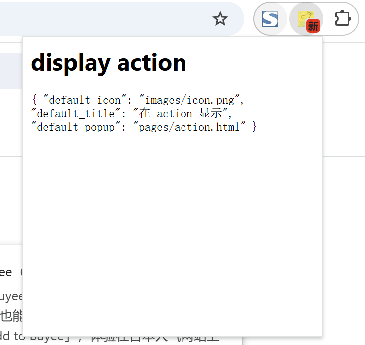

# 右上角 popup 展示 (chrome.action)

> v2 版本 有 browser_action / page_action 两个配置 

## package.json 配置
```json
{
  "action":
  {
      "default_icon": "images/icon.png",
      "default_title": "在 action 显示",
      "default_popup": "pages/action.html"
  },
  "background":
  {
      "scripts": ["js/background.js"]
  }
}

```
## 配置说明

### 图标 default_icon
```
    图标推荐使用宽高都为 19 像素的图片，更大的图标会被缩小，格式随意，一般推荐png

      "default_icon": {
        "16": "images/icon16.png",
        "24": "images/icon24.png",
        "32": "images/icon32.png"
      }
        
    由于具有 1.5 倍或 1.2 倍等不太常见缩放比例的设备越来越普遍，我们建议您为图标提供多种尺寸。
    这还可以确保您的扩展程序在未来能够应对潜在的图标显示大小变化。
    不过，如果只提供一种尺寸，也可以将 "default_icon" 键设置为指向单个图标路径的字符串，而不是字典。

    可以调用 setIcon() 方法设置 chrome.action.setIcon({path: "images/icon.png"});
    action.setIcon() API 旨在设置静态图片。请勿为图标使用动画图片。
```
### 提示（标题） default_title
```
    当用户将鼠标指针悬停在工具栏中的扩展程序图标上时，系统会显示提示或标题。
    当按钮获得焦点时，屏幕阅读器朗读的无障碍文本中也会包含该文本。

    可以调用 setTitle() 方法设置 chrome.action.setTitle({title: "新标题"});
```

### 徽章 badge
```
    所谓badge就是在图标上显示一些文本，可以用来更新一些小的扩展状态提示信息。
    因为badge空间有限，所以只支持4个以下的字符（英文4个，中文2个）。
    badge无法通过配置文件来指定，必须通过代码实现，
    设置badge文字和颜色可以分别使用 setBadgeText() 和 setBadgeBackgroundColor()
        chrome.action.setBadgeText({text: "新"});
        chrome.action.setBadgeBackgroundColor({color: "#FF0000"});
```

### 弹出式窗口
```   
  可以使用 action.setPopup() 方法动态更新该属性，使其指向其他相对路径

```

## 文件
```html
<html lang="zh-cn">
  <style>
    html {
      width: 300px;
      height: 300px;
    }
  </style>
  <body>
    <h1>display action</h1>
    <code>
      {
          "default_icon": "images/icon.png",
          "default_title": "在 action 显示",
          "default_popup": "pages/action.html"
      }
    </code>
  </body>
</html>
```

## 效果



# 资料
```
https://github.com/GoogleChrome/chrome-extensions-samples/tree/main/api-samples/action
https://developer.chrome.com/docs/extensions/reference/api/action?hl=zh-cn
```