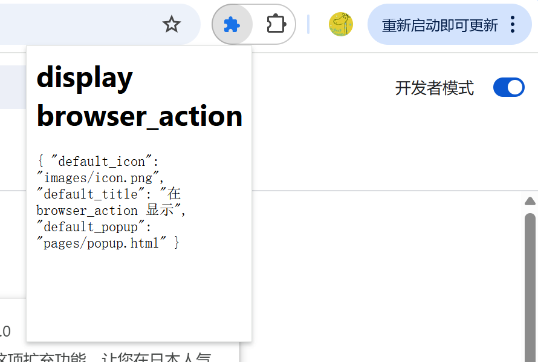

# 八种展示效果

## 1. browser_action 浏览器右上角
### package.json 配置
```json
"action":
{
    "default_icon": "images/icon.png",
    "default_title": "在 browser_action 显示",
    "default_popup": "pages/popup.html"
}

# default_icon

    图标推荐使用宽高都为 19 像素的图片，更大的图标会被缩小，格式随意，一般推荐png
    可以调用 setIcon() 方法设置 chrome.browserAction.setIcon({path: "images/icon.png"});

# default_title

    可以调用 setTitle() 方法设置 chrome.browserAction.setTitle({title: "新标题"});

# badge

    所谓badge就是在图标上显示一些文本，可以用来更新一些小的扩展状态提示信息。
    因为badge空间有限，所以只支持4个以下的字符（英文4个，中文2个）。
    badge无法通过配置文件来指定，必须通过代码实现，
    设置badge文字和颜色可以分别使用 setBadgeText() 和 setBadgeBackgroundColor()
        chrome.browserAction.setBadgeText({text: "新"});
        chrome.browserAction.setBadgeBackgroundColor({color: "#FF0000"});

V3  使用 action 代替 browser_action(V2)
```

### 文件
```html
<html lang="zh-cn">
  <body>
    <h1>display browser_action</h1>
    <code>
      {
          "default_icon": "images/icon.png",
          "default_title": "在 browser_action 显示",
          "default_popup": "pages/popup.html"
      }
    </code>
  </body>
</html>
```

### 效果



## 2. browser_action 浏览器右上角
### package.json 配置
```

```

[**pageAction(地址栏右侧)**](https://www.notion.so/pageAction-1a46c7bd4608809dad9def05085f29d7?pvs=21)

[**右键菜单**](https://www.notion.so/1a46c7bd460880419019ef9824d06e2b?pvs=21)

[**override(覆盖特定页面)**](https://www.notion.so/override-1a46c7bd460880a9957cf8e8174444b8?pvs=21)

[**devtools(开发者工具)**](https://www.notion.so/devtools-1a46c7bd46088085b7cbd0c5b5a147a3?pvs=21)

[**option(选项页)**](https://www.notion.so/option-1a46c7bd460880bea528e875804e7710?pvs=21)

[**omnibox**](https://www.notion.so/omnibox-1a46c7bd4608800e9fd6f7daef3c847d?pvs=21)

[**桌面通知**](https://www.notion.so/1a46c7bd460880e39bc8d30d2aafa6bd?pvs=21)

## F&Q
### 扩展页面的中文字符串乱码解决
```
把文件编码保存为 utf-16 编码
```