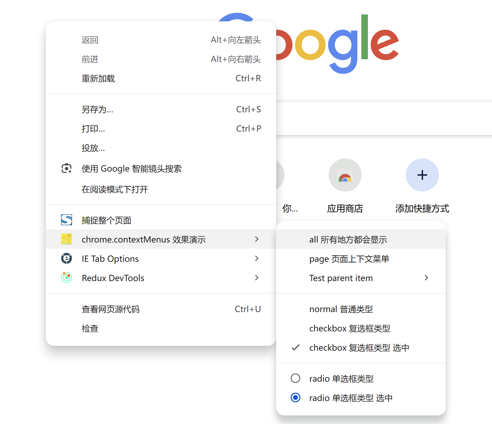
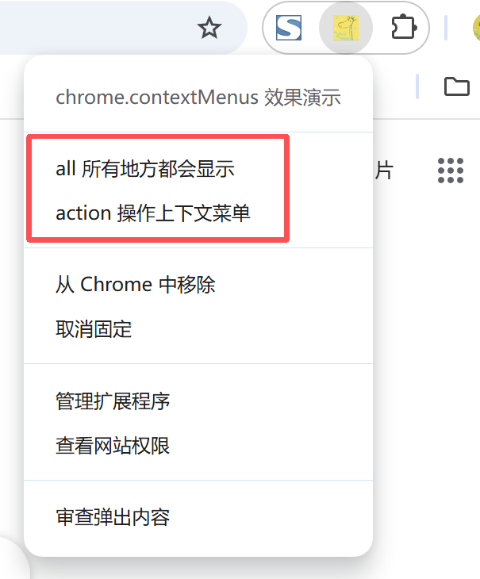
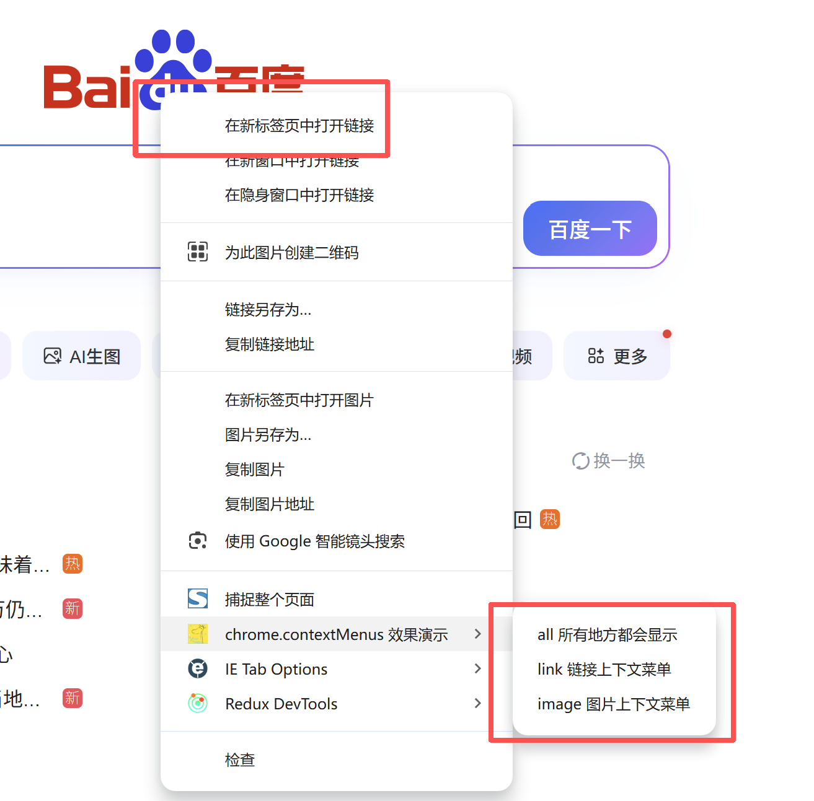
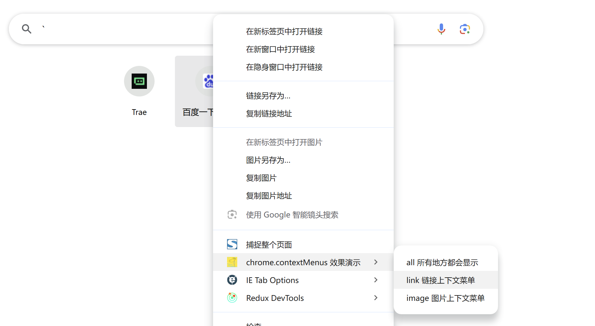
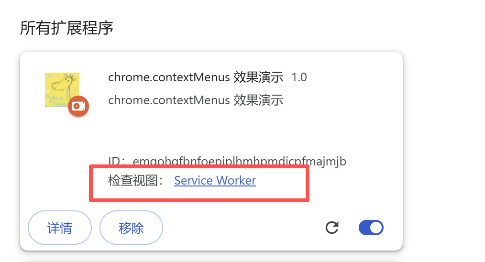
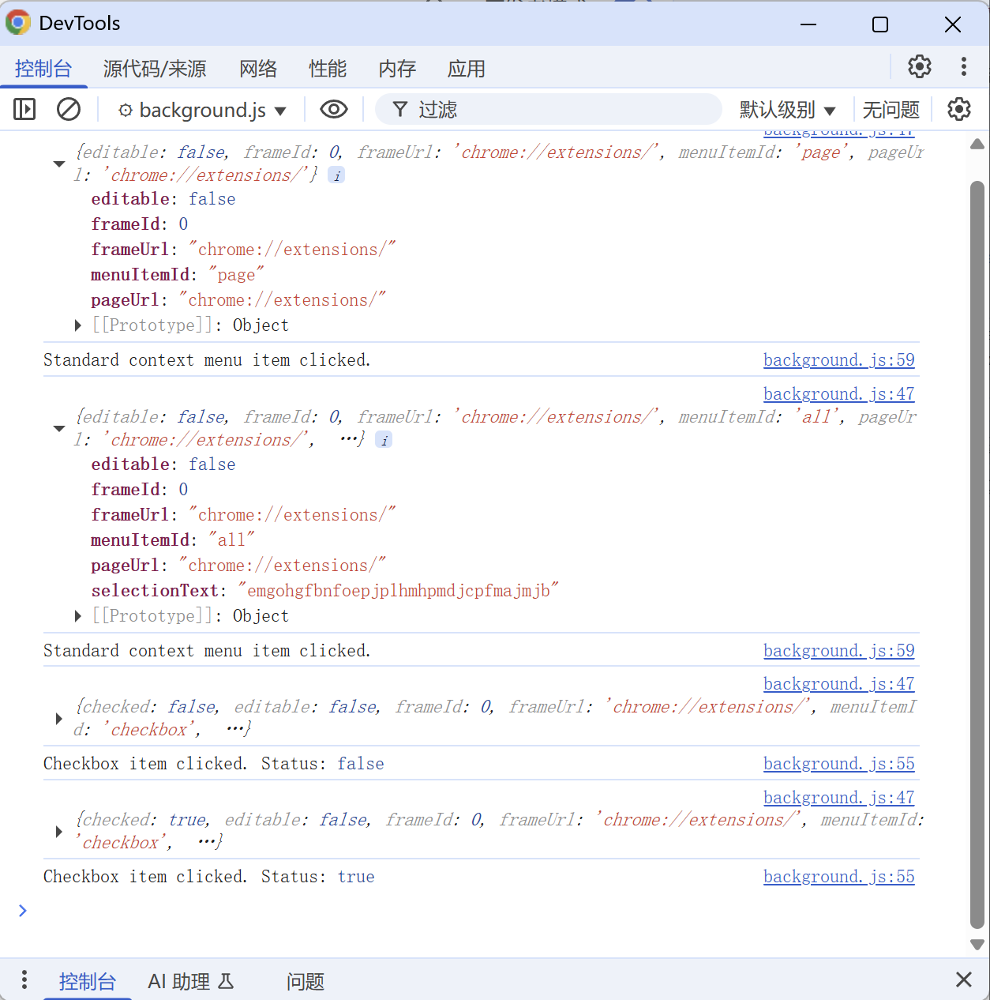

# 右键菜单 展示 (chrome.contextMenus)

> 使用 chrome.contextMenus API 可向 Google Chrome 的上下文菜单添加项。
> 可以选择上下文菜单添加项所适用的对象类型，例如图片、超链接和网页

## package.json 配置
```json
{
    "permissions": [
        "contextMenus"
    ],
    
    "background": {
        "service_worker": "js/background.js"
    }
}

```

## background.js

> 上下文菜单项可以显示在任何文档（或文档中的框架）中，即使是具有 file:// 或 chrome:// 网址的文档也不例外。
> 如需控制您的项可以显示在哪些文档中，请在调用 create() 或 update() 方法时指定 documentUrlPatterns 字段。
> 可以根据需要创建任意数量的上下文菜单项，但如果您的扩展程序中有多个上下文菜单项同时显示，Google Chrome 会自动将它们收起到一个父菜单中

```javascript
// 安装扩展椒加入 右键菜单
chrome.runtime.onInstalled.addListener(function () {
    // 不同的显示位置，不指定默认为: ["page"]
    console.log('加安装右键菜单');
    chrome.contextMenus.create({ title: "all 所有地方都会显示 ", contexts: ["all"], id:   "all"  }); // 指定“all”相当于指定除“launcher”之外的所有其他上下文的组合。“启动器”上下文仅受应用支持
    chrome.contextMenus.create({ title: "page 页面上下文菜单", contexts: ["page"], id:   "page"  });
    chrome.contextMenus.create({ title: "selection 选择上下文菜单", contexts: ["selection"], id:   "selection"  });
    chrome.contextMenus.create({ title: "link 链接上下文菜单", contexts: ["link"], id:   "link"  });
    chrome.contextMenus.create({ title: "editable 可编辑上下文菜单", contexts: ["editable"], id:   "editable"  });
    chrome.contextMenus.create({ title: "image 图片上下文菜单", contexts: ["image"], id:   "image"  });
    chrome.contextMenus.create({ title: "video 视频上下文菜单", contexts: ["video"], id:   "video"  });
    chrome.contextMenus.create({ title: "audio 音频上下文菜单", contexts: ["audio"], id:   "audio"  });
    // Unchecked runtime.lastError: Only packaged apps are allowed to use 'launcher' context 只有打包扩展才能注册 launcher 右键
    // chrome.contextMenus.create({ title: "launcher 启动器上下文菜单", contexts: ["launcher"], id:   "launcher"  }); 
    chrome.contextMenus.create({ title: "browser_action 浏览器操作上下文菜单", contexts: ["browser_action"], id:   "browser_action"  }); // v2 插件
    chrome.contextMenus.create({ title: "page_action 页面操作上下文菜单", contexts: ["page_action"], id:   "page_action"  }); // v2 插件
    chrome.contextMenus.create({ title: "action 操作上下文菜单", contexts: ["action"], id:   "action"  }); // v3 插件

    // 创建两级上下文菜单
    let parent = chrome.contextMenus.create({ title: 'Test parent item', id: 'parent' });
    chrome.contextMenus.create({ title: 'Child 1', parentId: parent, id: 'child1' });
    chrome.contextMenus.create({ title: 'Child 2', parentId: parent, id: 'child2'});
    chrome.contextMenus.create({ title: '指定父类名字符', parentId:'parent', id: '指定父类名字符'});

    // 显示类型 normal / checkbox / radio / separator
    chrome.contextMenus.create({ type: 'separator', id: 'separator'}); // 可以不用设置 title
    chrome.contextMenus.create({ type: 'normal', title: 'normal 普通类型', id: 'normal'}); // 默认的
    chrome.contextMenus.create({ type: 'checkbox', title: 'checkbox 复选框类型', id: 'checkbox'}); // checkbox
    chrome.contextMenus.create({ type: 'checkbox', title: 'checkbox 复选框类型 选中', id: 'checkbox-checked', checked: true}); // checkbox 
    chrome.contextMenus.create({ type: 'radio', title: 'radio 单选框类型', id: 'radio'}); // radio
    chrome.contextMenus.create({ type: 'radio', title: 'radio 单选框类型 选中', id: 'radio-checked', checked: true}); // radio

    // 添加异常
    chrome.contextMenus.create(
        { title: 'Oops', parentId: 999, id: 'errorItem' },
        function () {
            if (chrome.runtime.lastError) {
                console.log('Got expected error: ' + chrome.runtime.lastError.message);
            }
        },
    );

});

// 注册右键点击事件
chrome.contextMenus.onClicked.addListener(function(info) {
    console.log(info);
    switch (info.menuItemId) {
        case 'radio':
            // Radio item function
            console.log('Radio item clicked. Status:', info.checked);
            break;
        case 'checkbox':
            // Checkbox item function
            console.log('Checkbox item clicked. Status:', info.checked);
            break;
        default:
            // Standard context menu item function
            console.log('Standard context menu item clicked.');
    }

    console.log("选中的字符串 selectionText",   info.selectionText);
    console.log("选中的链接 linkUrl",   info.linkUrl);
    console.log("选中的图片 imageUrl",   info.srcUrl);
    // console.log("选中的视频 videoUrl",   info.videoUrl);
    // console.log("选中的音频 audioUrl",   info.audioUrl);
    console.log("配置的 menuItemId",   info.menuItemId);
});
```

## 显示效果





## 调试



## 资料
```
https://developer.chrome.com/docs/extensions/reference/api/contextMenus?hl=zh-cn
https://github.com/GoogleChrome/chrome-extensions-samples/tree/main/api-samples/contextMenus/basic
```