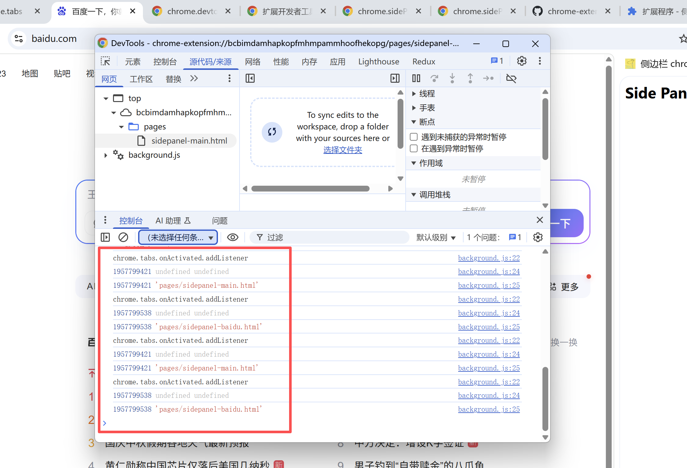
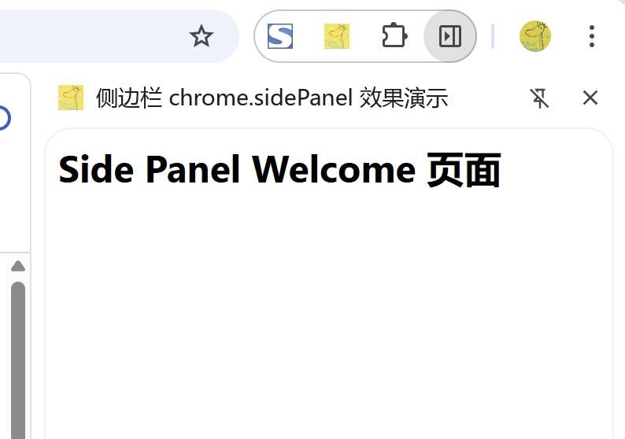
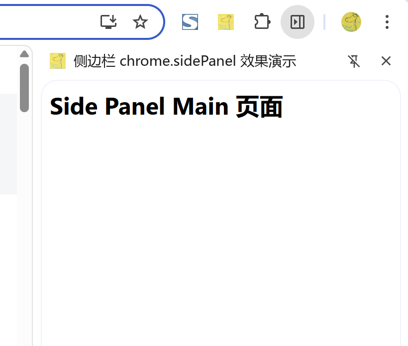
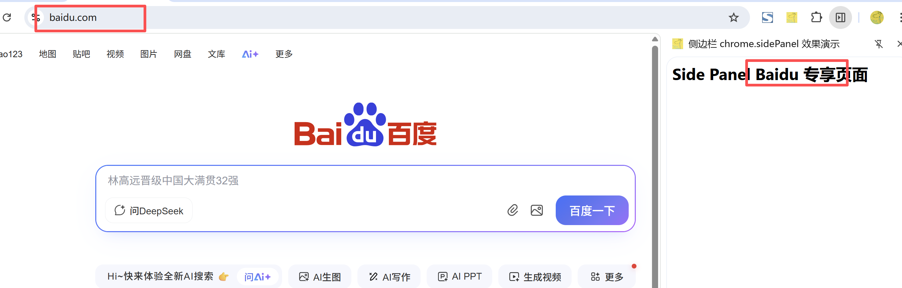

# 侧边栏 展示 (chrome.sidePanel)

> 使用 chrome.sidePanel API 在浏览器的侧边栏中托管内容，与网页的主要内容并排显示

## manifest.json 配置
```json
{
    "side_panel": {
        "default_path": "pages/sidepanel.html"
    },
    "permissions": [
        "sidePanel",
        "tabs"
    ]
}
```

## background.js 配置
```js
// chrome.runtime.onInstalled.addListener(() => {
//     console.log("插件安装完成");
//     // 点击 panel 图标时打开侧边栏
//     chrome.sidePanel.setPanelBehavior({ openPanelOnActionClick: true });
// });

const welcomePage = 'pages/sidepanel-welcome.html';
const mainPage = 'pages/sidepanel-main.html';

// 使用  chrome.sidePanel.setOptions({ path: welcomePage });
// manifest.json 中配置 side_panel 则无效了

// 插件安装完成时，设置侧边栏为 welcome 页面
chrome.runtime.onInstalled.addListener(() => {
    // 安装成功首次显示 welcome 页面
    chrome.sidePanel.setOptions({ path: welcomePage });
    chrome.sidePanel.setPanelBehavior({ openPanelOnActionClick: true });
});

// 当切换到其他标签页时，检查侧边栏是否需要切换到 main 页面
chrome.tabs.onActivated.addListener(async ({ tabId, info, tab }) => {
    console.log("chrome.tabs.onActivated.addListener");
    const { path } = await chrome.sidePanel.getOptions({ tabId });
    console.log(tabId, info, tab);
    console.log(tabId, path);
    if (path === welcomePage) { // welcome 页面 只显示一次 后面都显示 main 页面
        chrome.sidePanel.setOptions({ path: mainPage });
    }
});

// 在 百度 网站 显示 指定的页面
chrome.tabs.onUpdated.addListener(async (tabId, info, tab) => {
    console.log("chrome.tabs.onUpdated.addListener");
    console.log(tabId, info, tab);
    if (!tab.url) return;
    const url = new URL(tab.url);
    console.log(tab);
    console.log(url);
    if (url.origin === 'https://www.baidu.com') {
        await chrome.sidePanel.setOptions({
            tabId,
            path: 'pages/sidepanel-baidu.html',
            enabled: true
        });
    } else {
        // Disables the side panel on all other sites
        // await chrome.sidePanel.setOptions({
        //     tabId,
        //     enabled: false
        // });
        await chrome.sidePanel.setOptions({
            tabId,
            path: 'pages/sidepanel-main.html',
            enabled: true
        });
    }
});
```

## 调试



## 效果





## 资料
```
https://developer.chrome.google.cn/docs/extensions/reference/api/sidePanel?hl=zh-cn
https://github.com/GoogleChrome/chrome-extensions-samples/tree/main/functional-samples/cookbook.sidepanel-multiple
https://github.com/GoogleChrome/chrome-extensions-samples/tree/main/functional-samples/sample.sidepanel-dictionary
https://github.com/GoogleChrome/chrome-extensions-samples/tree/main/functional-samples/cookbook.sidepanel-global
https://github.com/GoogleChrome/chrome-extensions-samples/tree/main/functional-samples/cookbook.sidepanel-open
https://github.com/GoogleChrome/chrome-extensions-samples/tree/main/functional-samples/cookbook.sidepanel-site-specific
```