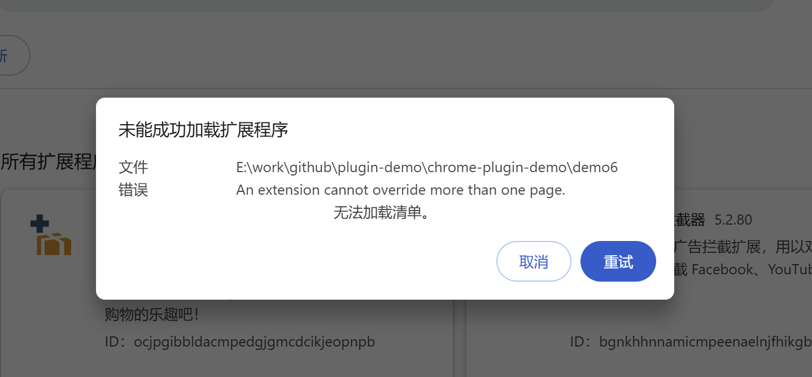
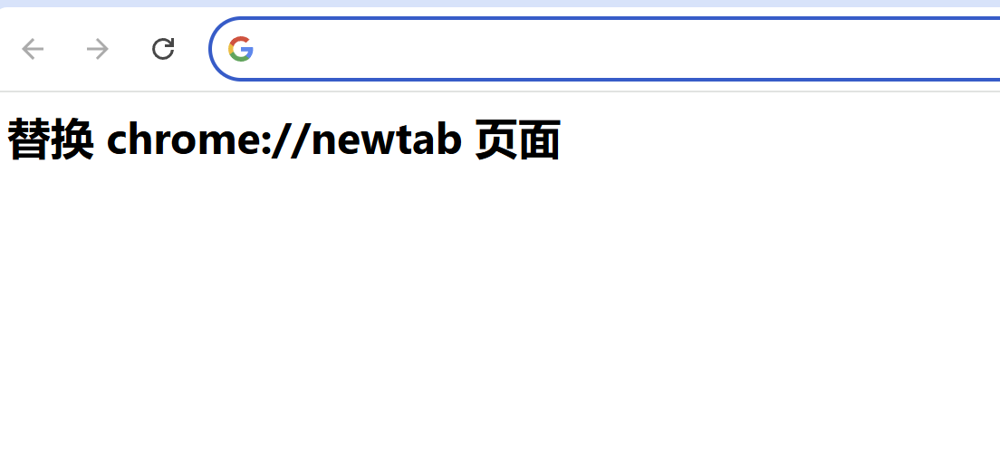
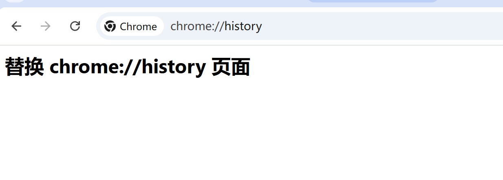
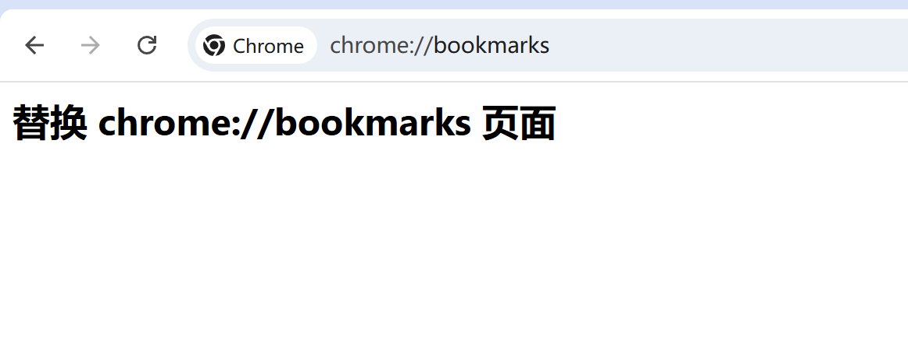

# 替换 Chrome 网页

> 扩展程序可以使用 HTML 替换页面来替换 Google Chrome 通常提供的页面。
> 扩展程序可以包含对以下任一网页的替换项，但每个扩展程序只能替换一个网页：

- 书签管理器 bookmarks
    用户从 Chrome 菜单中选择“书签管理器”菜单项或在 Mac 上从“书签”菜单中选择“书签管理器”菜单项时显示的页面。您也可以输入网址 chrome://bookmarks 前往此页面。

- 历史记录 history
    用户从 Chrome 菜单中选择“历史记录”菜单项或在 Mac 上从“历史记录”菜单中选择“显示完整历史记录”菜单项时显示的页面。您也可以输入网址 chrome://history 前往此页面。

- 打开新的标签页 newtab
    用户创建新标签页或新窗口时显示的页面。您也可以输入网址 chrome://newtab 前往此页面。

## manifest.json 配置
```json
{
    "chrome_url_overrides": {
        "newtab": "pages/newtab.html"
    }
}

{
    "chrome_url_overrides": {
        "bookmarks": "pages/bookmarks.html"
    }
}

{
    "chrome_url_overrides": {
        "history": "pages/history.html"
    }
}
```
> 一个扩展只能替换一个网页，不能同时替换多个网页。


## 效果



