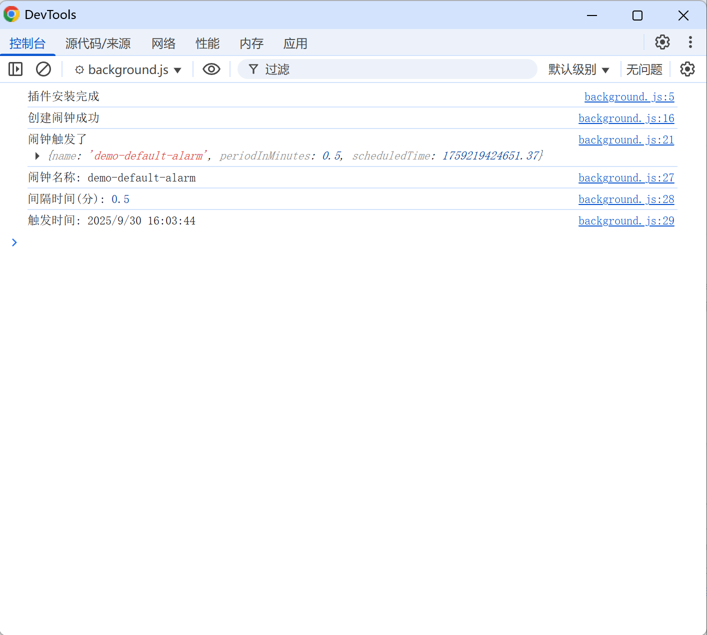

# 闹钟展示 (chrome.alarms)

> Chrome 120：从 Chrome 120 开始，闹钟的最小间隔已从 1 分钟缩短到 30 秒。如需在 30 秒后触发闹钟，请将 periodInMinutes: 0.5 设置为 30。
> Chrome 117：从 Chrome 117 开始，有效闹铃的数量限制为 500。达到此限制后，chrome.alarms.create() 将失败。使用回调时，系统会设置 chrome.runtime.lastError。使用 promise 时，promise 将被拒绝

## manifest.json 配置
```json
{
    "permissions": [
        "alarms"
    ]
}
```

## js/background.js 代码
```js
// 插件安装完成后，创建一个闹钟
chrome.runtime.onInstalled.addListener(async ({ reason }) => {
    if (reason !== 'install') { return; }

    console.log("插件安装完成");

    // Create an alarm so we have something to look at in the demo
    // when 和 delayInMinutes 不能同时使用
    await chrome.alarms.create('demo-default-alarm', {
        delayInMinutes: 1, //  onAlarm 事件应触发的时间长度（以分钟为单位） 延迟1分钟后触发第一次闹钟
        periodInMinutes: 0.5, //  periodInMinutes 每1分钟触发一次闹钟  支持 30 秒
        // when: Date.now() + 1000 * 10//  什么时间触发 10秒后触发第一次闹钟
    }).catch((error) => {
        console.error('创建闹钟失败:', error);
    });
    console.log("创建闹钟成功");
});

// 处理 闹钟触发事件 闹钟只会触发一次
chrome.alarms.onAlarm.addListener((alarm) => {
    console.log("闹钟触发了", alarm);
    // {
    //     "name": "demo-default-alarm",
    //     "periodInMinutes": 1,
    //     "scheduledTime": 1759218545676.386
    // }
    console.log("闹钟名称:", alarm.name);
    console.log("间隔时间(分):", alarm.periodInMinutes);
    console.log("触发时间:", new Date(alarm.scheduledTime).toLocaleString());

    // 获取所有闹钟
    chrome.alarms.getAll((alarms) => {
        console.log("当前所有闹钟:", alarms);
    });
    // 清除闹钟 
    chrome.alarms.clear(alarm.name);
    // 清除所有闹钟
    chrome.alarms.clearAll(); 
    console.log("清除闹钟成功");
});
```

## 效果


## 资料
```
https://developer.chrome.google.cn/docs/extensions/reference/api/alarms
https://github.com/GoogleChrome/chrome-extensions-samples/tree/main/api-samples/alarms
```