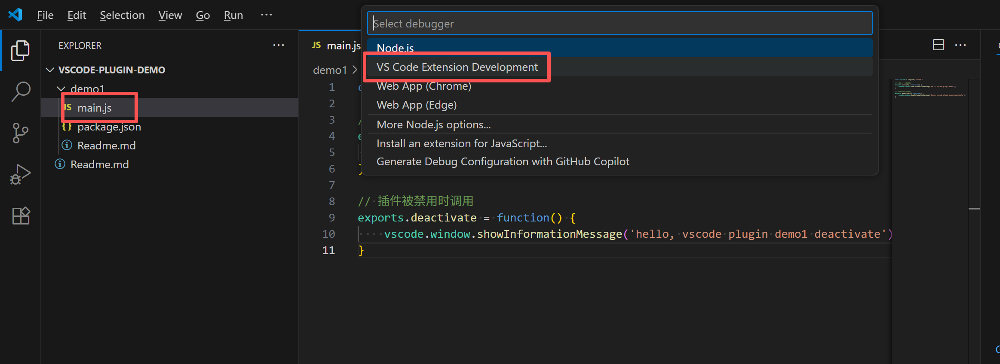
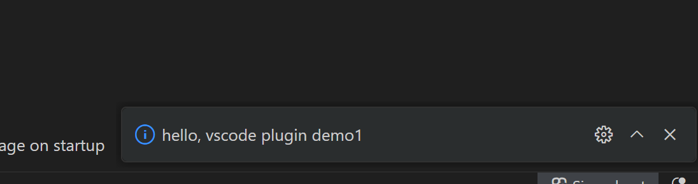

# 第一个 Hello World

## 创建扩展
### 创建目录
```bash
  mkdir demo1
```

### 创建清单文件 package.json
```json
{
  "name": "vscode plugin demo1",
    "version": "0.0.1",
    "engines": {
        "vscode": "^1.47.3"
    },
    "activationEvents": [
        "onStartupFinished"
    ],
    "main": "./main.js"
}

activationEvents: 声明插件启动的时机，此处是在 onStartupFinished，即（vscode）启动完成时（启动插件）
main: 主程序文件的路径
```

### 创建主程序文件 main.js
```javascript
const vscode = require('vscode')

// 插件被激活时调用
exports.activate = function() {
    vscode.window.showInformationMessage('hello, vscode plugin demo1');
}

// 插件被禁用时调用
exports.deactivate = function() {
    vscode.window.showInformationMessage('hello, vscode plugin demo1 deactivate');
}
```

## 运行
### 运行 插件
1. 选中 main.js
2. 按下 `F5` 或 `Ctrl+Shift+P` 打开命令面板
3. 选择 ` VS Code Extension Development` 


### 运行效果


